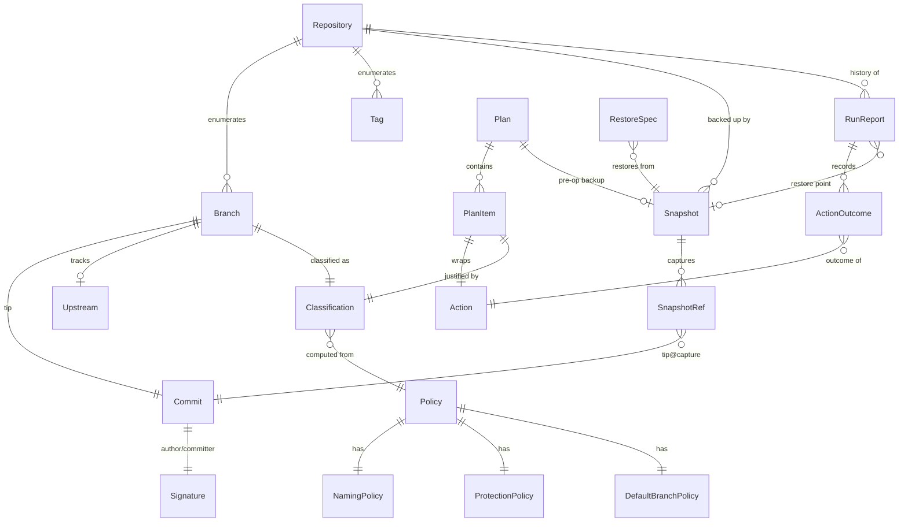
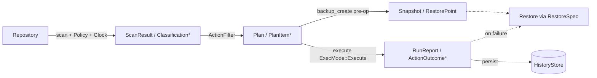

# 03 — Domain Model

`Status: Draft` · `Owner: Architecture` · `Last-updated: 2026-07-11` ·
`Related: [02-architecture.md](02-architecture.md), [04-core-spec.md](04-core-spec.md), [08-backup-and-restore.md](08-backup-and-restore.md), [11-safety-model.md](11-safety-model.md), [../delivery/CONVENTIONS.md](../delivery/CONVENTIONS.md)`

## 0. Purpose & scope

This document defines the **core entities** of `gitpurge-core` — the vocabulary the
whole product is built from. It is *implementation-guiding*, not the final API: the
concrete function signatures, traits, and error types are in
[04 — Core Library Spec](04-core-spec.md). The names, facets, and safety semantics
here are bound by [`../delivery/CONVENTIONS.md`](../delivery/CONVENTIONS.md) §6–§8 and
must not diverge from them.

All types live in `gitpurge-core::model` (see architecture §2). The type sketches
below are Rust-*ish*: they show shape and relationships, eliding derives
(`Debug, Clone, Serialize, Deserialize, PartialEq`), lifetimes, and constructors
that the real code will carry. Where a field is safety-relevant it is annotated.

Conventions used in the sketches:

- Newtypes wrap primitives so the compiler stops us mixing an SHA with a branch name.
- `Utc` timestamps are `time::OffsetDateTime` (the `time` crate), always stored UTC.
- Durations/ages are `std::time::Duration` or a parsed `AgeThreshold` (see §5).

---

## 1. Identity & Repository

```rust
/// Stable identity for a tracked repo. Derived, never user-typed.
/// Per CONVENTIONS §5: keyed by canonical remote URL + a hash of the local path,
/// so the *same* working copy and its mirror always resolve to one RepoId.
pub struct RepoId(String); // e.g. "gh:MohamedGamil/git-purge#a1b2c3"

pub enum ProviderHint {
    GitHub,
    GitLab,
    Bitbucket,
    Generic,        // plain git over ssh/https, no host API assumed
    Unknown,
}

/// A repository Git Purge tracks. May be local-only, remote-only, or both.
pub struct Repository {
    pub id: RepoId,
    pub display_name: String,          // user label, defaults to repo dir/URL slug
    pub local_path: Option<PathBuf>,   // working copy or bare repo on disk (R1/R4)
    pub remote_url: Option<GitUrl>,    // canonical fetch/push URL (R1/R4)
    pub default_branch: Option<Branch>,// resolved via DefaultBranchPolicy (§5)
    pub provider: ProviderHint,        // drives auth + future PR-metadata adapters
    pub added_at: OffsetDateTime,
    pub last_scanned_at: Option<OffsetDateTime>,
}

/// Parsed, normalized git URL (scp-like `git@host:owner/repo`, https, ssh, file).
pub struct GitUrl {
    pub scheme: UrlScheme,             // Ssh | Https | Git | File
    pub host: Option<String>,
    pub owner: Option<String>,
    pub name: String,
    pub raw: String,                   // exactly what the user/config supplied
}
```

At least one of `local_path` / `remote_url` is always present — enforced by the
`Repository` constructor, not the type system. The `default_branch` is *resolved*,
not assumed: see `DefaultBranchPolicy` in §5. This directly generalizes the legacy
scripts, which hardcoded `origin/main` with a fallback to `origin/master`.

---

## 2. Refs, Branches, Tags, Commits, Signatures

```rust
/// The location of a ref, mirroring git's own ref namespaces.
pub enum RefKind {
    LocalBranch,   // refs/heads/*
    RemoteBranch,  // refs/remotes/<remote>/*
    Tag,           // refs/tags/*
    Note,          // refs/notes/* (read-only, never a target of Actions)
    Other(String), // anything else, incl. our own refs/gitpurge/* backup namespace
}

/// A fully-qualified reference plus the short name humans use.
pub struct Ref {
    pub full: String,        // "refs/remotes/origin/feature/x"
    pub short: String,       // "origin/feature/x" or "feature/x"
    pub kind: RefKind,
    pub target: Oid,         // the commit (or tag object) it points at
}

/// A git object id (SHA-1 today, SHA-256-ready). Newtype over the hex string.
pub struct Oid(String);

pub enum BranchScope { Local, Remote }

/// A branch: the primary unit Git Purge classifies and acts on.
pub struct Branch {
    pub name: BranchName,          // "feature/x" — never includes remote prefix
    pub scope: BranchScope,        // Local | Remote
    pub remote: Option<String>,    // Some("origin") when scope == Remote
    pub full_ref: String,          // canonical refs/... path
    pub tip: Commit,               // resolved tip commit metadata
    pub upstream: Option<Upstream>,// tracking relationship, if any
    pub is_head: bool,             // is this the checked-out branch? (never delete)
}

pub struct BranchName(String);     // validated: no leading '-', no space, etc.

/// Tracking relationship between a local branch and its remote counterpart.
pub struct Upstream {
    pub remote: String,            // "origin"
    pub ref_name: BranchName,      // "feature/x"
    pub ahead: u32,                // commits local-only  (see Classification)
    pub behind: u32,               // commits remote-only
}

/// A tag. First-class so it can be a *restore target* (restore-as-tag) but is
/// GUARDED against deletion by branch operations (CONVENTIONS §7.4, SAFE-03).
pub struct Tag {
    pub name: String,
    pub target: Oid,
    pub annotated: bool,
    pub tagger: Option<Signature>,
    pub message: Option<String>,
}

/// Commit metadata as read from the object DB. No working-tree access needed.
pub struct Commit {
    pub oid: Oid,
    pub short: String,             // %(objectname:short)
    pub author: Signature,
    pub committer: Signature,
    pub author_date: OffsetDateTime,
    pub commit_date: OffsetDateTime, // the date staleness is measured against (§4)
    pub subject: String,           // first line of the message
    pub parents: Vec<Oid>,
}

/// A git identity + timestamp (author or committer / tagger).
pub struct Signature {
    pub name: String,
    pub email: String,             // NOTE: PII; never written to shared reports raw
    pub when: OffsetDateTime,
}
```

Notes:

- **`commit_date` drives staleness**, matching the legacy scripts, which measured age
  from `%(committerdate)` / `%ct`. `author_date` is retained for display and diffing.
- `Signature.email` is treated as PII: reports aggregate or redact it per config
  ([10-reporting-and-history.md](10-reporting-and-history.md)); it never leaks into
  logs (SAFE-07 lives in auth but the rule is global).
- `Branch.is_head` and any protected classification make a branch ineligible for
  destructive `Action`s regardless of other facets (§6, [11](11-safety-model.md)).

---

## 3. Classification — the computed facets

`Classification` is the heart of `scan`. It is a **pure function of a `Branch` + a
`Policy` + a `Clock`** (see [04](04-core-spec.md) `scan` module), so it is fully
deterministic and unit-testable against fixture repos.

```rust
pub struct Classification {
    pub branch: BranchName,
    pub scope: BranchScope,                 // Local | Remote

    pub merge_state: MergeState,            // Merged | Unmerged | Unknown
    pub activity: Activity,                 // Stale | Active (age vs threshold)
    pub age: Duration,                      // now - tip.commit_date
    pub protection: Protection,             // Protected{reason} | Unprotected
    pub naming: NamingVerdict,              // Standard | NonStandard{reason,..}
    pub tracking: TrackingFacet,            // ahead/behind + gone-upstream flag

    pub tip: Commit,                        // denormalized for display/sort
    pub recommendation: Recommendation,     // suggested Action, advisory only
}

pub enum MergeState {
    /// tip is an ancestor of the repo's default branch (merge-base --is-ancestor).
    Merged,
    Unmerged,
    /// default branch could not be resolved / ref unreadable — treated as UNMERGED
    /// for safety (never auto-delete on Unknown).
    Unknown,
}

pub enum Activity {
    Stale,   // age >= Policy.age_threshold
    Active,  // age <  Policy.age_threshold
}

pub enum Protection {
    Unprotected,
    /// Carries a machine + human reason for auditability and UI display.
    Protected { reason: ProtectionReason },
}

pub enum ProtectionReason {
    DefaultBranch,             // it *is* the resolved default branch
    WellKnown(String),         // main/master/develop/staging/production/HEAD
    UserListed(String),        // matched Policy.protected_names
    GlobMatch(String),         // matched a Policy.protected_globs pattern
    IsHead,                    // currently checked out
    IsTag,                     // a tag reached through a branch operation
}

/// Naming policy verdict. Generalizes generate_reports.py::is_standard_branch,
/// but the rules come from Policy (§5), not hardcoded constants.
pub enum NamingVerdict {
    Standard,
    /// Matched an explicit allowed exception (e.g. "upgrade/vue3", "*sdf*").
    Exempt { rule: String },
    NonStandard { reason: NamingViolation },
}

pub enum NamingViolation {
    NoCategoryPrefix,                  // no '/' — "wip", "temp"
    WrongPrefixFormat { prefix: String }, // known prefix, bad case/version format
    NonStandardPrefix { prefix: String }, // "bugfix/","task/" → should be feature/fix
    UnknownPrefix { prefix: String },  // anything else
}

/// ahead/behind vs upstream (or vs default branch when no upstream).
pub struct TrackingFacet {
    pub ahead: u32,
    pub behind: u32,
    pub upstream_gone: bool,           // upstream ref no longer exists on remote
    pub compared_against: RefBasis,    // Upstream | DefaultBranch
}

pub enum Recommendation { KeepProtected, DeleteMerged, ReviewUnmerged, ArchiveStale, NoAction }
```

### 3.1 Porting & generalizing the naming regex

The legacy `is_standard_branch` hardcoded one regex and two special cases. Git Purge
lifts every constant into `NamingPolicy` (§5) so teams configure their own strategy:

| Legacy (hardcoded)                                                                 | Git Purge (policy-driven)                                       |
| :--------------------------------------------------------------------------------- | :------------------------------------------------------------- |
| `^(main\|develop\|staging\|production\|release/\d+\.\d+\.\d+\|feature/.+\|fix/.+\|refactor/.+\|hotfix/.+)$` | `NamingPolicy.allowed: Vec<Regex>` — this string is the **default** first entry |
| special-case `upgrade/vue3`                                                        | `NamingPolicy.exact_exceptions: ["upgrade/vue3"]`               |
| substring `sdf` (case-insensitive)                                                 | `NamingPolicy.substring_exceptions: ["sdf"]` (ci)              |
| prefix→reason heuristics (`bugfix`, `task`, case mismatch …)                        | `NamingPolicy.remediation_map` → produces `NamingViolation`     |

The classifier evaluates in order: **default-branch/well-known → exact exception →
substring exception → allowed-regex list → violation analysis**. The result is a
`NamingVerdict`, and for `NonStandard`, a `NamingViolation` with a human reason (so the
report tables from `generate_reports.py` reproduce exactly). Matching operates on the
`BranchName` with any `remote/` prefix stripped, exactly as the legacy code did.

### 3.2 How facets map to filter & sort (R3)

Every facet is a **filterable and sortable dimension** — this is what powers R3
(“explore/filter/sort/compare”) in both the CLI and UI, driven by one
`ActionFilter`/`SortKey` in the core (§7). No facet is UI-only.

| Facet (`Classification` field) | Filter predicate (`ActionFilter`)            | Sort key (`SortKey`)      |
| :----------------------------- | :------------------------------------------- | :------------------------ |
| `merge_state`                  | `merged` / `include_unmerged`                | `Merged`                  |
| `activity` + `age`             | `older_than(AgeThreshold)`                   | `Age` (tip.commit_date)   |
| `scope`                        | `local_only` / `remote_only` / both          | `Scope`                   |
| `protection`                   | *always excludes* Protected from Action sets | `Protected`               |
| `naming`                       | `only_non_standard` / `only_standard`        | `Naming`                  |
| `tracking.ahead/behind`        | `ahead_gt(n)` / `behind_gt(n)` / `gone`      | `Ahead` / `Behind`        |
| `tip.author`                   | `author_matches(glob)`                       | `Author`                  |
| `branch` name                  | `matches(glob)` / `exclude(glob)`            | `Name`                    |

Filtering never overrides protection: a Protected branch can *appear* in a scan
listing but is structurally excluded from any `Plan` of destructive `Action`s (§6).

---

## 4. Time & staleness

```rust
/// A parsed age threshold. Accepts human input like "1 year ago", "6 months",
/// "90d" (mirrors the bash scripts' `--age "1 year ago"`), normalized to a Duration.
pub struct AgeThreshold {
    pub raw: String,
    pub duration: Duration,
}
```

Staleness = `now() - branch.tip.commit_date >= policy.age_threshold.duration`, where
`now()` comes from the injected `Clock` port (never `SystemTime::now()` directly) so
tests are deterministic. Default threshold is `"1 year ago"` per CONVENTIONS §9.

---

## 5. Policy — user-configured rules

`Policy` is loaded from `config.toml` (CONVENTIONS §5) merged with per-repo overrides
and CLI/UI flags. It is the *only* source of thresholds and rules; nothing is
hardcoded (the anti-goal called out in CONVENTIONS §5 re: the old scripts).

```rust
pub struct Policy {
    pub age: AgeThreshold,                  // default "1 year ago"
    pub naming: NamingPolicy,
    pub protection: ProtectionPolicy,
    pub excludes: Vec<GlobPattern>,         // branches to omit from scan/plan entirely
    pub default_branch: DefaultBranchPolicy,
}

pub struct NamingPolicy {
    pub allowed: Vec<Regex>,                // ordered; first hit wins → Standard
    pub exact_exceptions: Vec<String>,      // literal names → Exempt
    pub substring_exceptions: Vec<CiSubstring>, // case-insensitive contains → Exempt
    pub remediation_map: Vec<PrefixRule>,   // prefix → NamingViolation reason text
}

pub struct ProtectionPolicy {
    /// Always-on, cannot be removed by config (CONVENTIONS §7.3 / SAFE-02):
    /// main, master, develop, staging, production, HEAD.
    pub well_known: Vec<String>,            // seeded, immutable defaults
    pub protected_names: Vec<String>,       // user additions (e.g. "main-legacy")
    pub protected_globs: Vec<GlobPattern>,  // e.g. "release/*", "*-do-not-delete"
}

pub struct DefaultBranchPolicy {
    /// Ordered resolution: explicit config → remote HEAD → candidates below.
    pub explicit: Option<BranchName>,
    pub candidates: Vec<BranchName>,        // ["main","master","develop"] default
}

pub struct GlobPattern(String);
pub struct CiSubstring(String);
pub struct PrefixRule { pub prefix: String, pub violation: NamingViolation }
```

`ProtectionPolicy.well_known` is **seeded and immutable**: the resolver unions it with
user config, so a user can *add* protected names/globs but can never *remove* the six
well-known ones. This is the type-level backing for SAFE-02.

---

## 6. Snapshots & Restore Points (backup model)

Backed by CONVENTIONS §6 / ADR-0005 and detailed in
[08-backup-and-restore.md](08-backup-and-restore.md). A `Snapshot` does **not** clone
the repo; it writes captured refs into a namespaced ref inside the shared bare mirror
(`refs/gitpurge/backups/<snapshot-id>/<original-ref-path>`), so N snapshots cost
~O(changed objects).

```rust
pub struct SnapshotId(String);   // ULID/uuid, sortable by creation time

/// A point-in-time capture of a repo's refs. This IS the Restore Point.
pub struct Snapshot {
    pub id: SnapshotId,
    pub repo: RepoId,
    pub created_at: OffsetDateTime,
    pub trigger: SnapshotTrigger,
    pub refs: Vec<SnapshotRef>,      // one entry per captured branch/tag
    pub verified: bool,              // objects readable back? (backup-before-destroy)
    pub manifest_path: PathBuf,      // snapshot.json inside the bare mirror
}

pub enum SnapshotTrigger { Manual, PreDelete, PreArchive, Scheduled }

/// Metadata for one captured ref (CONVENTIONS §6).
pub struct SnapshotRef {
    pub branch: BranchName,          // original short name
    pub original_full_ref: String,   // where it lived, for faithful restore
    pub backup_ref: String,          // refs/gitpurge/backups/<id>/<orig>
    pub tip: Oid,                    // tip commit SHA at capture
    pub commit_count: u64,           // commits reachable — proves "content backed up"
    pub upstream: Option<String>,    // "origin/feature/x" at capture time
    pub merged_at_capture: MergeState, // merge status frozen at capture time
}

/// A Restore Point is simply a Snapshot referenced for restoration.
/// The alias exists so docs/UI can speak of "restore points" (CONVENTIONS §8).
pub type RestorePoint = Snapshot;
```

---

## 7. Actions, Plans, Runs, and the scan/exec value objects

```rust
/// A single mutating operation Git Purge can perform (CONVENTIONS §8).
pub enum Action {
    Delete  { target: Branch, scope: BranchScope },
    Archive { source: Branch, into: BranchName, strategy: MergeStrategy },
    Restore { snapshot: SnapshotId, spec: RestoreSpec },
}

/// Archive merge strategy — ports archive_unmerged_branches.sh's ours/theirs.
pub enum MergeStrategy { Ours, Theirs }

/// One planned action + the *why*. Every item carries its rationale so the
/// dry-run output (and audit journal) explains itself.
pub struct PlanItem {
    pub action: Action,
    pub classification: Classification, // the evidence
    pub rationale: String,              // human "why" ("merged into main; 400d stale")
    pub destructiveness: Destructiveness, // Normal | Destructive (drives confirm tier)
    pub backup_ref: Option<String>,     // filled once a pre-op snapshot exists
}

pub enum Destructiveness {
    Normal,      // delete a MERGED branch — recoverable from remote/backup
    Destructive, // delete UNMERGED / forced — requires stronger confirmation (§11)
}

/// The resolved set of actions a command WOULD take. Always computed before execute.
pub struct Plan {
    pub repo: RepoId,
    pub items: Vec<PlanItem>,
    pub skipped: Vec<SkippedItem>,      // protected/tag/head, with reason (for audit)
    pub requires_snapshot: bool,        // false only if user passed --no-backup
    pub summary: PlanSummary,           // counts by facet, for the header line
}

pub struct SkippedItem { pub branch: BranchName, pub reason: ProtectionReason }

/// Recorded outcome of executing a Plan. Feeds HistoryStore + reports (R7).
pub struct RunReport {
    pub run_id: RunId,
    pub repo: RepoId,
    pub started_at: OffsetDateTime,
    pub finished_at: OffsetDateTime,
    pub mode: ExecMode,
    pub snapshot: Option<SnapshotId>,   // the pre-op restore point, if any
    pub outcomes: Vec<ActionOutcome>,   // per-item success/failure/restored
    pub metrics: RunMetrics,            // counts, bytes reclaimed, duration
}

pub struct RunId(String);

pub struct ActionOutcome {
    pub action: Action,
    pub result: OutcomeKind,            // Succeeded | Failed | RestoredAfterFailure | SkippedUnconfirmed
    pub error: Option<String>,          // redacted, never secrets (SAFE-07)
}
```

### 7.1 Scan / execution inputs

```rust
pub struct ScanOptions {
    pub fetch: bool,                    // prune+fetch remotes first (default true)
    pub include_remote: bool,           // enumerate refs/remotes/* (default true)
    pub include_local: bool,            // enumerate refs/heads/*   (default true)
    pub policy_overrides: Option<PolicyPatch>, // CLI/UI flags layered on config
}

pub struct ScanResult {
    pub repo: RepoId,
    pub scanned_at: OffsetDateTime,
    pub classifications: Vec<Classification>,
    pub stats: ScanStats,               // repo-wide totals (§ generate_reports stats)
}

/// The filter/sort spec shared by CLI flags and UI controls (R3, R6).
pub struct ActionFilter {
    pub scope: ScopeFilter,             // Local | Remote | Both
    pub merged: Option<bool>,           // Some(true)=only merged; None=either
    pub include_unmerged: bool,         // default false (matches -u flag)
    pub older_than: Option<AgeThreshold>,
    pub name_matches: Vec<GlobPattern>,
    pub excludes: Vec<GlobPattern>,     // ports -x/--exclude
    pub only_non_standard: bool,
    pub sort: SortKey,
    pub sort_desc: bool,
}

pub enum SortKey { Age, Name, Author, Merged, Scope, Naming, Ahead, Behind, Protected }

/// The single knob that separates preview from mutation (CONVENTIONS §7.1, SAFE-01).
pub enum ExecMode {
    DryRun,   // default everywhere; compute + show Plan, touch nothing
    Execute,  // CLI --execute / UI confirmed action
}

/// How a restored ref should materialize (CONVENTIONS §6, R2).
pub struct RestoreSpec {
    pub source_ref: String,             // which SnapshotRef to restore
    pub as_kind: RestoreKind,           // AsBranch | AsTag
    pub target_name: BranchName,        // may differ from original
    pub on_conflict: OnConflict,        // never silently overwrite (SAFE-06)
}

pub enum RestoreKind { AsBranch, AsTag }

pub enum OnConflict {
    Abort,                 // default: refuse if target exists
    RestoreUnderNewName,   // suffix e.g. "-restored"
    Overwrite,             // ONLY with explicit consent token (§11)
}
```

---

## 8. Entity relationship diagram



Read the arrows as: a `Repository` has many `Branch`es and `Tag`s; each `Branch`
resolves to exactly one `Classification` (given a `Policy`) and one tip `Commit`; a
`Plan` gathers `PlanItem`s each wrapping one `Action` justified by its
`Classification`; execution yields a `RunReport` of `ActionOutcome`s and may reference
the pre-op `Snapshot` used for auto-restore.

---

## 9. Lifecycle: how the entities flow



This is the same seven-step data flow the architecture doc §6 describes; here it is
expressed in domain terms. The transitions are the public methods of the `Engine`
facade — their exact signatures are the subject of [04-core-spec.md](04-core-spec.md).

---

## 10. Open questions / spec notes

- **Ahead/behind basis when no upstream:** `TrackingFacet.compared_against` records
  whether counts are vs the upstream or (fallback) vs the default branch. Confirm the
  default-branch fallback is desired for remote-only branches — see [04](04-core-spec.md).
- **SHA-256 repos:** `Oid` is a string newtype to stay hash-agnostic; no field assumes
  40 hex chars.
- **PII in `Signature.email`:** redaction policy is defined in
  [10-reporting-and-history.md](10-reporting-and-history.md); the model only flags it.
