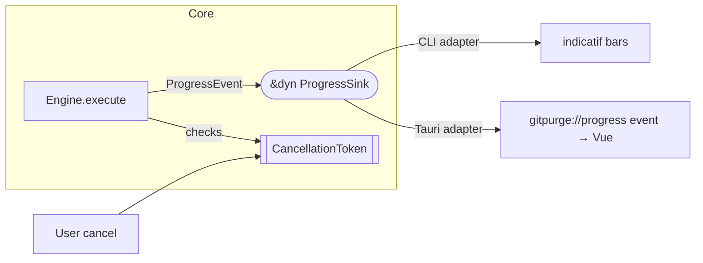

# 04 — Core Library Spec (`gitpurge-core`)

`Status: Draft` · `Owner: Architecture` · `Last-updated: 2026-07-11` ·
`Related: [02-architecture.md](02-architecture.md), [03-domain-model.md](03-domain-model.md), [08-backup-and-restore.md](08-backup-and-restore.md), [11-safety-model.md](11-safety-model.md), [15-extensibility.md](15-extensibility.md), [../delivery/CONVENTIONS.md](../delivery/CONVENTIONS.md)`

## 0. Purpose

`gitpurge-core` is **the brain**. Per [`../delivery/CONVENTIONS.md`](../delivery/CONVENTIONS.md)
§2 the CLI (`gitpurge-cli`) and the Tauri backend (`gitpurge-desktop`) are *thin
adapters* that contain **zero git logic**; both call the same `Engine` service object
and render its results. This document is the **contract** between the core and its
adapters: the module map, the `Engine` public API, the ports (traits), the backend
selection strategy, the error type, and the concurrency model.

Signatures here are illustrative-but-self-consistent Rust. They reference the entities
defined in [03 — Domain Model](03-domain-model.md) by their canonical names. Public
functions return `Result<T, GitPurgeError>` (CONVENTIONS §11); `#![forbid(unsafe_code)]`
and no runtime `unwrap()`/`expect()` (CONVENTIONS §12).

Type alias used throughout: `pub type Result<T> = std::result::Result<T, GitPurgeError>;`

---

## 1. Module map

Mirrors [architecture §2](02-architecture.md#2-workspace-layout). Each module owns one
concern; `model`, `error`, and `config` are dependency-free leaves.

```
gitpurge-core/src/
├── lib.rs        // re-exports Engine, Result, prelude; crate docs
├── error.rs      // GitPurgeError (thiserror) + SerializableError projection
├── config.rs     // Config load/save (TOML), path resolution via `directories`
├── model/        // §03 entities: Repository, Branch, Classification, Snapshot, Plan…
├── git/          // GitBackend trait + gix / git2 / shell adapters + CompositeBackend
├── policy/        // PolicyEngine: age, naming (regex), protected, filter/sort
├── scan/         // classification pipeline: Branch + Policy + Clock -> Classification
├── backup/       // snapshot create/list/verify/prune/restore over the bare mirror
├── action/       // delete / archive / restore orchestration (safety wrappers)
├── auth/         // credential providers + SecretStore usage (R5)
├── report/       // report building + md/json/html formatters (via ReportSink)
├── history/      // SQLite trend DB behind HistoryStore
├── diff/         // ref/commit diff + tree/blob "view at commit" (R1/R4)
└── testkit/      // fixture-repo builders; #[cfg(feature = "testkit")] only
```

Dependency direction: `action` → {`backup`, `scan`, `git`, `history`}; `scan` →
{`policy`, `git`, `model`}; everything → {`model`, `error`}. No module depends on a
sibling that sits "above" it, keeping the layering in architecture §3 acyclic.

---

## 2. The `Engine` facade

`Engine` is the single public entry point. It owns the resolved `Config` and the
injected **ports** (§3), so adapters construct it once and issue calls. It is
`Send + Sync`; long-running use-cases are `async` and accept a `&dyn ProgressSink`
plus a `CancellationToken` (architecture §5).

```rust
/// The one object both the CLI and the Tauri backend talk to.
pub struct Engine {
    config: Config,
    git: Arc<dyn GitBackend>,
    secrets: Arc<dyn SecretStore>,
    history: Arc<dyn HistoryStore>,
    reports: Arc<dyn ReportSink>,
    clock: Arc<dyn Clock>,
}

/// Ports supplied at construction. `default_ports()` wires production adapters;
/// tests pass in-memory fakes (architecture §3 "dependency inversion").
pub struct EnginePorts {
    pub git: Arc<dyn GitBackend>,
    pub secrets: Arc<dyn SecretStore>,
    pub history: Arc<dyn HistoryStore>,
    pub reports: Arc<dyn ReportSink>,
    pub clock: Arc<dyn Clock>,
}

impl Engine {
    /// Load config from the standard location (or the given override) and wire the
    /// production adapters (gix/git2 composite, keyring, rusqlite, system clock).
    pub fn open(config: Config) -> Result<Self>;

    /// Inject ports explicitly — the seam tests and alt-adapters use.
    pub fn with_ports(config: Config, ports: EnginePorts) -> Result<Self>;

    // ---- Repo registry (CLI `repo …` / IPC `repo_*`) -----------------------
    pub fn repo_add(&self, spec: RepoSpec) -> Result<Repository>;
    pub fn repo_list(&self) -> Result<Vec<Repository>>;
    pub fn repo_show(&self, repo: &RepoId) -> Result<Repository>;
    pub fn repo_remove(&self, repo: &RepoId) -> Result<()>;

    // ---- Read-only exploration (R1, R3, R4) --------------------------------
    /// Classify all refs. Fetches first unless `opts.fetch == false`.
    pub async fn scan(
        &self,
        repo: &RepoId,
        opts: ScanOptions,
        progress: &dyn ProgressSink,
        cancel: CancellationToken,
    ) -> Result<ScanResult>;

    /// Compute the set of actions a delete/archive WOULD take. ALWAYS dry-run;
    /// this is the object the UI/CLI show before any `execute` (SAFE-01).
    pub fn plan(&self, repo: &RepoId, filter: &ActionFilter, kind: PlanKind) -> Result<Plan>;

    pub fn diff(&self, repo: &RepoId, a: &RefSpec, b: &RefSpec) -> Result<DiffResult>;

    /// View repo/file content as of any ref or commit (R1/R4, `git-purge show`).
    pub fn show_tree(&self, repo: &RepoId, at: &RefSpec, path: Option<&Path>) -> Result<TreeView>;
    pub fn show_blob(&self, repo: &RepoId, at: &RefSpec, path: &Path) -> Result<BlobView>;

    // ---- Backup / restore (R2, CONVENTIONS §6) -----------------------------
    pub async fn backup_create(
        &self,
        repo: &RepoId,
        opts: BackupOptions,
        progress: &dyn ProgressSink,
        cancel: CancellationToken,
    ) -> Result<Snapshot>;

    pub fn backup_list(&self, repo: &RepoId) -> Result<Vec<Snapshot>>;
    pub fn backup_show(&self, snap: &SnapshotId) -> Result<Snapshot>;
    /// Re-read every captured ref's objects to prove the backup is restorable.
    pub fn backup_verify(&self, snap: &SnapshotId) -> Result<VerifyReport>;
    pub fn backup_prune(&self, repo: &RepoId, policy: PrunePolicy) -> Result<PruneReport>;

    /// Recreate a ref from a snapshot as a branch OR tag; never force-overwrites
    /// without explicit consent in `spec.on_conflict` (SAFE-06).
    pub async fn restore(
        &self,
        snap: &SnapshotId,
        spec: RestoreSpec,
        progress: &dyn ProgressSink,
        cancel: CancellationToken,
    ) -> Result<RestoreOutcome>;

    // ---- The one mutating entry point (R2, safety-wrapped) -----------------
    /// Execute a previously-computed Plan. In `ExecMode::DryRun` this is a no-op that
    /// returns the projected RunReport. In `ExecMode::Execute` it: (1) creates+verifies
    /// a pre-op Snapshot unless `plan.requires_snapshot == false`; (2) performs each
    /// Action; (3) on failure offers auto-restore from that Snapshot; (4) records the
    /// RunReport to HistoryStore. This ordering is the runtime spine of the safety
    /// model — see [11-safety-model.md](11-safety-model.md).
    pub async fn execute(
        &self,
        plan: &Plan,
        mode: ExecMode,
        consent: Consent,
        progress: &dyn ProgressSink,
        cancel: CancellationToken,
    ) -> Result<RunReport>;

    // ---- Reporting & history (R7) ------------------------------------------
    pub fn report(&self, repo: &RepoId, fmt: ReportFormat) -> Result<Report>;
    pub fn history(&self, repo: &RepoId) -> Result<TrendHistory>;

    // ---- Auth (R5) ---------------------------------------------------------
    pub fn auth_add(&self, cred: CredentialSpec) -> Result<CredentialId>;
    pub fn auth_list(&self) -> Result<Vec<CredentialInfo>>;   // metadata only, no secrets
    pub fn auth_remove(&self, id: &CredentialId) -> Result<()>;
    pub async fn auth_test(&self, id: &CredentialId, url: &GitUrl) -> Result<AuthProbe>;
}

pub enum PlanKind { Delete, Archive { into: BranchName, strategy: MergeStrategy } }

/// Explicit user consent carried into `execute` — the code-level counterpart of the
/// confirmation tiers in [11-safety-model.md](11-safety-model.md).
pub enum Consent {
    /// Normal ops (delete MERGED branches). CLI `--yes`; UI confirm button.
    Confirmed,
    /// Destructive ops (unmerged/forced). Requires the typed token / explicit toggle;
    /// carries what the user actually confirmed so the journal can record it.
    Destructive { token: String },
    /// No consent given — used for pure dry-run calls.
    None,
}

/// How to name a ref for diff/show: short name, full ref, or a raw commit SHA.
pub enum RefSpec { Name(String), Full(String), Commit(Oid) }
```

### 2.1 Adapter mapping

| Core method                    | CLI verb (CONVENTIONS §9) | Tauri command (§10) |
| :----------------------------- | :------------------------ | :------------------ |
| `scan`                         | `scan`                    | `scan`              |
| `plan`                         | `plan`                    | `plan`              |
| `execute` (Delete plan)        | `delete [--execute]`      | `delete_branches`   |
| `execute` (Archive plan)       | `archive [--execute]`     | `archive_branches`  |
| `backup_*`                     | `backup create/list/…`    | `backup_create`, …  |
| `restore`                      | `restore <snap> <ref>`    | `restore`           |
| `diff` / `show_tree`           | `diff` / `show`           | `diff` / `show_tree`|
| `report` / `history`           | `report` / `history`      | `report_generate` / `history_get` |
| `auth_*`                       | `auth add/list/…`         | `auth_*`            |

Both adapters build `ScanOptions`/`ActionFilter`/`ExecMode`/`Consent` from user intent,
call `Engine`, and render the returned domain objects. Neither ever imports `gix`,
`git2`, or `rusqlite` (enforced by an architecture test + `cargo-deny` bans,
CONVENTIONS §2 / architecture §1).

---

## 3. Ports (traits)

Ports are the hexagonal seams (architecture §3). Services depend on these traits, never
on concrete adapters. Every port is `Send + Sync` so `Engine` is too.

### 3.1 `GitBackend` — all VCS transport & object access

```rust
/// The one abstraction over git. Reads go to gix, mutating/auth ops fall through to
/// git2, and the shell backend is a last resort (§4). Callers NEVER touch gix/git2
/// directly (CONVENTIONS §4). This is also the seam a future VcsBackend widens (R6).
#[async_trait::async_trait]
pub trait GitBackend: Send + Sync {
    /// Open an existing repo (working copy or bare) at `path`.
    fn open(&self, path: &Path) -> Result<RepoHandle>;
    /// Discover the enclosing repo by walking up from `path` (like `git rev-parse`).
    fn discover(&self, path: &Path) -> Result<RepoHandle>;

    /// Enumerate refs. `include` selects local heads, remote branches, and/or tags.
    fn list_refs(&self, repo: &RepoHandle, include: RefSelector) -> Result<Vec<Ref>>;

    /// Read commit metadata (author/committer/dates/subject/parents) for one oid.
    fn read_commit(&self, repo: &RepoHandle, oid: &Oid) -> Result<Commit>;

    /// Resolve a RefSpec (name/full/sha) to a concrete Oid.
    fn resolve(&self, repo: &RepoHandle, spec: &RefSpec) -> Result<Oid>;

    /// Merge-base of two commits; None if histories are unrelated.
    fn merge_base(&self, repo: &RepoHandle, a: &Oid, b: &Oid) -> Result<Option<Oid>>;
    /// Is `ancestor` reachable from `descendant`? Backs MergeState (merged?) checks.
    fn is_ancestor(&self, repo: &RepoHandle, ancestor: &Oid, descendant: &Oid) -> Result<bool>;
    /// ahead/behind counts of `branch` relative to `base`.
    fn ahead_behind(&self, repo: &RepoHandle, branch: &Oid, base: &Oid) -> Result<(u32, u32)>;

    /// Structured diff between two refs/commits (R3).
    fn diff_refs(&self, repo: &RepoHandle, a: &Oid, b: &Oid, opts: DiffOptions) -> Result<DiffResult>;

    /// View-at-commit (R1/R4): list a tree, and read a blob, at an arbitrary commit.
    fn read_tree(&self, repo: &RepoHandle, at: &Oid, path: Option<&Path>) -> Result<TreeView>;
    fn read_blob(&self, repo: &RepoHandle, at: &Oid, path: &Path) -> Result<BlobView>;

    // ---- Mutating / network ops (typically routed to git2) -----------------
    async fn fetch(
        &self, repo: &RepoHandle, remote: &str, creds: &dyn CredentialSource,
        progress: &dyn ProgressSink, cancel: CancellationToken,
    ) -> Result<FetchOutcome>;

    /// Create a branch or tag ref pointing at `target`. `force` gated by callers,
    /// never defaulted true (SAFE-06 lives above this, but the flag is explicit here).
    fn create_ref(&self, repo: &RepoHandle, new_ref: &NewRef, force: bool) -> Result<()>;

    /// Delete a local ref (branch). Tag deletion is refused here unless
    /// `RefKind::Tag` is explicitly requested, backstopping SAFE-03.
    fn delete_ref(&self, repo: &RepoHandle, full_ref: &str) -> Result<()>;

    /// Delete a ref on a remote (push :ref). Irreversible on many hosts — callers
    /// MUST have a verified local backup first (SAFE-04, see risk table in doc 11).
    async fn push_delete(
        &self, repo: &RepoHandle, remote: &str, ref_name: &str,
        creds: &dyn CredentialSource, progress: &dyn ProgressSink, cancel: CancellationToken,
    ) -> Result<()>;

    /// Push a local ref to a remote (used by archive to publish the legacy branch).
    async fn push(
        &self, repo: &RepoHandle, remote: &str, refspec: &str,
        creds: &dyn CredentialSource, progress: &dyn ProgressSink, cancel: CancellationToken,
    ) -> Result<()>;

    /// Merge `source` into the checked-out branch with an ours/theirs strategy —
    /// ports archive_unmerged_branches.sh. Returns the merge commit oid.
    fn merge(&self, repo: &RepoHandle, source: &Oid, strategy: MergeStrategy, message: &str) -> Result<Oid>;

    /// Which backend actually serviced the handle — for diagnostics & parity tests.
    fn backend_kind(&self) -> BackendKind; // Gix | Git2 | Shell | Composite
}

pub struct RefSelector { pub local: bool, pub remote: bool, pub tags: bool }
pub struct NewRef { pub full_ref: String, pub target: Oid, pub kind: RefKind }
```

### 3.2 `SecretStore` — credential material at rest (R5, SAFE-07)

```rust
/// Stores/reads secret material via the OS keychain (`keyring`), with an encrypted
/// file fallback. Implementations MUST NOT log or Display secret bytes (SAFE-07).
pub trait SecretStore: Send + Sync {
    /// Persist a secret under a stable key; returns nothing revealing the value.
    fn put(&self, key: &SecretKey, value: SecretBytes) -> Result<()>;
    /// Fetch a secret. The returned type zeroizes on drop and has no Debug/Display.
    fn get(&self, key: &SecretKey) -> Result<Option<SecretBytes>>;
    fn delete(&self, key: &SecretKey) -> Result<()>;
    /// Enumerate KEYS/metadata only — never values.
    fn list_keys(&self) -> Result<Vec<SecretKey>>;
    /// Which store is active (keychain vs encrypted file) — for `auth test` output.
    fn backend(&self) -> SecretBackendKind;
}
```

### 3.3 `HistoryStore` — trend DB (R7)

```rust
/// Append-only history of runs + periodic scan snapshots, backing trend reports.
/// Production impl is SQLite via rusqlite (CONVENTIONS §5); tests use in-memory.
pub trait HistoryStore: Send + Sync {
    fn record_run(&self, report: &RunReport) -> Result<()>;
    fn record_scan_stats(&self, repo: &RepoId, at: OffsetDateTime, stats: &ScanStats) -> Result<()>;
    fn runs(&self, repo: &RepoId, limit: usize) -> Result<Vec<RunReport>>;
    fn trend(&self, repo: &RepoId, window: TrendWindow) -> Result<TrendHistory>;
    /// The append-only audit journal of mutations (CONVENTIONS §7.6, doc 11 §7).
    fn append_journal(&self, entry: &JournalEntry) -> Result<()>;
    fn journal(&self, repo: &RepoId, since: Option<OffsetDateTime>) -> Result<Vec<JournalEntry>>;
}
```

### 3.4 `ReportSink` — pluggable report output (R7, extensibility)

```rust
/// Renders a built Report to a target format. Adding html/csv/etc. is a new adapter,
/// not a facade change (R6; see [15-extensibility.md](15-extensibility.md)).
pub trait ReportSink: Send + Sync {
    fn supports(&self, fmt: ReportFormat) -> bool;      // Markdown | Json | Html
    fn render(&self, report: &Report, fmt: ReportFormat) -> Result<RenderedReport>;
}
```

### 3.5 `Clock` — deterministic time

```rust
/// Injected time source so staleness is testable (doc 03 §4). Production adapter
/// returns the system clock; tests return a frozen instant.
pub trait Clock: Send + Sync {
    fn now(&self) -> OffsetDateTime;
}
```

### 3.6 `ProgressSink` — progress & cancellation feedback

```rust
/// One-way channel for progress + human status of long ops (architecture §5).
/// CLI adapter renders with `indicatif`; Tauri adapter forwards to the
/// `gitpurge://progress` event (CONVENTIONS §10). Implementations must be cheap and
/// non-blocking; dropping events is acceptable, blocking the worker is not.
pub trait ProgressSink: Send + Sync {
    fn on_event(&self, event: ProgressEvent);
}

pub enum ProgressEvent {
    Started { op: OpKind, total: Option<u64> },
    Advanced { op: OpKind, done: u64, message: Option<String> },
    ItemDone { op: OpKind, item: String, outcome: OutcomeKind },
    Finished { op: OpKind, summary: String },
}

/// A no-op sink for callers that don't care (tests, JSON-only CLI runs).
pub struct NullProgress;
impl ProgressSink for NullProgress { fn on_event(&self, _: ProgressEvent) {} }
```

Also referenced by ports above:

```rust
/// Supplies per-request credentials to GitBackend network ops without the backend
/// knowing where they came from (keychain, env, ssh-agent, system identity — R5).
pub trait CredentialSource: Send + Sync {
    fn for_url(&self, url: &GitUrl) -> Result<Credential>;
}
```

---

## 4. Backend selection strategy (ADR-0002)

`GitBackend` is realized by a **`CompositeBackend`** that composes three concrete
adapters and routes each call to the best available one, honoring CONVENTIONS §4 /
[ADR-0002](adr/). Priority: **gix → git2 → shell**, with capability-based routing plus
runtime fall-through on failure.

```rust
pub enum BackendKind { Gix, Git2, Shell, Composite }

pub struct CompositeBackend {
    gix: GixBackend,             // primary: reads
    git2: Git2Backend,           // fallback: push/delete/fetch-auth/merge
    shell: Option<ShellGitBackend>, // last resort; behind `system-git` capability
    policy: RoutePolicy,
}
```

**Routing rules** (per operation *capability*, not per method name):

| Capability                                   | Primary | Fallback | Last resort |
| :------------------------------------------- | :------ | :------- | :---------- |
| ref enumeration, commit/tree/blob read, diff | `gix`   | `git2`   | `shell`     |
| merge-base / is-ancestor / ahead-behind      | `gix`   | `git2`   | `shell`     |
| fetch with credentials                       | `git2`  | `gix`*   | `shell`     |
| push / push-delete (remote mutation)         | `git2`  | —        | `shell`     |
| create/delete local ref                      | `gix`   | `git2`   | `shell`     |
| merge (ours/theirs archive)                  | `git2`  | —        | `shell`     |

\* gix credential/fetch coverage is advancing; `RoutePolicy` lets us promote gix as it
matures without touching callers.

**Fall-through mechanics.** The composite tries the primary; on a
`GitPurgeError::BackendUnsupported` (capability not implemented) or a recoverable
`Git(..)` transport error, it retries the next backend in the chain and records which
backend serviced the call (surfaced via `backend_kind()` and in verbose logs). It does
**not** fall through on *domain* errors (e.g. `ProtectedRef`, `RefNotFound`) — those are
authoritative regardless of backend. The shell adapter is only reachable when the
`system-git` capability is enabled (never on the zero-setup happy path, CONVENTIONS §4)
and is also used for **parity testing**: a test can force each backend and assert
identical `Classification`/`DiffResult` outputs on fixtures.

Adding a new VCS/provider = a new `GitBackend` (or broader `VcsBackend`) adapter slotted
into the composite via `RoutePolicy`; no `Engine`/service change (R6, doc 15).

---

## 5. Errors (`GitPurgeError`) & projections

Typed `thiserror` enum (CONVENTIONS §11). Every variant maps to (a) a **CLI exit code**
and (b) a serde-friendly **`SerializableError`** for Tauri (`code` + `message` + `hint`).
Error `Display`/`Debug` never contains secret material (SAFE-07).

```rust
#[derive(thiserror::Error, Debug)]
pub enum GitPurgeError {
    #[error("configuration error: {0}")]
    Config(String),

    #[error("repository not found or not a git repo: {0}")]
    RepoNotFound(String),

    #[error("ref not found: {0}")]
    RefNotFound(String),

    /// A safety guard fired. Carries the guard so the CLI/UI can explain it.
    #[error("blocked by safety guard: {guard}")]
    Blocked { guard: SafetyGuard, detail: String },

    /// Mutation attempted without the required confirmation/consent tier.
    #[error("operation requires confirmation: {0}")]
    ConfirmationRequired(String),

    /// A pre-op backup was required but could not be created/verified (SAFE-04).
    #[error("backup required before destructive op but failed: {0}")]
    BackupUnverified(String),

    /// Restore would overwrite an existing ref without consent (SAFE-06).
    #[error("restore target exists; refusing to overwrite without consent: {0}")]
    RestoreConflict(String),

    #[error("authentication failed for {url}")]
    Auth { url: String, #[source] source: AuthError }, // AuthError redacts secrets

    #[error("git backend error ({backend:?}): {message}")]
    Git { backend: BackendKind, message: String },

    #[error("requested capability not supported by any backend: {0}")]
    BackendUnsupported(String),

    #[error("operation cancelled")]
    Cancelled,

    #[error("history/store error: {0}")]
    Store(String),

    #[error("i/o error: {0}")]
    Io(#[from] std::io::Error),
}

pub enum SafetyGuard { ProtectedRef, TagGuard, HeadBranch, DryRunDefault, NoBackup }
```

**Exit-code projection** (used by `gitpurge-cli`, detailed in
[05-cli-spec.md](05-cli-spec.md)):

```rust
impl GitPurgeError {
    pub fn exit_code(&self) -> i32 {
        match self {
            GitPurgeError::Config(_)              => 2,
            GitPurgeError::RepoNotFound(_)
            | GitPurgeError::RefNotFound(_)       => 3,
            GitPurgeError::Blocked { .. }
            | GitPurgeError::ConfirmationRequired(_)
            | GitPurgeError::RestoreConflict(_)   => 4,  // safety refusals
            GitPurgeError::BackupUnverified(_)    => 5,
            GitPurgeError::Auth { .. }            => 6,
            GitPurgeError::Cancelled              => 130, // SIGINT convention
            _                                     => 1,
        }
    }
}
```

**Tauri projection:**

```rust
#[derive(serde::Serialize)]
pub struct SerializableError { pub code: String, pub message: String, pub hint: Option<String> }

impl From<&GitPurgeError> for SerializableError { /* stable `code` per variant, redacted msg */ }
```

Tauri commands therefore return `Result<T, SerializableError>` (CONVENTIONS §11); the
Vue layer switches on the stable `code` string, never on message text.

---

## 6. Concurrency & cancellation

- `Engine` is `Send + Sync`; adapters share one instance across tasks.
- Long use-cases (`scan`, `backup_create`, `execute`, `restore`, `fetch`) are `async`
  (Tokio) and take a `CancellationToken` (`tokio_util::sync::CancellationToken`).
  Cancellation is **cooperative and safe**: workers check the token at item boundaries;
  a cancel between items leaves the repo consistent (any in-flight ref op completes or
  is not started — never half-applied), and the already-created pre-op snapshot remains
  available for restore.
- CPU-bound git object work runs on `spawn_blocking`; the token cancels the surrounding
  loop, not a mid-object read.
- **Progress flow:** the same `ProgressEvent`s (§3.6) go to both faces. CLI wraps a
  `ProgressSink` around `indicatif` bars; the Tauri backend wraps one that emits the
  `gitpurge://progress` event (CONVENTIONS §10), and maps a UI "Cancel" click to
  `CancellationToken::cancel()`. Because the event stream is identical, behavior and
  test coverage are shared (R6).



---

## 7. Extensibility notes

The ports in §3 are the extension seams; full guidance is in
[15 — Extensibility](15-extensibility.md). In short:

- **New git host (GitLab/Bitbucket):** implement a `Provider` port for URL/auth/PR
  metadata; `GitBackend` already abstracts transport, so classification is unchanged.
- **New VCS:** implement `GitBackend` (or a widened `VcsBackend`) and register it in the
  `CompositeBackend`'s `RoutePolicy` (§4).
- **New backup/restore, diff, report format, or stats source:** each is a port
  (`ReportSink`, backup strategy, diff strategy) selected by config — no `Engine` change.
- **New naming/protection rules:** pure config via `Policy` (doc 03 §5); no code change.

Every extension point is reachable without modifying the `Engine` facade, which is the
concrete meaning of Requirement R6.
