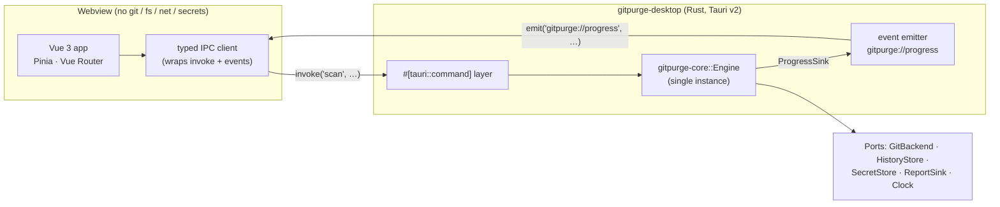
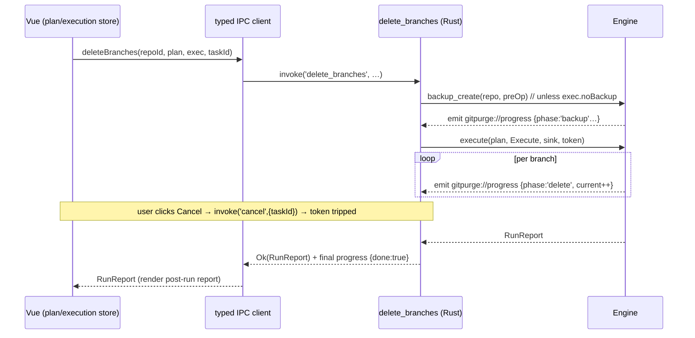
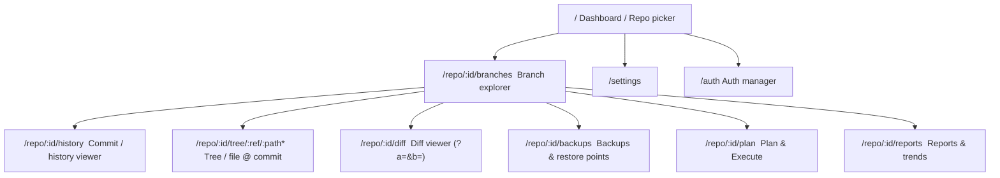

# 06 — Desktop UI Spec (Tauri v2 + Vue 3)

`Status: Draft` · `Owner: Desktop UI` · `Last-updated: 2026-07-11` ·
`Related: [CONVENTIONS](../delivery/CONVENTIONS.md), [02-architecture.md](02-architecture.md), [05-cli-spec.md](05-cli-spec.md), [07-ui-design-system.md](07-ui-design-system.md), [08-backup-and-restore.md](08-backup-and-restore.md), [09-authentication.md](09-authentication.md), [10-reporting-and-history.md](10-reporting-and-history.md), [11-safety-model.md](11-safety-model.md)`

> This document specifies the **Git Purge** desktop application: a **Tauri v2** shell
> with a **Vue 3 + Vite + TypeScript** frontend. The Tauri Rust backend
> (`gitpurge-desktop`) links `gitpurge-core` directly and exposes every capability as
> a `#[tauri::command]`. **The webview never touches git, the filesystem, the network,
> or secrets directly** — it only calls commands. The app runs fully standalone with
> **no CLI installed and no browser** (see [02-architecture.md §7](02-architecture.md)).
>
> Design tokens, colors, and component styling live in
> [07-ui-design-system.md](07-ui-design-system.md). This doc references components by
> name; the design system defines their look.

---

## 1. Scope & principles

The UI is a **thin adapter** (CONVENTIONS §1, [02-architecture.md §1](02-architecture.md)).
It contains **zero git logic**. Every screen action resolves to one or more
`#[tauri::command]` calls into `gitpurge-core::Engine`. The CLI ([05](05-cli-spec.md))
and this UI are the two faces of the same core; §12 traces full parity.

Per **R12** the app is **minimalist, intuitive, and free of unnecessary features**;
it ships light / dark / system themes and a Material design language built on the
**One Dark Pro** palette. Per **R3** it lets users explore branches, backups, restore
points, history, commits, changes, and stats — filter, sort, compare, and diff. Per
**R1/R4** it can view repository contents as of any commit.

---

## 2. App architecture

### 2.1 Tauri v2 process model

A single Tauri process. The Rust side owns one `Engine` instance (constructed once at
startup from resolved `Config`); the Vue webview is a pure presentation layer whose
only privileged capability is invoking the allow-listed commands below. All git, DB
(`rusqlite`), keychain, filesystem, and network access is confined to
`gitpurge-core`, reached exclusively through the Rust command layer. Tauri
capabilities in `tauri.conf.json` grant the webview **no** direct `fs`/`shell`/`http`
access (see [14-security.md](14-security.md)).



Startup sequence:

1. `gitpurge-desktop` `main()` resolves `Config` (via `directories`), calls
   `Engine::open(config)`, stores the `Engine` in Tauri managed state
   (`app.manage(AppState { engine, tasks })`).
2. The webview boots the Vue app; the `settings` store calls `settings_get()` and
   `repos` store calls `repo_list()` to hydrate the dashboard.
3. If `Engine::open` fails (e.g. corrupt config), the backend returns a
   `SerializableError` from `settings_get()`; the UI shows a blocking error screen
   with a "reset config" affordance rather than a blank window.

### 2.2 The Rust command layer (canonical IPC surface)

Every UI capability is a `#[tauri::command]` that calls `gitpurge-core::Engine`,
mapping **1:1** to the shared-core contract in [02-architecture.md §4](02-architecture.md).
Command names are the canonical set from **CONVENTIONS §10** (`repo_list`, `scan`,
`plan`, `backup_create`, `delete_branches`, `archive_branches`, `restore`, `diff`,
`show_tree`, `report_generate`, `history_get`, `auth_*`), expanded to the full CRUD
verbs the CLI exposes (CONVENTIONS §9) using the same `noun_verb` convention. Types
below are the TypeScript projections of the serde types crossing the IPC boundary;
their Rust originals live in `gitpurge-core::model`.

All commands are `async` and return `Result<T, SerializableError>` (CONVENTIONS §11).
Long-running commands additionally take a `taskId: string` and stream progress on the
`gitpurge://progress` event (see §2.3); they are cancellable via `cancel`.

| # | `#[tauri::command]` | Params (TS) | Returns (TS) | `Engine` call | Long? |
| :- | :--- | :--- | :--- | :--- | :-: |
| 1 | `repo_list` | `()` | `RepoSummary[]` | reads tracked repos (config + `history`) | |
| 2 | `repo_add` | `{ path?: string; url?: string; name?: string }` | `RepoSummary` | `Engine::open` + register in config | |
| 3 | `repo_remove` | `{ repoId: string; dropBackups?: boolean }` | `void` | deregister; optional backup GC | |
| 4 | `repo_show` | `{ repoId: string }` | `RepoDetail` | repo metadata + counts | |
| 5 | `scan` | `{ repoId: string; options: ScanOptions; taskId: string }` | `ScanResult` | `Engine::scan(repo, opts)` | ✔ |
| 6 | `plan` | `{ repoId: string; filter: ActionFilter }` | `Plan` | `Engine::plan(repo, filter)` | |
| 7 | `backup_create` | `{ repoId: string; options: BackupOptions; taskId: string }` | `Snapshot` | `Engine::backup_create(repo, opts)` | ✔ |
| 8 | `backup_list` | `{ repoId: string }` | `Snapshot[]` | `Engine::backup_create` service (list) | |
| 9 | `backup_show` | `{ snapshotId: string }` | `SnapshotDetail` | backup service (show) | |
| 10 | `backup_verify` | `{ snapshotId: string; taskId: string }` | `VerifyReport` | backup service (verify) | ✔ |
| 11 | `backup_prune` | `{ repoId: string; keep?: number; olderThan?: string }` | `PruneReport` | backup service (prune) | |
| 12 | `delete_branches` | `{ repoId: string; plan: Plan; exec: ExecOptions; taskId: string }` | `RunReport` | `Engine::backup_create` then `Engine::execute(plan, Execute)` | ✔ |
| 13 | `archive_branches` | `{ repoId: string; plan: Plan; exec: ExecOptions; taskId: string }` | `RunReport` | `Engine::backup_create` then `Engine::execute(plan, Execute)` | ✔ |
| 14 | `restore` | `{ snapshotId: string; spec: RestoreSpec }` | `RestoreOutcome` | `Engine::restore(snap, spec)` | |
| 15 | `diff` | `{ repoId: string; a: RefSpec; b: RefSpec }` | `DiffResult` | `Engine::diff(a, b)` | |
| 16 | `show_tree` | `{ repoId: string; at: RefSpec; path?: string }` | `TreeView` | `Engine::show_tree(at, path)` | |
| 17 | `report_generate` | `{ repoId: string; format: ReportFormat }` | `Report` | `Engine::report(repo, fmt)` | |
| 18 | `history_get` | `{ repoId: string }` | `TrendHistory` | `Engine::history(repo)` | |
| 19 | `auth_add` | `{ credential: NewCredential }` | `CredentialRef` | auth service (add) — secret to `SecretStore` | |
| 20 | `auth_list` | `()` | `CredentialRef[]` | auth service (list) — **no secrets returned** | |
| 21 | `auth_remove` | `{ id: string }` | `void` | auth service (remove) | |
| 22 | `auth_test` | `{ id: string; repoId?: string }` | `AuthTestResult` | auth service (test) | ✔ |
| 23 | `settings_get` | `()` | `Settings` | `Config` load | |
| 24 | `settings_save` | `{ settings: Settings }` | `Settings` | `Config` validate + save | |
| 25 | `install_cli` | `{ scope: 'user' \| 'system' }` | `InstallOutcome` | install-CLI helper (see §11) | |
| 26 | `cancel` | `{ taskId: string }` | `void` | signals the op's `CancellationToken` | |

> **Mapping note.** `delete_branches` and `archive_branches` are the canonical §10
> names for the two destructive actions. Each wraps the exact 7-step safety flow from
> [02-architecture.md §6](02-architecture.md): it takes the already-reviewed `Plan`
> (produced by `plan`), runs `Engine::backup_create` unless `exec.noBackup` is set,
> then `Engine::execute(plan, Execute)`, with auto-restore-on-failure inside `execute`.
> This is the same code path as `git-purge delete --execute`.

**Type sketches** (illustrative; authoritative definitions in
[04-core-spec.md](04-core-spec.md)):

```ts
// Errors — serde projection of GitPurgeError (CONVENTIONS §11)
interface SerializableError { code: string; message: string; hint?: string }

// Repos
interface RepoSummary {
  id: string; name: string; localPath?: string; remoteUrl?: string;
  branchCount: number; lastScanned?: string /* ISO-8601 */;
  stale: number; unmerged: number; protectedCount: number;
}
interface RepoDetail extends RepoSummary {
  defaultBranch: string; remotes: string[]; backupCount: number;
}

// Classification (CONVENTIONS §8)
type MergeState = 'merged' | 'unmerged';
type Locality   = 'local' | 'remote';
type Freshness  = 'stale' | 'active';
type Naming     = 'standard' | 'nonStandard';
interface Classification {
  merge: MergeState; locality: Locality; freshness: Freshness;
  protected: boolean; naming: Naming; ahead: number; behind: number;
}
interface Branch {
  name: string; refPath: string; tipSha: string; tipShort: string;
  authorName: string; committedAt: string /* ISO-8601 */; ageDays: number;
  upstream?: string; classification: Classification;
}
interface ScanOptions { age?: string; naming?: boolean; includeRemote?: boolean }
interface ScanResult { repoId: string; scannedAt: string; branches: Branch[] }

// Plan / execution (CONVENTIONS §8)
type ActionKind = 'delete' | 'archive';
interface ActionFilter {
  kind: ActionKind; age?: string; merged?: boolean; includeUnmerged?: boolean;
  exclude?: string[]; refs?: string[]; // explicit selection from the explorer
}
interface PlannedAction {
  ref: string; action: ActionKind; reason: string;
  classification: Classification; destructive: boolean;
}
interface Plan { repoId: string; kind: ActionKind; actions: PlannedAction[]; createdAt: string }
interface ExecOptions { noBackup: boolean; confirmedToken?: string /* typed-confirm */ }
interface RunReport {
  runId: string; startedAt: string; finishedAt: string;
  attempted: number; succeeded: number; failed: number; skipped: number;
  snapshotId?: string; perRef: { ref: string; outcome: 'done' | 'failed' | 'skipped' | 'restored'; error?: SerializableError }[];
}

// Backups (CONVENTIONS §6)
type SnapshotTrigger = 'manual' | 'preDelete' | 'scheduled';
interface BackupOptions { trigger: SnapshotTrigger; refs?: string[] /* omit ⇒ all */; verify: boolean }
interface Snapshot {
  id: string; repoId: string; createdAt: string; trigger: SnapshotTrigger;
  refCount: number; verified: boolean;
}
interface SnapshotDetail extends Snapshot {
  refs: { branch: string; tipSha: string; commitCount: number; upstream?: string; merge: MergeState }[];
}
interface VerifyReport { snapshotId: string; ok: boolean; checkedRefs: number; problems: string[] }
interface PruneReport { removed: string[]; kept: string[]; reclaimedBytes: number }
interface RestoreSpec { ref: string; as: 'branch' | 'tag'; newName?: string; force: boolean /* consent */ }
interface RestoreOutcome { restored: string; as: 'branch' | 'tag'; sha: string }

// Diff / tree (R1/R3/R4)
interface RefSpec { repoId: string; ref: string /* branch, tag or SHA */ }
interface DiffFile { path: string; status: 'added' | 'modified' | 'deleted' | 'renamed'; added: number; removed: number }
interface DiffResult { a: RefSpec; b: RefSpec; files: DiffFile[]; ahead: number; behind: number }
interface TreeEntry { name: string; path: string; kind: 'dir' | 'file'; size?: number; mode: string }
interface TreeView { at: RefSpec; path: string; entries: TreeEntry[]; blob?: { text: string; truncated: boolean; binary: boolean } }

// Reports / history (R7)
type ReportFormat = 'md' | 'json' | 'html';
interface Report { format: ReportFormat; content: string; generatedAt: string }
interface TrendPoint { at: string; total: number; stale: number; unmerged: number; merged: number; protectedCount: number }
interface TrendHistory { repoId: string; points: TrendPoint[] }

// Auth (R5) — secrets NEVER cross the boundary outward
type CredentialKind = 'sshKey' | 'httpsUserPass' | 'token';
interface CredentialRef { id: string; kind: CredentialKind; label: string; host?: string; username?: string; addedAt: string }
interface NewCredential { kind: CredentialKind; label: string; host?: string; username?: string; secret: string; keyPath?: string }
interface AuthTestResult { ok: boolean; host: string; method: CredentialKind; detail: string }

// Settings / install
interface Settings {
  theme: 'light' | 'dark' | 'system';
  policy: { age: string; namingRegex: string; protectedRefs: string[]; excludeGlobs: string[] };
  backupsRoot: string; defaultNoBackup: false; // safety: cannot default-disable backups
}
interface InstallOutcome { installedPath: string; onPath: boolean; scope: 'user' | 'system' }
```

### 2.3 Progress & cancellation — the `gitpurge://progress` event

Long-running commands (`scan`, `backup_create`, `backup_verify`, `delete_branches`,
`archive_branches`, `auth_test`) accept a caller-generated `taskId` and forward
`gitpurge-core`'s `ProgressSink` to the Tauri event **`gitpurge://progress`**. Each
event carries the `taskId` so the frontend correlates it to the initiating call.

```ts
interface ProgressEvent {
  taskId: string;
  phase: string;        // e.g. 'backup', 'delete', 'verify', 'scan'
  message: string;      // human-readable step (never contains secrets)
  current: number;      // completed units
  total: number;        // total units (0 ⇒ indeterminate)
  done: boolean;        // terminal event
  error?: SerializableError;
}
```

- **Emit (Rust):** the command builds a `TauriProgressSink` that calls
  `app_handle.emit("gitpurge://progress", ProgressEvent { .. })` and passes it (plus a
  fresh `CancellationToken`, registered in `AppState.tasks[taskId]`) into the `Engine`
  call.
- **Cancel:** the UI's Cancel button calls `cancel({ taskId })`; the command looks up
  the token in `AppState.tasks` and triggers it. The `Engine` observes cancellation at
  safe checkpoints and returns a `Cancelled` `RunReport`/error; any pre-op snapshot is
  retained so nothing is lost.
- **Cleanup:** the `taskId` entry is removed on the terminal (`done: true`) event.



---

## 3. Frontend architecture

### 3.1 Stack & conventions

Vue **3.4+** Composition API with `<script setup>` **only**; Vite **5.x**; TypeScript
**5.x** (`strict: true`); Pinia **2.x**; Vue Router **4.x**; `@tauri-apps/api@^2`;
pnpm **9.x** (CONVENTIONS §3). Lightweight `d3`-flavored inline SVG for charts and the
branch graph — **no heavy component or charting library** (R12; [01-tech-stack.md](01-tech-stack.md)).

Source layout under `apps/desktop/src`:

```
apps/desktop/src/
├── main.ts                 # createApp + Pinia + Router + theme bootstrap
├── App.vue                 # app shell: nav rail, toast host, task tray
├── ipc/
│   ├── client.ts           # typed invoke() wrapper (§3.4)
│   ├── commands.ts         # 1:1 fns mirroring command names
│   ├── progress.ts         # gitpurge://progress listener + task registry
│   └── types.ts            # TS projections of core types (§2.2)
├── stores/                 # Pinia (§3.2)
├── router/index.ts         # route map (§3.3)
├── composables/            # useTheme, useProgress, useConfirm, useToast, useVirtualList
├── components/             # design-system components (see doc 07)
└── views/                  # one file per screen (§4)
```

### 3.2 Pinia stores

| Store | Responsibility | Key commands used |
| :--- | :--- | :--- |
| `repos` | Tracked repos, current repo selection, dashboard stat tiles | `repo_list`, `repo_add`, `repo_remove`, `repo_show` |
| `scan` (branches) | Scan result + classification, filter/sort/selection state, compare pair | `scan`, `diff`, `show_tree` |
| `backups` | Snapshots, restore points, verify status | `backup_list`, `backup_show`, `backup_create`, `backup_verify`, `backup_prune`, `restore` |
| `plan` (execution) | Current `Plan`, backup toggle, confirmation state, live `RunReport` | `plan`, `delete_branches`, `archive_branches`, `cancel` |
| `reports` (history) | Rendered reports + `TrendHistory` for charts | `report_generate`, `history_get` |
| `auth` | Credential list, add/remove/test flows (never stores secrets) | `auth_add`, `auth_list`, `auth_remove`, `auth_test` |
| `settings` | Policy, theme, backups location, install-CLI state | `settings_get`, `settings_save`, `install_cli` |
| `tasks` (support) | Cross-cutting registry of in-flight `taskId`s + progress for the global task tray and Cancel buttons | subscribes to `gitpurge://progress`; calls `cancel` |

Stores are `defineStore` with `setup` syntax. They never call `invoke()` directly —
they call the typed `commands.ts` functions (§3.4) so mocking in Vitest is trivial.

### 3.3 Vue Router route map



| Path | Name | View | Notes |
| :--- | :--- | :--- | :--- |
| `/` | `dashboard` | `DashboardView` | repo picker + global stats |
| `/repo/:id/branches` | `branches` | `BranchExplorerView` | default repo landing |
| `/repo/:id/history` | `history` | `HistoryView` | commit log |
| `/repo/:id/tree/:ref/:path*` | `tree` | `TreeView` | contents @ commit (R1/R4) |
| `/repo/:id/diff` | `diff` | `DiffView` | query: `a`, `b` refs |
| `/repo/:id/backups` | `backups` | `BackupsView` | snapshots + restore |
| `/repo/:id/plan` | `plan` | `PlanExecuteView` | review + execute |
| `/repo/:id/reports` | `reports` | `ReportsView` | audit + trends |
| `/auth` | `auth` | `AuthView` | credentials |
| `/settings` | `settings` | `SettingsView` | policy/theme/backups/CLI |

A navigation guard redirects `/repo/:id/*` to `/` if `id` is not in the `repos` store,
and lazily triggers `repo_show` to hydrate a directly-opened deep link.

### 3.4 Typed IPC client wrapper

`ipc/client.ts` centralizes `invoke()`, unwraps the `Result`, and normalizes errors so
every store handles a single `SerializableError` shape. `ipc/commands.ts` exposes one
strongly-typed function per command, mirroring the canonical names exactly.

```ts
// ipc/client.ts
import { invoke } from '@tauri-apps/api/core';
import type { SerializableError } from './types';

export class IpcError extends Error implements SerializableError {
  constructor(readonly code: string, message: string, readonly hint?: string) {
    super(message);
  }
}

export async function call<T>(command: string, args?: Record<string, unknown>): Promise<T> {
  try {
    return await invoke<T>(command, args);
  } catch (e) {
    // Tauri rejects with our SerializableError JSON
    const err = e as Partial<SerializableError>;
    throw new IpcError(err.code ?? 'E_UNKNOWN', err.message ?? String(e), err.hint);
  }
}
```

```ts
// ipc/commands.ts — 1:1 with the canonical command surface (§2.2)
import { call } from './client';
import type * as T from './types';

export const repoList   = ()                                   => call<T.RepoSummary[]>('repo_list');
export const repoAdd    = (a: { path?: string; url?: string; name?: string }) => call<T.RepoSummary>('repo_add', a);
export const scan       = (a: { repoId: string; options: T.ScanOptions; taskId: string }) => call<T.ScanResult>('scan', a);
export const plan       = (a: { repoId: string; filter: T.ActionFilter }) => call<T.Plan>('plan', a);
export const backupCreate = (a: { repoId: string; options: T.BackupOptions; taskId: string }) => call<T.Snapshot>('backup_create', a);
export const deleteBranches  = (a: { repoId: string; plan: T.Plan; exec: T.ExecOptions; taskId: string }) => call<T.RunReport>('delete_branches', a);
export const archiveBranches = (a: { repoId: string; plan: T.Plan; exec: T.ExecOptions; taskId: string }) => call<T.RunReport>('archive_branches', a);
export const restore    = (a: { snapshotId: string; spec: T.RestoreSpec }) => call<T.RestoreOutcome>('restore', a);
export const diff       = (a: { repoId: string; a: T.RefSpec; b: T.RefSpec }) => call<T.DiffResult>('diff', a);
export const showTree   = (a: { repoId: string; at: T.RefSpec; path?: string }) => call<T.TreeView>('show_tree', a);
export const reportGenerate = (a: { repoId: string; format: T.ReportFormat }) => call<T.Report>('report_generate', a);
export const historyGet = (a: { repoId: string }) => call<T.TrendHistory>('history_get', a);
export const authList   = ()                                   => call<T.CredentialRef[]>('auth_list');
export const authTest   = (a: { id: string; repoId?: string }) => call<T.AuthTestResult>('auth_test', a);
export const cancel     = (a: { taskId: string })             => call<void>('cancel', a);
// … repoRemove, repoShow, backupList/Show/Verify/Prune, authAdd/Remove,
//    settingsGet/Save, installCli follow the same 1:1 pattern.
```

```ts
// ipc/progress.ts — subscribe once at app boot; fan out by taskId
import { listen } from '@tauri-apps/api/event';
import type { ProgressEvent } from './types';

export function subscribeProgress(onEvent: (e: ProgressEvent) => void) {
  return listen<ProgressEvent>('gitpurge://progress', ({ payload }) => onEvent(payload));
}
```

### 3.5 Error handling

Commands reject with a `SerializableError` (`code` + `message` + optional `hint`). The
`call()` wrapper rethrows it as an `IpcError`. Rendering policy:

- **Inline** (form-field or panel) when the error is tied to a specific input
  (`repo_add` bad path, `auth_add` invalid key, `settings_save` invalid regex).
- **Toast** (non-blocking, auto-dismiss, action to "view details") for transient or
  background failures (a scan that failed on one ref, verify problems).
- **Blocking dialog** only for destructive-op failures needing a decision
  (e.g. "3 deletes failed — restore from snapshot?" surfaces the auto-restore offer).

Every error surface shows `message`, and the `hint` as secondary text; `code` is shown
in a "details" disclosure for bug reports. Secrets never appear (auth errors are
sanitized in core, CONVENTIONS §11 / AGENT_GUIDE §1).

---

## 4. Screen-by-screen spec

Common states apply to every data view unless noted:

- **Loading:** skeleton rows / shimmer tiles, never a blank screen; long ops show the
  progress bar wired to `gitpurge://progress`.
- **Empty:** an empty-state component (icon + one line + primary action).
- **Error:** inline panel with `message`/`hint` + Retry; see §3.5.

### 4.1 Repo picker / Dashboard (`/`)

**Purpose.** Land here on launch. Manage tracked repos (R4) and read overall stats.

```
┌────────────────────────────────────────────────────────────────────┐
│ Git Purge                                        [◐ theme] [⚙ settings]│
├──────────────┬─────────────────────────────────────────────────────┤
│ ▊ Repos      │  Overview                                            │
│  • acme/api  │  ┌─────────┐ ┌─────────┐ ┌─────────┐ ┌─────────┐      │
│  • acme/web  │  │ Repos   │ │ Branches│ │ Stale   │ │ Unmerged│      │
│              │  │   4     │ │  3,199  │ │  1,204  │ │   318   │      │
│  [+ Add repo]│  └─────────┘ └─────────┘ └─────────┘ └─────────┘      │
│              │                                                       │
│              │  Tracked repositories                                │
│              │  ┌───────────────────────────────────────────────┐  │
│              │  │ acme/api   local+remote  2,356 br  ⚠318 unmerged│→ │
│              │  │ acme/web   remote         843 br   ✓ clean      │→ │
│              │  └───────────────────────────────────────────────┘  │
└──────────────┴─────────────────────────────────────────────────────┘
```

- **Add repo** dialog: tabs "Local path" (folder-picker via a `repo_add` roundtrip;
  the webview asks the backend to open the native picker — it has no `fs` capability
  itself) and "Remote URL" (text + optional credential select). Calls `repo_add`.
- **Stat tiles** aggregate `RepoSummary` totals from `repo_list`.
- **Row click** → `/repo/:id/branches`. Row menu: Scan now, Backups, Remove.
- **Commands:** `repo_list` (load), `repo_add`, `repo_remove`, `repo_show`.
- **Empty:** "No repositories yet — add a local folder or a remote URL." + Add button.

### 4.2 Branch explorer (`/repo/:id/branches`)

**Purpose.** The core R3 surface: explore, filter, sort, multi-select, compare, and
open diffs across **thousands** of branches performantly.

```
┌────────────────────────────────────────────────────────────────────┐
│ acme/api ▸ Branches            [Scan ⟳] [Compare] [Plan ▸] [Backups] │
├────────────────────────────────────────────────────────────────────┤
│ 🔎 filter…   Merge:[any▾] Age:[>1y▾] Naming:[any▾] □ protected only  │
├──┬───────────────────────────┬────────┬──────┬────────┬─────────────┤
│☐ │ Branch                    │ Class. │ Age  │ Ahead/B│ Author      │
├──┼───────────────────────────┼────────┼──────┼────────┼─────────────┤
│☑ │ feature/login-v2          │🟢merged│ 512d │ 0/240  │ a.khan      │
│☑ │ hotfix/2019-cache         │🟠unmrg │ 743d │ 12/8   │ r.díaz      │
│☐ │ main                 🔒    │🔵prot  │  2d  │ 0/0    │ ci-bot      │
│☐ │ wip_experiment            │🟣n-std │ 388d │ 3/50   │ j.lee       │
│  │ …(virtualized, 2,356 rows)…                                       │
├──┴───────────────────────────┴────────┴──────┴────────┴─────────────┤
│ 842 selected · merged 800 · unmerged 42   [Compare 2] [Plan delete ▸]│
└────────────────────────────────────────────────────────────────────┘
```

- **Virtualized table** (`useVirtualList`): windowed rendering, fixed row height, only
  visible rows in DOM → smooth at 2,300+ branches (matches the source repos' 843 /
  2,356 counts from [00-vision-and-scope.md](00-vision-and-scope.md)). Sort/filter run
  in-memory over the `scan` store's `ScanResult` (already classified by core — the UI
  does no git work). Filtering is debounced.
- **Classification badges** per CONVENTIONS §8 — color **and** icon **and** text
  (never color-only; see [07 §8](07-ui-design-system.md)): merged, unmerged, stale,
  active, protected, non-standard, with ahead/behind counts.
- **Multi-select** with shift-range and "select all filtered"; protected refs are
  render-locked and cannot be selected for destructive actions (safety §7.3).
- **Compare** enabled when exactly two rows are selected → `/repo/:id/diff?a=&b=`.
- **Plan delete / archive ▸** carries the current selection/filter as an
  `ActionFilter` into the Plan & Execute flow (§4.6).
- **Commands:** `scan` (with progress), `diff`, `show_tree` (row → "view @ tip").
- **Empty:** "Not scanned yet — run a scan." + Scan button (calls `scan`).
- **Loading:** progress bar bound to the scan `taskId`; table shows skeleton rows.

### 4.3 Commit / history viewer + contents-at-commit (`/repo/:id/history`, `/repo/:id/tree/:ref/:path*`)

**Purpose.** R1/R4 — inspect commit history for a ref and **view repository contents as
of any commit** via a tree/file browser.

```
┌───────────────────────────────┬────────────────────────────────────┐
│ History · ref:[feature/login▾]│ Contents @ a1b2c3d                   │
│ ● a1b2c3d  fix null guard   ↩ │  📁 src/                             │
│ │ 2y ago · a.khan            │   📁 auth/                            │
│ ● 9f8e7d6  add v2 flow       │    📄 login.ts        4.2 KB          │
│ │ 2y ago · a.khan            │   📄 index.ts         1.1 KB          │
│ ● 0c1d2e3  scaffold          │  ─────────────────────────────────── │
│  …(commit list, virtualized) │  [breadcrumb: src / auth / login.ts] │
│                               │  1  export function login(…) { … }   │
│  [Open tree @ selected ▸]     │  2  …(file blob, read-only)          │
└───────────────────────────────┴────────────────────────────────────┘
```

- **History pane** lists commits for the selected ref (from `show_tree`/diff metadata
  the core exposes; commit walk is core-side). Selecting a commit sets the tree `ref`.
- **Tree pane** calls `show_tree({ at, path })`; navigating a directory pushes
  `/repo/:id/tree/:ref/:path*`. Selecting a file shows its blob (read-only, syntax-lite
  highlighting, `binary`/`truncated` handled from `TreeView.blob`).
- **Commands:** `show_tree`, `diff` (commit-to-parent).
- **Empty/Error:** "Choose a ref to inspect"; binary/oversized blobs show a placeholder
  with size rather than raw bytes.

### 4.4 Diff viewer (`/repo/:id/diff`)

**Purpose.** Compare two refs (branch/tag/commit) — R3.

```
┌────────────────────────────────────────────────────────────────────┐
│ Diff   A:[main ▾]  ⇄  B:[feature/login-v2 ▾]      [Side-by-side|Unif]│
├───────────────────────┬────────────────────────────────────────────┤
│ Files (18)            │  src/auth/login.ts        +42 −7            │
│  📄 login.ts  +42 −7  │  ──────────────┬─────────────────────────── │
│  📄 index.ts  +3  −0  │   old          │  new                       │
│  🗑 legacy.ts −120    │  1 function a  │ 1 function a                │
│  …                    │  2 -  bad()    │ 2 +  good()                 │
└───────────────────────┴────────────────────────────────────────────┘
   B is 240 behind, 0 ahead of A
```

- **Ref pickers** for A and B (default from the two selected explorer rows). Toggle
  **side-by-side** / **unified**; the file list shows per-file `added`/`removed` and a
  status glyph. Ahead/behind summary from `DiffResult`.
- **Commands:** `diff`.
- **Empty:** "Pick two refs to compare." **Error:** unknown ref → inline on the picker.

### 4.5 Backups & restore points (`/repo/:id/backups`)

**Purpose.** R2 — browse snapshots and their captured refs, verify integrity, and
restore as branch **or** tag with explicit consent; never force-overwrite silently.

```
┌────────────────────────────────────────────────────────────────────┐
│ acme/api ▸ Backups                         [+ Create snapshot] [Prune]│
├───────────────────────────────┬────────────────────────────────────┤
│ Snapshots                     │ snap-2026-07-11T09:12 · pre-delete   │
│ ● snap …09:12  pre-delete ✓   │ 842 refs · verified ✓ · 4.1 MB added │
│ ● snap …07-02  manual     ✓   │ ┌────────────────────────────────┐   │
│ ● snap …06-20  scheduled  ⚠   │ │ ref                tip     cnt │   │
│  …                            │ │ feature/login-v2  a1b2c3d  240 │[↩]│
│                               │ │ hotfix/2019-cache 9f8e7d6  20  │[↩]│
│ [Verify selected]             │ └────────────────────────────────┘   │
└───────────────────────────────┴────────────────────────────────────┘
```

- **Snapshot list** from `backup_list`; trigger badge (manual/preDelete/scheduled) and
  verified state. **Verify** runs `backup_verify` (progress) and shows problems.
- **Restore** (per-ref `[↩]`) opens the consent dialog: choose **branch** or **tag**,
  optional new name, and — only if the target ref exists — an explicit "overwrite
  existing ref" toggle that maps to `RestoreSpec.force`. Never force by default
  (CONVENTIONS §6, safety §7). Calls `restore`.
- **Create snapshot** → `backup_create` (progress). **Prune** → `backup_prune` with a
  keep-N / older-than form; shows reclaimed space.
- **Commands:** `backup_list`, `backup_show`, `backup_verify`, `backup_create`,
  `backup_prune`, `restore`.
- **Empty:** "No snapshots yet. A pre-op snapshot is created automatically before any
  delete." + Create button.

### 4.6 Plan & Execute flow (`/repo/:id/plan`)

**Purpose.** The safety-critical R3/R2 flow: review the dry-run `Plan`, keep the
mandatory pre-op backup, pass tiered confirmation for destructive/unmerged actions,
execute with a cancellable progress view, and read the post-run report.

```
┌────────────────────────────────────────────────────────────────────┐
│ Plan: delete (dry-run)                       842 actions · 42 unmerged│
├────────────────────────────────────────────────────────────────────┤
│ ☑ Create pre-op backup (recommended, on)                             │
│ ┌──────────────────────────────────────────────────────────────┐    │
│ │☑ feature/login-v2   delete  merged   reason: merged & stale   │    │
│ │☑ hotfix/2019-cache  delete  ⚠unmerged reason: stale >1y       │    │
│ │☐ main               —       protected  (excluded, locked)     │    │
│ └──────────────────────────────────────────────────────────────┘    │
│                                                                      │
│  ⚠ 42 selected branches are UNMERGED — deleting loses unmerged work. │
│  Type  DELETE 42 UNMERGED  to confirm:  [__________________]         │
│                                        [Cancel]  [Execute ▶ (locked)]│
└────────────────────────────────────────────────────────────────────┘
```

Flow & tiers ([11-safety-model.md](11-safety-model.md)):

1. Entered from the explorer with an `ActionFilter`; the view calls `plan` and renders
   the returned `Plan` as a **checklist** (dry-run is always first — safety §7.1).
2. **Pre-op backup toggle** defaults **on** and is highlighted; turning it off requires
   acknowledging a warning (maps to `ExecOptions.noBackup`; `Settings.defaultNoBackup`
   is fixed `false`).
3. **Tiered confirmation:**
   - *Standard* (all merged, non-protected): a single "Execute" confirmation.
   - *Destructive/unmerged*: a **typed-confirmation** (the destructive dialog from
     [07 §6](07-ui-design-system.md)) — the Execute button stays disabled until the
     user types the exact token (e.g. `DELETE 42 UNMERGED`). Mirrors the CLI's stronger
     confirm (CONVENTIONS §7.2).
   - Protected refs are shown struck-through and locked; they are never in the action
     set (safety §7.3).
4. **Execute** calls `delete_branches` / `archive_branches` with the reviewed `Plan`,
   `exec`, and a `taskId`. A live progress panel (per-branch, from `gitpurge://progress`)
   shows counts and a **Cancel** button (`cancel`).
5. **Post-run report:** renders `RunReport` — succeeded/failed/skipped, the created
   `snapshotId` (with a link to Backups), and per-ref outcomes. If any delete failed,
   the auto-restore offer surfaces (restore from the pre-op snapshot).
- **Commands:** `plan`, `backup_create` (implicit in the action commands),
  `delete_branches`, `archive_branches`, `cancel`, `restore` (from the failure offer).
- **Empty:** "Nothing matches this filter — no actions to plan."

### 4.7 Reports & trends (`/repo/:id/reports`)

**Purpose.** R7 — render the audit report and visualize trends over time.

```
┌────────────────────────────────────────────────────────────────────┐
│ Reports   Format:[md|json|html]  [Regenerate] [Export…]              │
├───────────────────────────────┬────────────────────────────────────┤
│ Audit report (rendered)       │ Trends                              │
│ ## acme/api — 2026-07-11      │  branches over time                 │
│ - total: 2,356                │   4k┤       ╭─╮                     │
│ - merged: 1,802               │   2k┤ ╭─────╯ ╰──╮                  │
│ - unmerged: 318 …             │    0┼───────────────► 6 runs         │
│                               │  [total][stale][unmerged] legend    │
└───────────────────────────────┴────────────────────────────────────┘
```

- **Report pane** shows `report_generate` output; `md`/`html` render, `json` shows in a
  code view. **Export** writes via a backend save roundtrip (the webview has no `fs`).
- **Trends pane** draws lightweight inline-SVG line charts from `history_get`
  (`TrendPoint[]`) — total / stale / unmerged / merged series with a legend; hover
  tooltips. Charts follow the dataviz + palette rules in [07](07-ui-design-system.md).
- **Commands:** `report_generate`, `history_get`.
- **Empty:** "No recorded runs yet — trends appear after your first execution."

### 4.8 Auth manager (`/auth`)

**Purpose.** R5 — add, list, remove, and test credentials. **Secrets are never
displayed or returned** to the webview.

```
┌────────────────────────────────────────────────────────────────────┐
│ Credentials                                              [+ Add cred]│
├────────────────────────────────────────────────────────────────────┤
│ Label            Kind        Host           User        [Test][🗑]   │
│ github-token     token       github.com     —           [Test][🗑]   │
│ work-ssh         sshKey      git@work        —           [Test][🗑]   │
│ mirror-https     httpsUser   git.acme.io     ci-bot      [Test][🗑]   │
├────────────────────────────────────────────────────────────────────┤
│ System SSH identity fallback: detected (ssh-agent, 2 keys) ✓         │
└────────────────────────────────────────────────────────────────────┘
```

- **Add** dialog switches fields by `CredentialKind` (SSH key path, HTTPS user/pass,
  token). The secret goes to the backend once via `auth_add` and is stored in the OS
  keychain (`SecretStore`); the UI keeps only the `CredentialRef`. Password/token
  fields are masked and never echoed back.
- **Test** runs `auth_test` (progress; shows reachability/method), **Remove** runs
  `auth_remove`. A read-only line reports detected system SSH-identity fallback (R5).
- **Commands:** `auth_add`, `auth_list`, `auth_remove`, `auth_test`.
- **Empty:** "No credentials — Git Purge will try your system SSH identity."

### 4.9 Settings (`/settings`)

**Purpose.** R12 — policy, theme, backups location, and the install-CLI helper.

```
┌────────────────────────────────────────────────────────────────────┐
│ Settings                                                             │
│ Appearance   Theme: (•) System  ( ) Light  ( ) Dark                  │
│ Policy       Stale age:        [1 year ago         ]                 │
│              Naming regex:     [^(feat|fix|chore)/  ]                 │
│              Protected refs:   [main, master, develop, staging, …]   │
│              Exclude globs:    [release/*, vendor/*                ]  │
│ Backups      Location:         [~/.local/share/git-purge/backups][…]│
│ CLI          [Install CLI to PATH]  status: not installed            │
└────────────────────────────────────────────────────────────────────┘
```

- **Theme** switches light/dark/system via `useTheme` ([07 §7](07-ui-design-system.md))
  and persists through `settings_save`.
- **Policy** edits age threshold, naming regex, protected list, and exclude globs
  (defaults mirror CONVENTIONS §7.3 and §9 CLI defaults). Invalid regex/glob → inline
  error on save. The pre-op-backup default is intentionally **not** user-disablable
  here (safety).
- **Backups location** override (per CONVENTIONS §5); path picked via backend roundtrip.
- **Install CLI** button → `install_cli` (see §11).
- **Commands:** `settings_get`, `settings_save`, `install_cli`.

---

## 5. Standalone vs CLI-installed behavior

The desktop app is **fully standalone**: because `gitpurge-desktop` links
`gitpurge-core`, every screen works with **no `git-purge` CLI on `PATH`, no external
`git`, and no browser** ([02-architecture.md §7](02-architecture.md);
[01-tech-stack.md](01-tech-stack.md)). Nothing in §4 depends on a CLI being present.

The **"Install CLI to PATH"** action in Settings (§4.9) is a *convenience*, not a
dependency. It calls `install_cli({ scope })`, which invokes the same install helper
`gitpurge-core`/`git-purge install-cli` uses (CONVENTIONS §9, [13](13-distribution-and-ci.md)):
it places the `git-purge` binary (or a launcher) on the user or system `PATH` and
reports the resulting path and on-`PATH` status via `InstallOutcome`. This lets a
UI-first user opt into the terminal workflow later; declining it changes nothing about
the app's functionality.

| Condition | UI behavior |
| :--- | :--- |
| CLI **not** installed (default) | Full functionality; Settings shows "Install CLI to PATH". |
| CLI installed elsewhere | Same; Settings shows "installed at `<path>`" and hides the button. |
| Install fails (perms) | `install_cli` returns a `SerializableError`; inline hint suggests the `system` scope needs elevation. |

---

## 6. Accessibility & keyboard navigation

- **Keyboard:** every action reachable without a mouse. Global: `⌘/Ctrl+K` command
  palette, `/` focus filter, `g b`/`g h`/`g d` go to Branches/History/Diff. Explorer:
  arrows move the active row, `Space` toggles selection, `Shift+↑/↓` range-select,
  `Enter` opens. Dialogs trap focus, `Esc` cancels, the destructive dialog's confirm
  stays unreachable until the typed token matches.
- **Focus:** a visible `--focus-ring` on every interactive element; logical tab order;
  skip-to-content link.
- **Screen readers:** semantic roles; the virtualized table uses `role="grid"` with
  `aria-rowcount`/`aria-rowindex` reflecting the *full* dataset, not just the window;
  progress uses `role="progressbar"` with `aria-valuenow`; toasts use `aria-live`.
- **Never color-only:** classification and status always pair color with an icon and
  text label ([07 §8](07-ui-design-system.md)); contrast meets WCAG AA in both themes.
- **Motion:** respects `prefers-reduced-motion` (disables non-essential transitions).

## 7. Progress & cancellation UX

Long ops render a determinate bar (or indeterminate when `total == 0`) fed by
`gitpurge://progress`, plus the current `message` and `current/total`. A persistent
**task tray** in the app shell (backed by the `tasks` store) lists all in-flight ops so
a background scan stays visible while the user navigates. **Cancel** is available on
every long op and calls `cancel({ taskId })`; a cancelled destructive op keeps its
pre-op snapshot and reports partial results in the `RunReport`. See §2.3.

## 8. How the safety model surfaces in the UI

Every safety invariant from CONVENTIONS §7 / [11-safety-model.md](11-safety-model.md)
has a visible UI manifestation:

| Safety rule | UI surface |
| :--- | :--- |
| Dry-run default (§7.1) | Plan & Execute always shows the `Plan` first; no screen mutates without an explicit Execute. |
| Confirmation; stronger for destructive (§7.2) | Tiered confirm — standard button vs. typed-token dialog for unmerged/destructive (§4.6, [07 §6](07-ui-design-system.md)). |
| Protected refs never touched (§7.3) | Protected branches are render-locked, unselectable, struck-through in plans. |
| Tags never deleted by branch ops (§7.4) | Branch actions never list tags; restore-as-tag is a separate explicit choice. |
| Backup-before-destroy (§7.5) | Pre-op backup toggle defaults on and is emphasized; `defaultNoBackup` fixed false. |
| Everything logged / undoable (§7.6) | Post-run `RunReport`, the auto-restore offer on failure, and the Backups browser. |

---

## 9. Traceability

| Req | Where satisfied in the UI |
| :--- | :--- |
| **R1** view contents @ commit | §4.3 tree/file viewer via `show_tree`. |
| **R2** backup/restore, auto-restore, restore as branch/tag, no force | §4.5, §4.6 (pre-op backup, post-run restore offer, consent dialog). |
| **R3** explore/filter/sort/compare/diff/stats | §4.2 explorer, §4.4 diff, §4.5 backups, §4.7 trends, §4.1 stats. |
| **R4** track local + remote repos | §4.1 add local/remote; §4.3 contents @ commit. |
| **R5** auth methods, secure storage, system fallback | §4.8 auth manager; secrets never cross to the webview. |
| **R6** shared core, thin UI | §1–§2: every command maps 1:1 to `Engine`; zero git logic in the webview. |
| **R7** reports + history | §4.7 report render + trend charts. |
| **R12** minimalist, themes, One Dark Pro Material | §3, §6, and [07-ui-design-system.md](07-ui-design-system.md). |

### 9.1 Parity with the CLI (doc 05)

Every CLI verb (CONVENTIONS §9) has a UI home, both calling the same `Engine`:

| CLI (doc 05) | UI screen / command |
| :--- | :--- |
| `repo add/list/remove/show` | §4.1 · `repo_add`/`repo_list`/`repo_remove`/`repo_show` |
| `scan` | §4.2 · `scan` |
| `plan` | §4.6 · `plan` |
| `backup create/list/show/verify/prune` | §4.5 · `backup_*` |
| `delete` | §4.6 · `delete_branches` |
| `archive` | §4.6 · `archive_branches` |
| `restore` | §4.5 · `restore` |
| `diff` | §4.4 · `diff` |
| `show` | §4.3 · `show_tree` |
| `report` | §4.7 · `report_generate` |
| `history` | §4.7 · `history_get` |
| `auth add/list/remove/test` | §4.8 · `auth_*` |
| `install-cli` | §4.9 · `install_cli` |
| `ui` | launches this app (no UI screen needed) |
| `completions` | CLI-only (not applicable to the UI) |

---

## 10. Assumptions & open items

- The literal §10 command list is representative; this doc expands it to the full CRUD
  verbs (`repo_add/remove/show`, `backup_list/show/verify/prune`, `auth_add/remove`,
  `settings_get/save`, `install_cli`, `cancel`) using the same `noun_verb` convention.
  If §10 should enumerate all of them, update CONVENTIONS to match (no behavior change).
- Native file/folder pickers and report export run as backend roundtrips because the
  webview has no `fs` capability; the exact command shape (`repo_add` opening a picker
  vs. a dedicated `pick_path` command) is an implementation detail for
  [14-security.md](14-security.md) to finalize.
- Commit-log data is assumed reachable through `show_tree`/`diff` metadata; if a
  dedicated `log`/`history` walk command is preferred, add `commit_log` following the
  same 1:1 pattern (does not affect screens).
