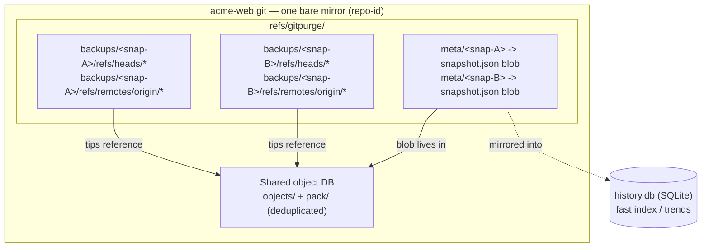
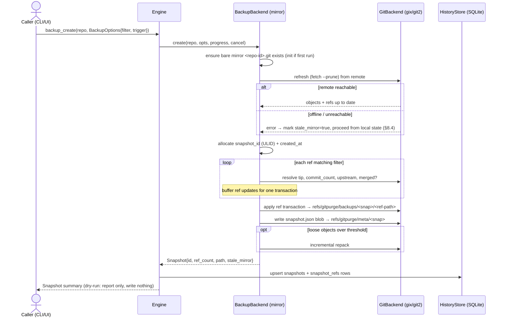
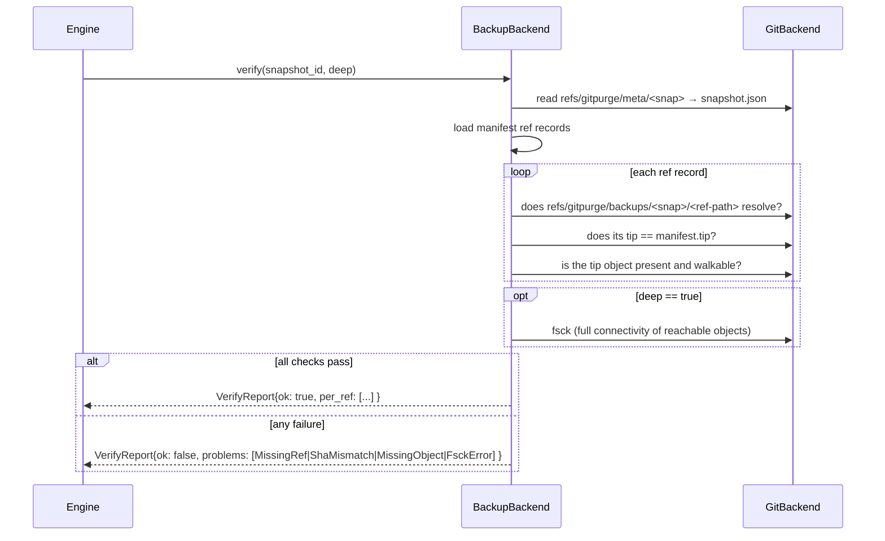
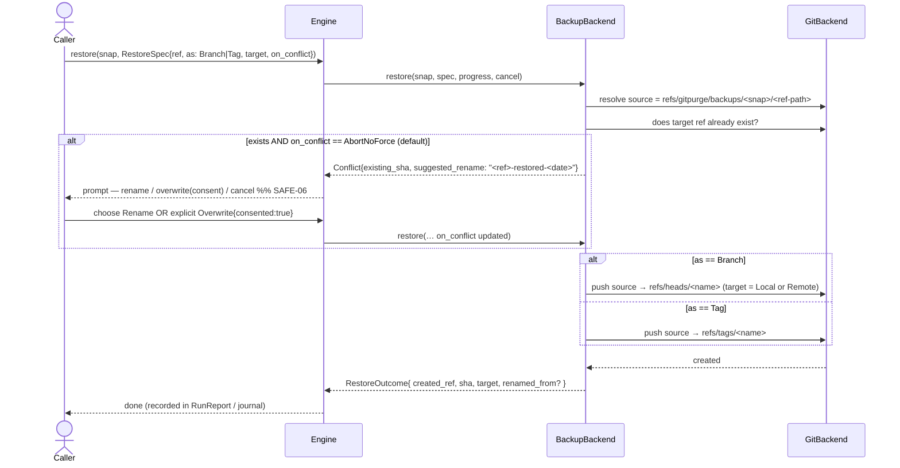
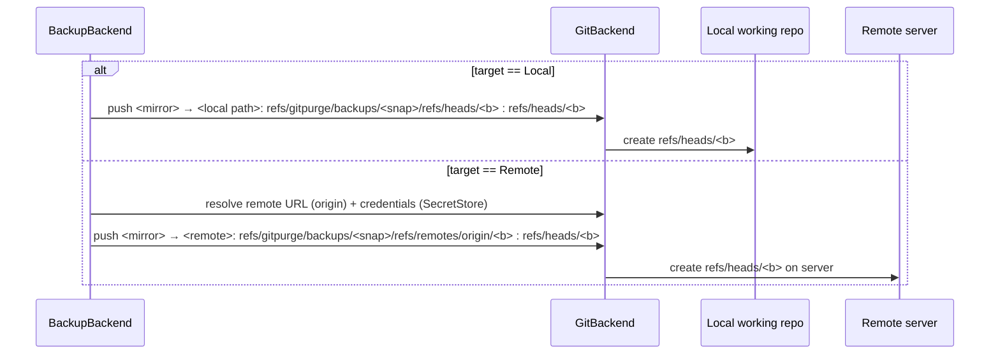
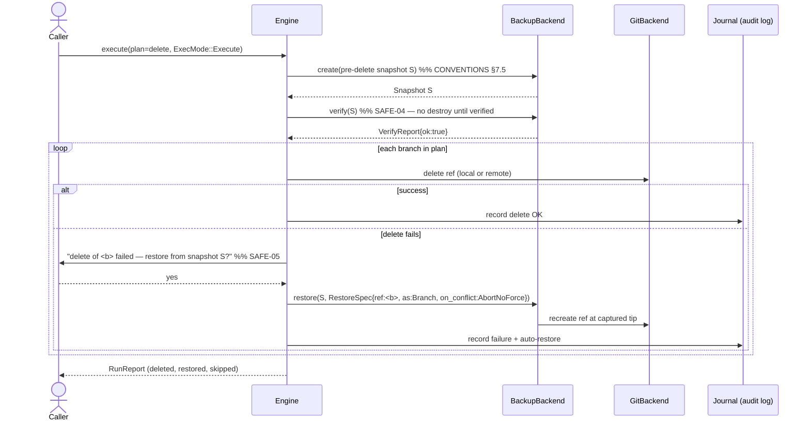

# 08 — Backup & Restore

`Status: Draft` · `Owner: Architecture` · `Last-updated: 2026-07-11` ·
`Related: ../delivery/CONVENTIONS.md (§6), 02-architecture.md, 04-core-spec.md,
11-safety-model.md, 15-extensibility.md, 00-vision-and-scope.md (R2, R10)`

> This document realizes **R2** and **R10** and is the detailed expansion of
> **[CONVENTIONS §6 — Backup model](../delivery/CONVENTIONS.md#6-backup-model-adr-0005--the-minimal-space-rule)**.
> Where this doc and CONVENTIONS disagree, CONVENTIONS wins — open a PR to fix
> this doc.

The backup subsystem is what makes destructive branch cleanup *reversible*. It is
the "net under every operation" from the product tagline. Everything here lives in
`gitpurge-core::backup` behind the [`BackupBackend`](#9-the-backupbackend-port)
port (§9); the CLI (`git-purge backup …`, `git-purge restore …`) and the Tauri UI
are thin adapters that call the same `Engine` methods.

---

## 1. Design goals

| Goal | How it is met | Source |
| :--- | :--- | :--- |
| Capture branch **name + content + commits** | A snapshot records each ref's name and pins its tip SHA into a backup ref; the tip's whole history is reachable in the shared object DB. | R2 |
| A backup "lives as a **local clone** at time of backup" | The store is a real bare git repo (`<repo-id>.git`); a snapshot is a frozen set of refs into it. | R2, legacy `backup_repos.sh` |
| **Minimal space consumption** | Snapshots share one object DB; cost is O(changed objects), not O(N × repo size). See §3. | R2 |
| **Easy restore** | `git-purge restore <snapshot> <ref>` recreates a branch or tag via one push/refspec. | R2 |
| **Auto-restore on failed delete** | Every destructive op is wrapped: on failure it offers restore from the just-created pre-op snapshot (SAFE-05). | R2, §8 |
| Restore as **new branch OR tag** | `RestoreSpec.as = Branch \| Tag` (default branch). | R2, R10 |
| **User-approved, never forced** | Restore never force-overwrites an existing ref without explicit consent; it offers a rename (SAFE-06). | R2 |
| **Portable / single-binary** | The store is plain git; no external daemon. Works offline for local targets. | R10 |

---

## 2. Where backups live

Paths resolve through the `directories` crate (never hardcoded — the legacy
scripts' `/home/mgamil/...` is exactly the anti-pattern we remove; see
[CONVENTIONS §5](../delivery/CONVENTIONS.md#5-storage--data-locations)).

```
<data_dir>/git-purge/
├── history.db                     # SQLite index (fast queries, trends)
└── backups/
    ├── acme-web.git/              # ONE bare mirror per source repo  (<repo-id>.git)
    ├── acme-api.git/
    └── …
```

- **`<repo-id>`** is a stable, filesystem-safe identifier derived from the repo's
  *canonical remote URL* plus a hash of its local path (per CONVENTIONS §5, per-repo
  state is "keyed by canonical repo URL + local path hash"). Two working copies of
  the same remote share one mirror; a repo with no remote is keyed by path hash
  alone.
- The backups root is overridable per repo and globally
  (`config.toml` + `--backup-dir`), per CONVENTIONS §5.

---

## 3. Storage model — the "minimal space" rule (ADR-0005)

### 3.1 One bare mirror, many namespaced snapshots

There is exactly **one bare mirror per source repo**. A *snapshot* does **not**
clone anything. It writes the repo's current refs into a namespaced backup ref
inside that same bare repo:

```
refs/gitpurge/backups/<snapshot-id>/<original-ref-path>
```

For example, capturing `feature/login` and the remote-tracking
`origin/feature/login` in snapshot `01J…ABC` produces:

```
refs/gitpurge/backups/01J…ABC/refs/heads/feature/login          -> <tip-sha>
refs/gitpurge/backups/01J…ABC/refs/remotes/origin/feature/login -> <tip-sha>
```

Because every snapshot's refs point into **the same object database**, the commit,
tree, and blob objects behind those tips are stored **once** and referenced by all
snapshots that contain them.



### 3.2 Why this beats N full clones

Let `S` = repo size, `N` = number of snapshots, `Δ` = objects that changed between
two snapshots (usually a handful of new commits).

| Approach | Space for N snapshots | Notes |
| :--- | :--- | :--- |
| N separate `git clone --mirror` dirs | **O(N × S)** | Every clone re-stores the entire history. A 2 GB repo × 30 snapshots ≈ 60 GB. |
| **Git Purge (this model)** | **O(S + Σ Δ)** ≈ O(S) | First snapshot pays S once; each later snapshot adds only its new objects (often ~0 if nothing changed). 30 snapshots of a quiet repo ≈ ~2 GB. |

This is the concrete meaning of "minimal space consumption" in R2/§6: **snapshots
share objects**, so taking a pre-delete snapshot before every cleanup run is
effectively free.

### 3.3 Object sharing, `gc`, and repack

- Writing snapshot refs never copies objects; it only adds ~40-byte ref entries.
  Thousands of refs are stored compactly in `packed-refs`.
- After `create`, if the loose-object count exceeds a threshold, the backend runs an
  **incremental repack** (`git repack`-equivalent) so packs stay tidy.
- **Objects are only unreferenced once *no* snapshot ref points at them.** A full
  `git gc` is therefore only ever run as part of `prune` (§6.5), after old snapshot
  refs have been removed. This guarantees `gc` can never delete an object a live
  snapshot still needs — the refs *are* the GC roots.
- All maintenance goes through `GitBackend` (gix/git2), not a shelled-out `git gc`,
  to preserve the zero-setup single-binary guarantee (CONVENTIONS §4).

### 3.4 Contrast with the legacy `backup_repos.sh`

| Aspect | Legacy `backup_repos.sh` | Git Purge |
| :--- | :--- | :--- |
| Store | One `git clone --mirror` per repo, refreshed with `remote update --prune`. | Same bare-mirror idea, **managed** and space-shared. |
| History of backups | **None.** The mirror only ever holds the *latest* state; a re-run overwrites/prunes it. If a branch was deleted upstream and then the mirror pruned, the old tip is **gone**. | Every snapshot is retained as its own immutable ref namespace. You can restore from *any* past snapshot, not just "latest". |
| What "prune" does | `--prune` **destroys** history that no longer exists upstream. | Prune is an explicit retention decision (§6.5) with `gc` gated behind ref removal; nothing is lost implicitly. |
| Space | O(repos), but no point-in-time recovery. | O(S + Σ Δ) **with** full point-in-time recovery. |
| Paths / repos | Hardcoded `/home/mgamil/...`, fixed `("backend" "frontend")`. | `directories`-resolved, any tracked repo. |
| Metadata | None. | `snapshot.json` manifest + SQLite index (§4). |

**The key improvement:** the legacy mirror is a *single moving snapshot*; Git Purge
turns it into a *versioned history of snapshots* on the same disk budget, which is
what makes reliable pre-op backup and restore possible.

---

## 4. Snapshot metadata

Each snapshot has a `snapshot.json` **manifest** that is:

1. Written as a git **blob** inside the mirror and pointed to by
   `refs/gitpurge/meta/<snapshot-id>` — so the mirror is **self-describing** and can
   be rehydrated even if `history.db` is lost or the mirror is copied to another
   machine; and
2. **Mirrored into SQLite** (`history.db`) for fast listing, filtering, and trend
   queries without walking refs.

SQLite is the fast **index**; the manifest blob is the **source of truth** carried
with the data. On a cache miss or DB rebuild, the index is reconstructed by reading
`refs/gitpurge/meta/*`.

### 4.1 `snapshot.json` schema

```jsonc
{
  "schema_version": 1,
  "snapshot_id": "01J8ZK9Q2F3M4N5P6R7S8T9V0W",   // ULID (sortable, time-ordered)
  "created_at": "2026-07-11T09:41:22Z",           // ISO-8601 UTC
  "repo": {
    "repo_id": "acme-web",                        // <repo-id> (see §2)
    "canonical_url": "https://git.example.com/acme/web.git",
    "local_path": "/…/acme/web",                  // absolute; may be null (remote-only)
    "stale_mirror": false                          // true if remote refresh was skipped (offline); see §8.4
  },
  "trigger": "pre-delete",                         // manual | pre-delete | pre-archive | scheduled
  "run_id": "01J8ZK…",                             // optional: the Run/Report this pre-op backup belongs to
  "ref_count": 842,
  "refs": [
    {
      "name": "feature/login",                     // branch name (short)
      "ref_path": "refs/heads/feature/login",      // full ref path as captured
      "tip": "3f1e9a2c…",                          // 40/64-hex tip SHA
      "commit_count": 137,                         // commits reachable from tip (bounded; see note)
      "upstream": "origin/feature/login",          // tracking ref, or null
      "merged_at_capture": true,                   // merged into the repo's base at capture time
      "is_remote": false                           // false = local head, true = remote-tracking ref
    }
    // … one record per captured ref
  ]
}
```

Field notes:

- **`snapshot_id`** is a ULID: lexicographically sortable and time-ordered, so
  `list` needs no separate sort and IDs never collide across machines.
- **`commit_count`** is computed once at capture via `GitBackend` ancestry walk. For
  very large histories it may be reported as a bounded count (e.g. capped with a
  `"commit_count_capped": true` flag) to keep `create` fast; the exact policy is a
  config knob, defaulting to exact.
- **`merged_at_capture`** freezes the classification *as of* capture so a later
  restore/report can explain "this branch was already merged when we backed it up"
  even after the base branch moves on.
- **`is_remote`** distinguishes a local head from a remote-tracking ref, which the
  restore engine needs to choose the right refspec (§7.3).

### 4.2 SQLite projection (index)

`history.db` holds two tables the backup subsystem owns (full schema in
[10-reporting-and-history.md](10-reporting-and-history.md)):

- `snapshots(snapshot_id PK, repo_id, created_at, trigger, run_id, ref_count,
  stale_mirror)`
- `snapshot_refs(snapshot_id FK, name, ref_path, tip, commit_count, upstream,
  merged_at_capture, is_remote)`

These are a pure projection of the manifests; they are never authoritative.

---

## 5. Operations overview

Exposed via `git-purge backup create|list|show|verify|prune` (CONVENTIONS §9) and
the matching `Engine`/`BackupBackend` methods. `restore` is its own top-level verb
(§7).

| Op | What it does | Mutating? |
| :--- | :--- | :--- |
| `create` | Refresh the mirror, then capture selected refs into a new snapshot. Full repo or filtered subset. | Additive only (writes refs/objects; deletes nothing) |
| `list` | Enumerate snapshots for a repo (newest first) from the SQLite index. | No |
| `show` | Print one snapshot's manifest + per-ref records. | No |
| `verify` | Integrity-check a snapshot: refs resolvable, tips match manifest, objects present; optional deep `fsck`. | No |
| `prune` | Apply a retention policy: remove selected snapshot refs, then `gc` to reclaim space. | Destructive **to old backups** (dry-run default, own confirmation) |

### 5.1 `backup create` (sequence)



Filtering mirrors the legacy default filters (CONVENTIONS §9): capture all refs, or
a subset by glob/age/merged status. A pre-op snapshot (trigger `pre-delete` /
`pre-archive`) captures **at least** every ref the plan will touch, plus (by
default) all protected refs, so nothing in the blast radius is unbacked.

### 5.2 `backup verify` (sequence)



`verify` is read-only and is the gate for **verification-before-trust** (§8.3,
SAFE-04).

---

## 6. Prune & retention

`prune` is the *only* operation that removes backup data, so it inherits the full
safety model (dry-run default, confirmation, logged — CONVENTIONS §7).

- **Retention policy** (`RetentionPolicy`) selects which snapshots to keep, by any
  combination of:
  - `keep_last: N` — keep the N newest snapshots;
  - `keep_within: Duration` — keep everything newer than a cutoff;
  - `keep_triggers: [manual, …]` — always keep e.g. manual snapshots;
  - `min_keep: N` — hard floor so prune can never empty the store.
- Prune deletes the selected `refs/gitpurge/backups/<snap>/*` and
  `refs/gitpurge/meta/<snap>` refs (via a ref transaction), then runs a full `gc` so
  now-unreferenced objects are reclaimed. Because the removed snapshot's refs are
  gone *before* `gc`, only truly orphaned objects are collected (§3.3).
- The SQLite index rows are removed in the same transaction as a post-step.
- Dry-run prints the reclaimable space estimate and the exact snapshots that would
  be dropped; nothing is removed without `--execute` + confirmation.

---

## 7. Restore flows

Restore reads a backup ref and **recreates** a ref elsewhere. It never mutates the
snapshot itself. `RestoreSpec` captures intent:

```rust
pub struct RestoreSpec {
    pub refs: Vec<String>,          // one or more captured ref names/paths ("*" = all)
    pub as_kind: RestoreAs,         // Branch (default) | Tag
    pub target: RestoreTarget,      // Local(working repo) | Remote(remote name or URL)
    pub rename: Option<String>,     // explicit new name (overrides derived name)
    pub on_conflict: OnConflict,    // AbortNoForce (default) | Rename | Overwrite { consented: bool }
}

pub enum RestoreAs { Branch, Tag }
pub enum RestoreTarget { Local, Remote(RemoteRef) }
pub enum OnConflict { AbortNoForce, Rename, Overwrite { consented: bool } }
```

### 7.1 Restore as branch (default) / as tag, with conflict policy



- **Default is `AbortNoForce`.** A restore that would clobber an existing ref stops
  and returns a `Conflict` carrying a suggested non-colliding name. The user must
  either choose **rename** or opt into an **explicit, consented overwrite**
  (a force push). There is no silent force (SAFE-06 — matches R2 "never force
  restore").
- **Restore as tag** targets `refs/tags/<name>`; useful for immortalizing a deleted
  branch's tip without reintroducing a live branch.

### 7.2 Restore target: local working repo **or** remote server

This generalizes the legacy `restore_repos.sh -t local|remote`.



- **Local** restore recreates branches in the developer's working repo
  (legacy: `git --git-dir=BACKUP push SRC 'refs/heads/*:refs/heads/*'`).
- **Remote** restore pushes the captured remote-tracking refs back up to
  `refs/heads/*` on the server (legacy: `push URL 'refs/remotes/origin/*:refs/heads/*'`).
  Auth and transport go through `GitBackend` + `SecretStore`
  ([09-authentication.md](09-authentication.md)); Git Purge builds explicit refspecs
  rather than shelling out.

### 7.3 Auto-restore on failed delete (SAFE-05)

Every destructive op (`delete`, `archive`) runs inside a wrapper that has a
pre-op snapshot in hand (created and **verified** first — §8.3). If a per-branch
mutation fails, restore from that snapshot is offered immediately.



This is the same flow whether triggered by `git-purge delete --execute` or the UI's
"Execute" button (architecture doc §6, step 5).

---

## 8. Verification-before-trust, cross-platform & offline

### 8.1 Cross-platform notes

- All paths via `directories`; the store is a plain bare git repo (portable).
- Avoid symlinks in the store. On **case-insensitive filesystems** (default macOS,
  Windows), two refs differing only in case (`Feature/X` vs `feature/x`) can collide;
  the backend keeps refs in `packed-refs` (a single file, case-exact) and surfaces a
  clear warning rather than silently merging them.
- Ref transactions use `GitBackend`'s atomic update API so a crash mid-`create`
  leaves either all or none of a snapshot's refs (no half-written snapshot).

### 8.2 Performance notes (large repos, thousands of refs)

- The motivating repos had **843** and **2,356** branches (vision §Problem). Snapshot
  refs are written in **one batched transaction** and stored in `packed-refs`, so
  `create` is O(refs) in ref-writes and O(changed objects) in data — not O(repo size).
- `list`/`show` read the SQLite index, never the object DB, so they are instant even
  with hundreds of snapshots.
- Repack/`gc` are amortized: incremental after `create`, full only on `prune`.
- Long ops accept a `ProgressSink` + `CancellationToken` (architecture §5), so the UI
  can show a bar and cancel a huge snapshot mid-flight.

### 8.3 Verification-before-trust (SAFE-04)

**A destructive op is only allowed after its pre-op snapshot passes `verify`.** The
delete/archive wrapper calls `verify(S)` (§5.2) and refuses to proceed if any ref is
unresolvable, any tip mismatches, or (in deep mode) `fsck` fails. This closes the
"we thought we had a backup but it was corrupt" gap: the net is tested *before* the
fall. Ties to CONVENTIONS §7.5 ("a pre-op snapshot is created **and verified** before
any delete/archive").

### 8.4 Offline / remote-unreachable behavior

- **`create` for a local repo works fully offline** — it reads local refs and objects.
  If the mirror's remote refresh fails (no network / server down), the snapshot still
  proceeds from the last-known mirror state and records `stale_mirror: true` in the
  manifest, with a warning. The pre-op backup is therefore never *blocked* by a flaky
  network, but the staleness is auditable.
- **Restore to `Local` works offline.** **Restore to `Remote` requires connectivity**
  and returns a clear, typed `GitPurgeError` (with a retry hint) if the server is
  unreachable — it never partially applies.
- `verify` is fully offline (operates on the local store).

### 8.5 The SAFE-* register (backup/restore invariants)

The canonical safety register lives in [11-safety-model.md](11-safety-model.md); the
backup subsystem owns these entries:

| ID | Invariant | Enforced in |
| :-- | :--- | :--- |
| **SAFE-04** | Verification-before-trust: no destroy until the pre-op snapshot passes `verify`. | §8.3, delete/archive wrapper |
| **SAFE-05** | Auto-restore-on-failed-delete: a failed destructive op offers restore from the pre-op snapshot. | §7.3 |
| **SAFE-06** | Consent-gated restore: never force-overwrite an existing ref without explicit consent; offer rename. | §7.1 |

(CONVENTIONS §7 also covers dry-run default, confirmation, protected refs, the
tags-never-deleted guard, and append-only journaling, which apply to backup/restore
commands too.)

---

## 9. The `BackupBackend` port

The mirror-based strategy above is the **default adapter**
(`MirrorBackupBackend`). Alternative strategies — git **bundle** files, **tarballs**,
or a **cloud** object store — are added by implementing the same trait, with no
change to the `backup`/`action` services (Requirement 6). See
[15-extensibility.md](15-extensibility.md#c-a-new-backuprestore-strategy).

```rust
/// Port: a strategy for capturing, listing, verifying, restoring, and pruning
/// point-in-time backups of a repository's refs.
///
/// Callers (the `backup` and `action` services) depend ONLY on this trait —
/// never on gix/git2 or a filesystem layout. The default adapter is
/// `MirrorBackupBackend` (§3). Adapters MUST NOT leak backend types across the
/// boundary (see 15-extensibility.md anti-patterns).
#[async_trait::async_trait]
pub trait BackupBackend: Send + Sync {
    /// Machine id of this strategy: "mirror" | "bundle" | "tarball" | "s3" | …
    fn kind(&self) -> BackupKind;

    /// Capture a snapshot of the refs selected by `opts.filter` for `repo`.
    /// Additive only: writes refs/objects, deletes nothing.
    async fn create(
        &self,
        repo: &RepoId,
        opts: &BackupOptions,
        progress: &dyn ProgressSink,
        cancel: &CancellationToken,
    ) -> Result<Snapshot, GitPurgeError>;

    /// List snapshots for `repo`, newest first (from the index).
    async fn list(&self, repo: &RepoId) -> Result<Vec<SnapshotMeta>, GitPurgeError>;

    /// Load one snapshot's full manifest + per-ref records.
    async fn show(&self, id: &SnapshotId) -> Result<Snapshot, GitPurgeError>;

    /// Integrity-check a snapshot (§5.2). `deep` runs a full fsck.
    async fn verify(&self, id: &SnapshotId, deep: bool) -> Result<VerifyReport, GitPurgeError>;

    /// Restore one or more refs from a snapshot to a Local or Remote target (§7).
    /// Honors OnConflict; never force-overwrites without explicit consent.
    async fn restore(
        &self,
        id: &SnapshotId,
        spec: &RestoreSpec,
        progress: &dyn ProgressSink,
        cancel: &CancellationToken,
    ) -> Result<RestoreOutcome, GitPurgeError>;

    /// Apply a retention policy: remove selected snapshots, then reclaim space (§6).
    async fn prune(
        &self,
        repo: &RepoId,
        policy: &RetentionPolicy,
        mode: ExecMode,               // dry-run default
    ) -> Result<PruneReport, GitPurgeError>;
}

/// Options for `create`.
pub struct BackupOptions {
    pub filter: RefFilter,            // all | by glob/age/merged status
    pub trigger: BackupTrigger,       // Manual | PreDelete | PreArchive | Scheduled
    pub run_id: Option<RunId>,        // link a pre-op backup to its Run/Report
    pub refresh_remote: bool,         // fetch --prune before capture (default true)
}

pub enum BackupTrigger { Manual, PreDelete, PreArchive, Scheduled }
pub enum BackupKind { Mirror, Bundle, Tarball, Cloud(String) }

/// Result of an integrity check.
pub struct VerifyReport {
    pub ok: bool,
    pub per_ref: Vec<RefCheck>,
    pub problems: Vec<VerifyProblem>, // MissingRef | ShaMismatch | MissingObject | FsckError
}
```

`Snapshot`, `SnapshotMeta`, `SnapshotId`, `RepoId`, `RestoreOutcome`, `RunReport`,
`ExecMode`, `ProgressSink`, and `CancellationToken` are the shared model/port types
from [04-core-spec.md](04-core-spec.md) and [02-architecture.md](02-architecture.md).

---

## 10. Traceability

| Requirement / invariant | Where satisfied |
| :--- | :--- |
| **R2** — back up all branches before deletion (name/content/commits) as a local clone at minimal space; easily restorable; auto-restore on failed delete; restore as branch or tag; never force restore | §1, §3 (minimal space), §5.1 (capture), §7.1 (branch/tag + no force), §7.3 (auto-restore) |
| **R10** — single binary / portable; restore semantics per R2 | §2 (plain-git store, no daemon), §8.1 (portable), §8.4 (offline local restore) |
| **SAFE-04** — verification-before-trust | §5.2, §8.3 |
| **SAFE-05** — auto-restore-on-failed-delete | §7.3 |
| **SAFE-06** — consent-gated restore (no forced overwrite) | §7.1 |
| CONVENTIONS **§6** (backup model) | §3, §4 (this doc is its expansion) |
| CONVENTIONS **§7.5** (backup-before-destroy, verified) | §7.3, §8.3 |
| Requirement **R6** (pluggable backup strategy) | §9, [15](15-extensibility.md) |

Related: [11-safety-model.md](11-safety-model.md) (full SAFE register),
[10-reporting-and-history.md](10-reporting-and-history.md) (history.db schema),
[09-authentication.md](09-authentication.md) (remote restore auth).
