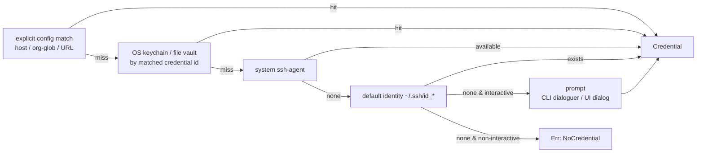

# 09 — Authentication & Secure Storage

`Status: Draft` · `Owner: Security` · `Last-updated: 2026-07-11` ·
`Related: [../delivery/CONVENTIONS.md](../delivery/CONVENTIONS.md), [02-architecture.md](02-architecture.md), [04-core-spec.md](04-core-spec.md), [05-cli-spec.md](05-cli-spec.md), [14-security.md](14-security.md), [../delivery/DEFINITION_OF_DONE.md](../delivery/DEFINITION_OF_DONE.md)`

Implements **Requirement 5** (multiple git auth methods with secure storage and
system-identity fallback) and enforces **SAFE-07** (no secret material ever appears
in logs, errors, snapshots, or reports). All logic in this doc lives in
`gitpurge-core::auth`; the CLI (`git-purge auth …`) and the Tauri backend
(`auth_*` commands) are thin adapters (see [CONVENTIONS §2](../delivery/CONVENTIONS.md)).

---

## 1. Scope & goals

- Authenticate git **reads** (ls-remote, fetch) and **writes** (push, delete of
  remote branches) against arbitrary remotes, across providers.
- Support four credential kinds plus a **system fallback** so the zero-setup happy
  path (a user with a working `ssh-agent` / default identity) needs no configuration.
- Store secrets in the **OS keychain** where available, with an **encrypted-file
  fallback** for headless / CI / keychain-less environments.
- Select the right credential **per remote** automatically (match by host/URL).
- Guarantee secrets are never persisted in the config file, the SQLite history DB,
  backup snapshots, reports, logs, or error messages.

Non-goals (v1): OAuth device/browser flows, GitHub App tokens, credential
*rotation* automation, and per-user multi-account UIs beyond what `auth` provides.

## 2. Supported authentication methods

| Method | `method` value | Secret material | Public metadata (safe to list) |
| :--- | :--- | :--- | :--- |
| SSH key file | `ssh-key` | Optional passphrase | key path, username (default `git`), public-key fingerprint |
| HTTPS user/password | `https-basic` | Password | host, username |
| Personal access token (Bearer / basic) | `token` | Token | host, username (`oauth2`/`x-access-token` for many hosts), token **last-4** |
| System SSH agent / default identity | `ssh-agent` | *(held by the agent, never by us)* | username, agent socket presence |

**Fallback identities.** When no explicit credential matches a remote, the
`CredentialResolver` (see §5) falls back to:

1. the running **`SSH_AUTH_SOCK` agent** (`ssh-agent`), then
2. the **default on-disk identities** `~/.ssh/id_ed25519`, `~/.ssh/id_ecdsa`,
   `~/.ssh/id_rsa` (first that exists), and
3. **user-provided** keys/identities registered via `auth add … --method ssh-key`.

This mirrors the behavior of the legacy scripts (which relied on the ambient SSH
identity) while making explicit credentials first-class and portable across machines.

### 2.1 Per-remote credential selection (match by host/URL)

Every stored credential has a **match spec**. On each operation the resolver builds
the remote's normalized coordinates and picks the **most specific** matching
credential:

```
exact URL match            (e.g. https://github.com/acme/api.git)   ← highest priority
  > host + path/org glob   (e.g. github.com/acme/*)
    > host match           (e.g. github.com)
      > scheme default     (any ssh:// → ssh-agent fallback)
        > system fallback  (agent → default identity)               ← lowest priority
```

URL normalization canonicalizes scheme, lowercases the host, strips a default port,
drops a trailing `.git`, and understands the SCP-like SSH form
(`git@github.com:acme/api.git` → host `github.com`, path `acme/api`). Ties (two specs
of equal specificity) are a **configuration error** surfaced by `auth test` and
`scan`, never silently resolved.

```toml
# <config_dir>/git-purge/config.toml  — credential ENTRIES hold metadata only.
# The secret itself lives in the SecretStore, referenced by `id`.
[[auth.credential]]
id       = "github-ssh"          # SecretStore account key
method   = "ssh-key"
match    = "github.com"          # host | host/org-glob | full URL
username = "git"
key_path = "~/.ssh/id_ed25519"   # path is metadata, NOT a secret

[[auth.credential]]
id       = "acme-gitlab-token"
method   = "token"
match    = "gitlab.acme.com/acme/*"
username = "oauth2"
```

## 3. The `SecretStore` port

`SecretStore` is one of the hexagonal **ports** from
[architecture §3](02-architecture.md#3-layered-design-inside-gitpurge-core). It stores
only opaque secret bytes keyed by `(service, account)`; it knows nothing about git.

```rust
// gitpurge-core::auth
use zeroize::Zeroizing;

/// Namespacing for stored secrets. `service` is constant ("git-purge");
/// `account` is a credential id from config (e.g. "github-ssh").
#[derive(Clone, Debug, PartialEq, Eq)]
pub struct SecretKey { pub service: String, pub account: String }

/// A secret value whose backing buffer is zeroized on drop.
pub type Secret = Zeroizing<Vec<u8>>;

#[derive(Clone, Copy, Debug, PartialEq, Eq)]
pub enum SecretBackendKind { Keychain, EncryptedFile }

pub trait SecretStore: Send + Sync {
    /// Fetch a secret, or `None` if absent. Never logs the value.
    fn get(&self, key: &SecretKey) -> Result<Option<Secret>, GitPurgeError>;
    /// Store/overwrite a secret. Takes the buffer by value and consumes it.
    fn set(&self, key: &SecretKey, value: Secret) -> Result<(), GitPurgeError>;
    /// Remove a secret. Idempotent.
    fn delete(&self, key: &SecretKey) -> Result<(), GitPurgeError>;
    /// Enumerate stored ACCOUNTS (keys) only — never values. For `auth list`.
    fn accounts(&self) -> Result<Vec<SecretKey>, GitPurgeError>;
    /// Which concrete backend is active (for `auth list` / diagnostics).
    fn kind(&self) -> SecretBackendKind;
}
```

Note `SecretStore` returns/accepts `Zeroizing<Vec<u8>>`, so secret buffers are wiped
from memory when dropped (§7). `Debug` on `SecretKey` is safe (metadata only); there
is deliberately **no `Debug`/`Display` that exposes a `Secret`**.

### 3.1 Adapters

| Adapter | Crate | Platforms / use |
| :--- | :--- | :--- |
| `KeyringSecretStore` | [`keyring`](https://crates.io/crates/keyring) | macOS **Keychain**, Windows **Credential Manager**, Linux **Secret Service** (libsecret / gnome-keyring / KWallet over D-Bus). Default when available. |
| `EncryptedFileSecretStore` | [`age`](https://crates.io/crates/age) (+ `argon2` KDF) | Headless / CI / keychain-less. Single encrypted vault at `<data_dir>/git-purge/secrets.age`. |

`service` is the constant `"git-purge"`; on macOS/Windows this becomes the keychain
item's service/target name, so items are discoverable and revocable by the user with
native tools.

#### Encrypted-file fallback (`EncryptedFileSecretStore`)

- **Format:** an `age` v1 encrypted file holding a small serialized map
  `account → secret bytes`. (`aes-gcm` is an acceptable equivalent if `age` cannot
  be used on a target; the on-disk header records which.) The whole vault is
  re-encrypted on every `set`/`delete` — vaults are tiny.
- **Key derivation:** the age identity (X25519 keypair, or a symmetric key for the
  `aes-gcm` variant) is unlocked by **either**:
  - an **OS-protected secret** — a random per-install master key sealed *in the OS
    keychain* when a keychain is present but the app is configured to prefer a file
    vault (e.g. to keep all secrets in one portable file); **or**
  - a **user passphrase** — stretched with **Argon2id** (per-vault random salt, tuned
    memory/iterations) into the symmetric key. Chosen automatically when no keychain
    exists.
- **File permissions:** created `0600` (owner-only) on Unix; parent dir `0700`.
- The passphrase, when used interactively, is held in `Zeroizing` and dropped
  immediately after deriving the key.

## 4. `Credential` and how it flows into `GitBackend`

The resolver produces a concrete `Credential` that adapters translate into
transport-specific auth. `GitBackend` (the git port,
[ADR-0002](adr/)) stays credential-agnostic — it receives an already-resolved
credential per operation.

```rust
pub enum Credential {
    /// Explicit key file. Passphrase (if any) is zeroized.
    SshKey { username: String, private_key: PathBuf,
             public_key: Option<PathBuf>, passphrase: Option<Secret> },
    /// Delegate to the running ssh-agent / default identity.
    SshAgent { username: String },
    /// HTTPS basic auth.
    UserPass { username: String, password: Secret },
    /// Bearer / token (many hosts accept it as basic with a fixed username).
    Token { username: Option<String>, token: Secret },
    /// Let the transport use its own default (no explicit credential).
    Default,
}
```

### 4.1 git2 (push / delete / authenticated fetch)

Per [CONVENTIONS §4](../delivery/CONVENTIONS.md), **git2 owns push/auth flows**. The
`Git2Backend` installs a `git2::RemoteCallbacks::credentials` callback that maps the
resolved `Credential` onto `git2::Cred`, respecting the `allowed_types` git2 offers:

```rust
let mut cb = git2::RemoteCallbacks::new();
let cred = credential.clone(); // an Arc/borrow in practice
cb.credentials(move |_url, username_from_url, allowed| {
    match &cred {
        Credential::SshKey { username, private_key, public_key, passphrase } =>
            git2::Cred::ssh_key(
                username_from_url.unwrap_or(username),
                public_key.as_deref(),
                private_key,
                passphrase.as_ref().map(|s| /* &str view, zeroized after */ ..),
            ),
        Credential::SshAgent { username } =>
            git2::Cred::ssh_key_from_agent(username_from_url.unwrap_or(username)),
        Credential::UserPass { username, password } =>
            git2::Cred::userpass_plaintext(username, /* &str view */ ..),
        Credential::Token { username, token } =>
            git2::Cred::userpass_plaintext(username.as_deref().unwrap_or("oauth2"), /* token */ ..),
        Credential::Default if allowed.contains(git2::CredentialType::DEFAULT) =>
            git2::Cred::default(),
        Credential::Default =>
            git2::Cred::ssh_key_from_agent(username_from_url.unwrap_or("git")),
    }
});
```

The callback pulls secret bytes only for the duration of the call; the underlying
`Secret` remains zeroizing.

### 4.2 gix (reads)

`GixBackend` handles ref enumeration / commit walking. For **authenticated** reads it
configures gix's transport: HTTPS uses gix's credential mechanism seeded from the
resolved `Credential`; SSH uses the system SSH program (thus the agent / default
identity) or the configured key path. Where an authenticated read is needed but gix's
auth surface is insufficient, the `CompositeGitBackend` **routes that read to git2**
(the same routing seam used for pushes). Anonymous reads (public HTTPS) need no
credential.

### 4.3 The `CredentialResolver`

```rust
pub struct AuthContext<'a> {
    pub remote_url: &'a str,      // as configured on the remote
    pub host: &'a str,            // normalized
    pub operation: AuthOp,        // LsRemote | Fetch | Push
    pub interactive: bool,        // false in CI / --quiet / non-tty
}

pub trait CredentialResolver: Send + Sync {
    fn resolve(&self, ctx: &AuthContext) -> Result<Credential, GitPurgeError>;
}
```

**Resolution order (per operation):**



In non-interactive contexts (CI, `--quiet`, no TTY, or a Tauri call with no UI
prompt registered) the prompt step is skipped and a typed
`GitPurgeError::NoCredential { host }` is returned — never a hang.

## 5. `auth` command semantics

Identical logic backs both the CLI (`git-purge auth …`) and the Tauri `auth_*`
commands (`auth_add`, `auth_list`, `auth_remove`, `auth_test`).

| Subcommand | Behavior |
| :--- | :--- |
| `auth add` | Register a credential: write the **metadata** entry to `config.toml` and the **secret** to the `SecretStore` under `(service="git-purge", account=<id>)`. Secret is read from a prompt or `--secret-stdin` (never a CLI arg — args leak into shell history / process lists). |
| `auth list` | Print **metadata only** — id, host/match, method, username, key path, key **fingerprint** (SHA-256 of the public key), token **last-4**, and the active `SecretBackendKind`. Never prints secret material. `--json` emits the same redacted view. |
| `auth remove <id>` | Delete both the config entry and the stored secret (idempotent). |
| `auth test <id \| --remote <url>>` | Perform a **no-op authenticated handshake**: an `ls-remote`-equivalent that lists remote refs using the resolved credential. No objects fetched, nothing written. Reports success, the resolved method, and the redacted identity used (fingerprint / last-4). |

`auth test` is the single supported way to validate a credential; it is also what the
UI's "Test connection" button calls. Example (redacted) output:

```
$ git-purge auth test github-ssh
✔ github.com — ssh-key (git) key SHA256:v0Xr…9kQ  →  refs listed: 128
```

## 6. Security requirements (SAFE-07 and supporting rules)

- **No secrets in logs/errors.** `tracing` fields never carry secret values;
  `GitPurgeError` variants that mention auth carry only host/method/redacted
  identity. Any `Display`/`Debug` that could touch a secret is hand-written to redact.
  A regression test (`safe_07_*`, see [12-testing-strategy.md](12-testing-strategy.md#4-safety-regression-tests-safe-01safe-07))
  feeds a known token through resolve → error → log capture → snapshot manifest →
  report and asserts the token string never appears.
- **No secrets in snapshots/reports.** Snapshot manifests
  ([backup model, CONVENTIONS §6](../delivery/CONVENTIONS.md)) and generated reports
  contain repo/branch metadata only; the credential layer never writes into them.
- **No secrets in the history DB.** The SQLite schema
  ([`<data_dir>/git-purge/history.db`](../delivery/CONVENTIONS.md)) has **no** columns
  for secret material; only credential **ids** (references) may appear.
- **Zeroization.** All in-memory secret buffers use
  [`zeroize`](https://crates.io/crates/zeroize) (`Zeroizing<Vec<u8>>` / `Secret`
  wrappers). Passphrases and derived keys are dropped as soon as the transport call
  or KDF completes.
- **Least exposure.** Secrets enter the process only at `resolve()` time and only for
  the operation at hand; they are not cached across operations beyond the lifetime of
  a single `Engine::execute`/`fetch` call unless the OS keychain itself caches.
- **No secret-bearing CLI args.** `auth add` reads secrets from a prompt or stdin,
  never from `argv` (argv is world-readable via `/proc` and shell history).

## 7. Platform notes & graceful degradation

| Platform | Keychain backend | Notes |
| :--- | :--- | :--- |
| macOS | Keychain Services | Works out of the box; items appear in Keychain Access under service `git-purge`. |
| Windows | Credential Manager | Items appear under Generic Credentials `git-purge:<id>`. |
| Linux (desktop) | Secret Service (libsecret) | Requires a running secret service (gnome-keyring / KWallet) on the D-Bus session. |
| Linux (headless/CI/SSH) | *(none)* → file vault | No D-Bus session → `KeyringSecretStore` init fails; auto-degrade to `EncryptedFileSecretStore`. |

**Graceful degradation.** On startup the auth module probes for a working keychain.
If unavailable, it selects `EncryptedFileSecretStore` and emits a single
`WARN`-level, secret-free notice; `auth list` shows the active backend so the user
always knows where secrets live. The choice can be forced via config
(`[auth] backend = "keychain" | "file"`) for reproducible CI. Nothing about the
credential *model* changes — only the storage adapter — because both sit behind
`SecretStore`.

## 8. Traceability

| Requirement / invariant | Where satisfied |
| :--- | :--- |
| **R5** — SSH key, HTTPS creds, token, system-identity fallback, user-provided keys | §2, §2.1, §4, §5 (implemented in P6, see [ROADMAP](ROADMAP.md#p6--authentication--secure-storage-9-ed)) |
| **R5** — secure storage | §3, §3.1 (keychain + encrypted-file fallback) |
| **SAFE-07** — no secret in logs/errors/snapshots/reports | §6 + named regression test in [12-testing-strategy.md](12-testing-strategy.md#4-safety-regression-tests-safe-01safe-07) |
| Shared-core contract (R6) | auth logic lives in `gitpurge-core::auth`; CLI `auth` and Tauri `auth_*` are thin adapters ([CONVENTIONS §2/§9/§10](../delivery/CONVENTIONS.md)) |

See [14-security.md](14-security.md) for the surrounding threat model and secret-handling
posture.
