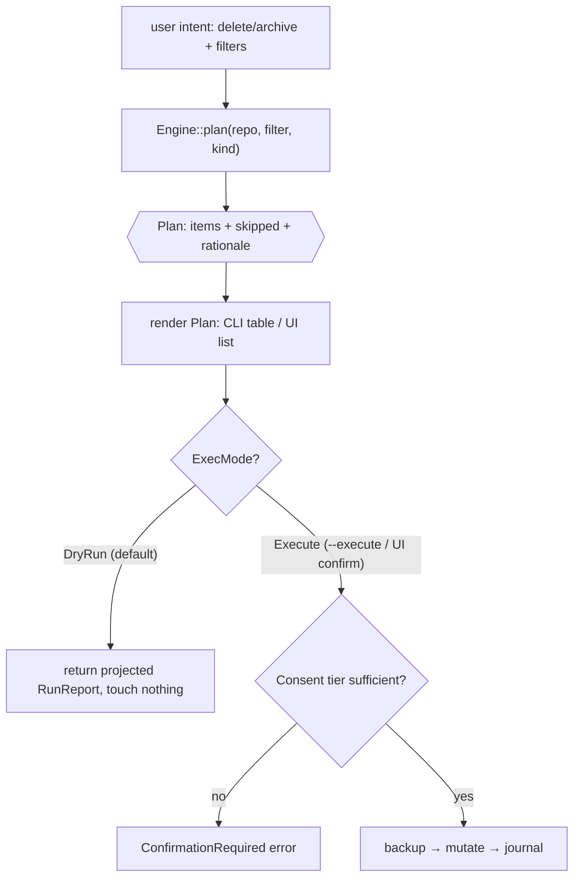
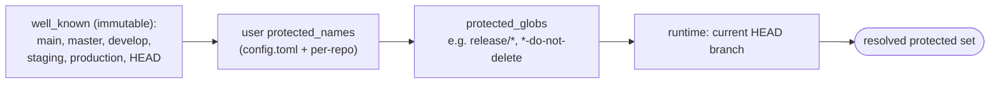

# 11 — Safety Model

`Status: Draft` · `Owner: Safety/Architecture` · `Last-updated: 2026-07-11` ·
`Related: [03-domain-model.md](03-domain-model.md), [04-core-spec.md](04-core-spec.md), [08-backup-and-restore.md](08-backup-and-restore.md), [../delivery/CONVENTIONS.md](../delivery/CONVENTIONS.md), [../delivery/DEFINITION_OF_DONE.md](../delivery/DEFINITION_OF_DONE.md)`

## 0. Why this doc exists

Git Purge's promise is in its tagline: *"Safely purge stale branches — with a net under
every operation."* The scripts this tool generalizes could destroy unmerged work with a
single `git push --delete`. This document specifies the **net**: the guarantees, where
each is enforced in code (by which port/service from [04-core-spec.md](04-core-spec.md)),
the failure it prevents, and the **named regression test** (`SAFE-01`..`SAFE-07` from
[DEFINITION_OF_DONE.md](../delivery/DEFINITION_OF_DONE.md)) that keeps it true forever.

The model is normative: it binds both faces. Because the CLI and UI are thin adapters
over the same `Engine` (architecture §1), every guarantee below holds *identically*
whether invoked from `git-purge delete --execute` or the UI's Execute button.

Two principles resolve any ambiguity:
1. **Fail safe.** When state is unknown (unreadable default branch, ambiguous merge
   status), treat the branch as *unmerged* and *not eligible* for automatic destruction.
2. **Nothing destructive is unrecoverable without explicit, informed opt-out.**

---

## 1. The six safety rules (CONVENTIONS §7)

Each rule below is expanded with: **Guarantee**, **Enforced by** (the service/port),
**Prevents** (the failure mode), and **Guarded by** (the regression test). The seven
`SAFE-*` tests map onto the six rules as shown — rule 6 (journaling) and the backup
model (rule 5) between them cover `SAFE-05`/`SAFE-06`/`SAFE-07`.

### Rule 1 — Dry-run is the default (`SAFE-01`)

- **Guarantee:** every mutating command computes and returns a `Plan` and changes
  nothing unless `ExecMode::Execute` is explicitly requested.
- **Enforced by:** `Engine::plan` always runs first; `Engine::execute` branches on
  `ExecMode` and in `DryRun` returns the *projected* `RunReport` without calling any
  mutating `GitBackend` method (04 §2). The default `ExecMode` is `DryRun` in both
  adapters.
- **Prevents:** accidental bulk deletion from a mistyped filter — you always see the
  list first.
- **Guarded by:** `SAFE-01` — "mutating commands are dry-run unless `--execute`/explicit
  confirm."

### Rule 2 — Confirmation required; destructive ops need a stronger tier (`SAFE-01`)

- **Guarantee:** even with `--execute`, execution proceeds only when the matching
  `Consent` tier is present; unmerged/forced actions demand the *destructive* tier.
- **Enforced by:** `Engine::execute(plan, mode, consent, …)` checks each `PlanItem`'s
  `Destructiveness` against `Consent`; a mismatch returns
  `GitPurgeError::ConfirmationRequired` (04 §5). See §3 for the tier mechanics.
- **Prevents:** treating a dangerous unmerged-delete like a routine merged-delete.
- **Guarded by:** `SAFE-01` (the confirm half) — plus §3's tier tests.

### Rule 3 — Protected refs are never touched (`SAFE-02`)

- **Guarantee:** `main`, `master`, `develop`, `staging`, `production`, `HEAD`, the
  currently checked-out branch, plus the user's protected names and glob patterns, can
  never be selected for `Delete` or `Archive`.
- **Enforced by:** the `policy` engine's protection resolver (04 §1 module map, doc 03
  §5 `ProtectionPolicy`). `well_known` is **seeded and immutable** — user config may
  *add* but never *remove* it. Protected branches are dropped into `Plan.skipped` with a
  `ProtectionReason`, never `Plan.items`. A defense-in-depth check also runs inside
  `action` immediately before each mutation.
- **Prevents:** deleting a release/integration branch or your current HEAD.
- **Guarded by:** `SAFE-02` — "protected refs … are never deleted/archived."

### Rule 4 — Tags are never deleted by branch operations (`SAFE-03`)

- **Guarantee:** a `delete`/`archive` (branch) operation can never remove a tag, even if
  a name collides.
- **Enforced by:** `scan`/`plan` only ever populate `Action::Delete`/`Archive` from
  `RefKind::LocalBranch`/`RemoteBranch`; the `GitBackend::delete_ref` adapter refuses a
  `refs/tags/*` target unless `RefKind::Tag` is *explicitly* requested (04 §3.1) — a
  backstop mirroring the legacy scripts' explicit tag guard.
- **Prevents:** collateral tag loss (tags are the historical record; often irreplaceable).
- **Guarded by:** `SAFE-03` — "tags are never deleted by branch operations."

### Rule 5 — Backup before destroy (`SAFE-04`, and `SAFE-05` on failure)

- **Guarantee:** a **verified** pre-op `Snapshot` exists before any delete/archive,
  unless the user explicitly passes `--no-backup`. A failed destructive op offers restore
  from that snapshot.
- **Enforced by:** `Engine::execute` calls `backup_create` then `backup_verify` before
  the first mutation (04 §2; snapshot model in [08-backup-and-restore.md](08-backup-and-restore.md)
  / CONVENTIONS §6). If `plan.requires_snapshot && !verified` it aborts with
  `GitPurgeError::BackupUnverified`. Each mutation is wrapped so a failure triggers an
  **offered** restore from the just-created snapshot; declining is a no-op.
- **Prevents:** irreversible loss — the "net" under every operation.
- **Guarded by:** `SAFE-04` (verified snapshot exists) and `SAFE-05` (failed delete
  offers restore; declining changes nothing).

### Rule 6 — Every mutating op is logged (audit journal)

- **Guarantee:** every attempted and completed mutation is appended to a tamper-evident,
  append-only journal for audit and undo.
- **Enforced by:** `HistoryStore::append_journal` (04 §3.3), written by `action` around
  each op — including refusals and cancellations. See §7.
- **Prevents:** silent, untraceable changes; enables reconstruction and post-hoc restore.
- **Guarded by:** covered by the journaling assertions in the `execute` tests and, for
  redaction, `SAFE-07` (no secrets in journal/logs/reports).

**Rule → test matrix:**

| Rule | Enforcement site (04)                      | Test(s)              |
| :--- | :----------------------------------------- | :------------------- |
| 1 Dry-run default        | `Engine::plan` / `execute` ExecMode  | `SAFE-01`            |
| 2 Confirmation tiers     | `execute` + `Consent`                | `SAFE-01`            |
| 3 Protected refs         | `policy` resolver + `action` recheck | `SAFE-02`            |
| 4 Tag guard              | `scan`/`plan` + `GitBackend::delete_ref` | `SAFE-03`        |
| 5 Backup-before-destroy  | `execute` → `backup_create`/`verify`  | `SAFE-04`, `SAFE-05` |
| 6 Audit journal          | `HistoryStore::append_journal`       | (journaling asserts) + `SAFE-07` |
| — Restore never force-overwrites | `restore` + `OnConflict`     | `SAFE-06`            |
| — No secrets leak        | `SecretStore` / redaction everywhere | `SAFE-07`            |

---

## 2. Dry-run-by-default mechanics

`plan` and `execute` are two distinct core calls (04 §2). The invariant: **`plan` is
always computed and shown before anything runs.**



- **CLI:** absence of `--execute` ⇒ `ExecMode::DryRun`. `git-purge plan` is a
  dry-run-only alias that never accepts `--execute`. `--execute` ⇒ `ExecMode::Execute`,
  and `--yes` supplies `Consent::Confirmed` for the normal tier (non-interactive use).
- **UI:** the plan renders as a reviewable list; the disabled-by-default **Execute**
  button maps a click to `ExecMode::Execute` + the appropriate `Consent`. There is no UI
  path that executes without first showing the plan.
- The `Plan` shown and the `Plan` executed are **the same object**: `execute` takes the
  exact `Plan` produced by `plan`, so "what you saw is what runs" (no re-resolution
  drift between preview and execution, except the mandatory re-verify in §8).

---

## 3. Confirmation tiers

`Destructiveness` (doc 03 §7) classifies each `PlanItem`; `Consent` (04 §2) is what the
user supplied. Execution requires `Consent` ≥ the plan's highest tier.

| Tier          | Applies to                                             | CLI requirement                          | UI requirement                                  |
| :------------ | :----------------------------------------------------- | :--------------------------------------- | :---------------------------------------------- |
| **Normal**    | delete **merged** branches (recoverable)               | `--execute` + `--yes` *or* interactive `y/N` | click **Execute** in confirm dialog             |
| **Destructive** | delete **unmerged**/forced; remote deletes; overwrite-on-restore | `--execute` **and** typed confirmation **token** (e.g. retype repo/branch count) | explicit **"I understand"** toggle **then** Execute |

- The destructive tier cannot be satisfied by `--yes` alone; it requires
  `Consent::Destructive { token }`, and the token is validated against a value derived
  from the plan (so blind automation can't trip it). This generalizes the bash scripts'
  extra `-u/--include-unmerged` gate and the `y/N` prompt, but makes the barrier
  *stronger* and machine-checkable.
- A mixed plan (some merged, some unmerged) takes the **highest** tier present.
- Tier checks happen in `Engine::execute` before any backup/mutation, so a wrong tier is
  a clean `ConfirmationRequired` refusal with zero side effects.

---

## 4. Protected refs resolution & the tag guard

**Resolution order** (all unioned; later sources add, never subtract from `well_known`):



A branch is `Protected` if it matches **any** source; the `ProtectionReason` records
*which* (doc 03 §3, `ProtectionReason`), and that reason appears in `Plan.skipped`, the
audit journal, and the UI so protection is always explainable. Because `well_known` is
seeded immutable in `ProtectionPolicy`, no config can expose those six refs
(this is the type-level backing of `SAFE-02`).

**Tag guard (`SAFE-03`):** two layers. (1) Planning only draws destructive targets from
branch ref kinds, so tags never enter a `Plan`. (2) `GitBackend::delete_ref` refuses any
`refs/tags/*` path unless an explicit `RefKind::Tag` request is made (only `restore`'s
as-tag path and an explicit future tag-management command can do that). A branch
operation therefore *cannot* reach a tag even through a crafted name.

---

## 5. Backup-before-destroy + auto-restore-on-failure

Per CONVENTIONS §6 / [08-backup-and-restore.md](08-backup-and-restore.md), the pre-op
snapshot writes captured refs into the shared bare mirror
(`refs/gitpurge/backups/<snapshot-id>/…`) — minimal space, and it is **verified**
(objects re-read) before any destruction proceeds.

```mermaid
sequenceDiagram
    actor U as User (CLI/UI)
    participant EN as Engine::execute
    participant BK as backup service
    participant GB as GitBackend
    participant J as HistoryStore (journal)

    U->>EN: execute(plan, Execute, consent)
    EN->>EN: verify Consent tier (§3)
    alt plan.requires_snapshot (no --no-backup)
        EN->>BK: backup_create(pre-op)
        BK->>GB: write refs/gitpurge/backups/<id>/*
        EN->>BK: backup_verify(<id>)
        alt not verified
            EN-->>U: BackupUnverified (abort, nothing deleted)
        end
    else --no-backup (explicit opt-out)
        EN->>J: journal "backup skipped by --no-backup"
    end
    loop each PlanItem
        EN->>J: journal "attempt: delete <branch>"
        EN->>GB: delete_ref / push_delete / merge
        alt success
            GB-->>EN: ok
            EN->>J: journal "succeeded"
        else failure
            GB-->>EN: error
            EN->>U: OFFER restore from <id> for this ref
            alt user accepts
                EN->>GB: create_ref from backup (auto-restore)
                EN->>J: journal "restored after failure"
            else user declines
                EN->>J: journal "failure; restore declined (no-op)"
            end
        end
    end
    EN->>J: record RunReport
    EN-->>U: RunReport (outcomes + metrics)
```

- **`--no-backup`** is the *only* way to skip the pre-op snapshot, and it is an explicit
  opt-out (`plan.requires_snapshot = false`). It is journaled loudly and, in the UI, is a
  deliberately awkward advanced toggle. Without it, an unverifiable backup is a hard stop
  (`SAFE-04`).
- **Auto-restore is offered, not forced** — declining is a clean no-op (`SAFE-05`), and
  both branches of the offer are journaled.

---

## 6. Restore consent model

Restore (`Engine::restore` + `RestoreSpec`, doc 03 §7 / 04 §2) recreates a ref from a
snapshot. It **never force-overwrites** an existing ref without explicit consent
(`SAFE-06`).

- **As-branch vs as-tag:** `RestoreKind::AsBranch | AsTag` — the user chooses (R2). Tags
  are the only sanctioned way `GitBackend` creates a `refs/tags/*` ref during restore.
- **Target naming:** `RestoreSpec.target_name` may differ from the original captured
  name (restore under a new name without disturbing anything else).
- **Conflict handling** via `OnConflict`:

| `OnConflict`            | Behavior                                                        | Consent needed         |
| :---------------------- | :------------------------------------------------------------- | :--------------------- |
| `Abort` (default)       | refuse if target exists → `RestoreConflict` error, no change   | none                   |
| `RestoreUnderNewName`   | create with a `-restored` suffix (or user-chosen name)         | normal                 |
| `Overwrite`             | replace the existing ref                                       | **destructive token**  |

Overwrite reuses the destructive `Consent` tier (§3): a restore can only clobber an
existing ref when the user has explicitly, unmistakably asked for it.

---

## 7. Audit journal (append-only)

Every mutation path writes to an append-only journal via `HistoryStore::append_journal`
(04 §3.3), stored alongside the history DB (CONVENTIONS §5). A `JournalEntry` records:
timestamp, `RepoId`, actor/face (CLI or UI), operation, target ref, `ExecMode`, consent
tier used, backup `SnapshotId` (if any), and outcome — plus refusals and cancellations.

- **Traceability:** answers "what changed, when, by which command, and was there a
  backup?" for any repo.
- **Undo aid:** because each destructive entry references its pre-op `SnapshotId`, the
  journal is the index the `restore` flow (and a future `undo`) uses to find the exact
  restore point.
- **Redaction (`SAFE-07`):** the journal, like all logs/reports/errors, contains **no
  secret material** — credentials live only in `SecretStore` (04 §3.2) and never in
  serialized output. Author emails follow the report PII policy
  ([10-reporting-and-history.md](10-reporting-and-history.md)).

---

## 8. What could still go wrong — risks & mitigations

| Risk / failure mode                                                        | Mitigation in Git Purge                                                                                              |
| :------------------------------------------------------------------------- | :------------------------------------------------------------------------------------------------------------------ |
| **Remote deletes are not reversible on all hosts** (no server-side reflog) | We keep a **local backup ref** in the bare mirror before any `push_delete`; restore re-pushes from it (SAFE-04/05). The risk table entry the tagline is built on. |
| **Concurrent external changes** (someone pushes/deletes between plan & run) | `execute` **re-verifies** each target against the live ref (still exists, tip unchanged, still merged) immediately before mutating; a mismatch skips that item and journals it. |
| **Merge status misread** (unreadable/ambiguous default branch)             | `MergeState::Unknown` is treated as *unmerged* → never auto-deleted; requires the destructive tier to act (fail-safe principle). |
| **Backup write/verify silently incomplete**                                | `backup_verify` re-reads every captured ref's objects and commit count; failure ⇒ `BackupUnverified` hard stop, no deletion. |
| **User deletes their current branch / a protected ref by pattern**         | Protection resolver + HEAD guard + `action` recheck (SAFE-02); HEAD is always in the protected set at runtime. |
| **Name collision deletes a tag**                                           | Two-layer tag guard (§4, SAFE-03).                                                                                  |
| **Restore clobbers newer work under the same name**                        | `OnConflict::Abort` default; overwrite needs the destructive token (SAFE-06).                                       |
| **Cancellation mid-run leaves inconsistent state**                         | Cooperative cancellation at item boundaries (04 §6); in-flight ref op completes or isn't started; pre-op snapshot stays available. |
| **Secrets leak into logs/reports/journal**                                 | `SecretStore` isolation + redaction across all serialized output; asserted by `SAFE-07`.                            |
| **`--no-backup` misuse**                                                   | Explicit, loudly-journaled opt-out; awkward advanced toggle in UI; never the default.                               |
| **Space blowup from many snapshots**                                      | Shared object DB in one bare mirror (CONVENTIONS §6) → O(changed objects); `backup_prune` with `PrunePolicy`.        |

---

## 9. Traceability

- Safety rules ↔ CONVENTIONS §7. Enforcement sites ↔ [04-core-spec.md](04-core-spec.md)
  (`Engine::plan`/`execute`/`restore`, `policy`, `action`, `backup`, ports).
- Entities (`Plan`, `Consent`, `Destructiveness`, `ProtectionReason`, `RestoreSpec`,
  `OnConflict`) ↔ [03-domain-model.md](03-domain-model.md).
- Backup/restore internals ↔ [08-backup-and-restore.md](08-backup-and-restore.md).
- Every guarantee has a named test in
  [DEFINITION_OF_DONE.md](../delivery/DEFINITION_OF_DONE.md) (`SAFE-01`..`SAFE-07`) and
  the DoD requires **100% coverage of these safety invariants** — they are never removed.
