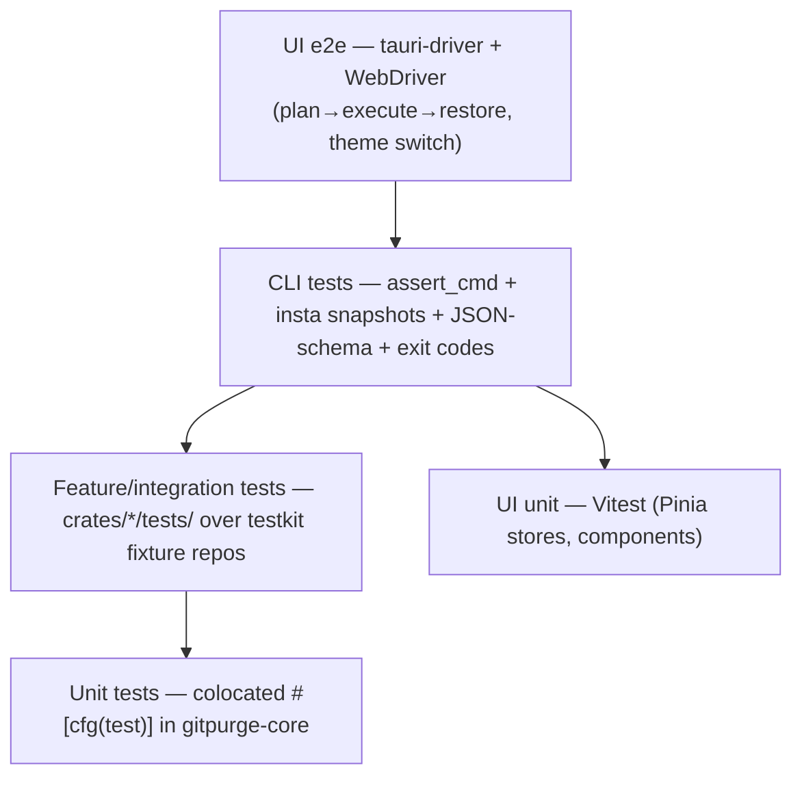

# 12 — Testing Strategy

`Status: Draft` · `Owner: Quality` · `Last-updated: 2026-07-11` ·
`Related: [../delivery/CONVENTIONS.md](../delivery/CONVENTIONS.md), [../delivery/DEFINITION_OF_DONE.md](../delivery/DEFINITION_OF_DONE.md), [02-architecture.md](02-architecture.md), [11-safety-model.md](11-safety-model.md), [13-distribution-and-ci.md](13-distribution-and-ci.md)`

Implements **Requirement 8** (unit + feature testing are mandatory) and enforces the
testing bar in [CONVENTIONS §13](../delivery/CONVENTIONS.md): **≥ 80 % line coverage on
`gitpurge-core`** and a **dedicated regression test for every safety invariant**
(`SAFE-01..07`). Tests are **deterministic and network-free**: they never touch the
user's real repos, remotes, or credentials.

---

## 1. Test pyramid



| Layer | Location | Tooling | What it proves |
| :--- | :--- | :--- | :--- |
| Unit | colocated `#[cfg(test)]` in `gitpurge-core` | `cargo nextest` | pure logic: policy, classification, URL/name parsing, error mapping |
| Feature / integration | `crates/gitpurge-core/tests/`, `crates/gitpurge-cli/tests/` | `nextest` + `testkit` | use-cases end-to-end over real git objects on fixture repos |
| CLI snapshot | `crates/gitpurge-cli/tests/` | `assert_cmd` + `insta` | human output stability, `--json` shape, exit codes |
| UI unit | `apps/desktop/src/**/*.spec.ts` | **Vitest** | Pinia stores, components, formatters |
| UI e2e | `apps/desktop/e2e/` | **tauri-driver** + WebDriver | real IPC → core, full flows, theming |

The pyramid is intentionally bottom-heavy: most behavior is verified in fast Rust
unit/feature tests against `gitpurge-core`, because that is where **all logic lives**
([architecture §1](02-architecture.md#1-guiding-principle)). The CLI and UI layers only
assert that the thin adapters translate/render correctly.

## 2. The `testkit` module — programmatic fixture repos

`gitpurge-core::testkit` (a **test-only** module gated behind
`#[cfg(any(test, feature = "testkit"))]`, per
[architecture §2](02-architecture.md#2-workspace-layout)) builds git repositories
programmatically through the **`GitBackend` port**, so fixtures are byte-deterministic
and require no network, no system `git`, and no fixed clock other than the injected
`Clock` fake. This is the mechanism CONVENTIONS §13 mandates.

### 2.1 API sketch

```rust
// gitpurge-core::testkit
pub struct FixedClock { /* returns a constant "now" */ }
impl FixedClock { pub fn at(iso8601: &str) -> Self; pub fn now(&self) -> OffsetDateTime; }

/// Fluent builder for a deterministic repository.
pub struct RepoBuilder { /* ... */ }

impl RepoBuilder {
    pub fn new(clock: FixedClock) -> Self;
    pub fn default_branch(self, name: &str) -> Self;      // e.g. "main"
    pub fn branch(self, spec: BranchSpec) -> Self;
    /// Add a "remote" backed by a local bare repo (file:// — never the network).
    pub fn remote(self, name: &str) -> Self;
    pub fn build(self) -> Result<FixtureRepo, GitPurgeError>;
}

#[derive(Clone)]
pub struct BranchSpec {
    pub name: String,          // may be non-standard on purpose, e.g. "JIRA_123"
    pub from: String,          // base ref
    pub commits: u32,          // extra commits on top of `from`
    pub age: Duration,         // author/committer date = clock.now() - age
    pub merged: bool,          // if true, fast-forward/merge base so it's an ancestor
    pub upstream: Option<String>, // sets an upstream on the remote
}

pub struct FixtureRepo {
    pub repo_id: RepoId,
    pub root: TempDir,                 // auto-cleaned
    pub backend: Box<dyn GitBackend>,  // gix/git2 composite over the temp repo
    pub clock: FixedClock,
}
impl FixtureRepo {
    pub fn engine(&self) -> Engine;    // an Engine wired with fakes + this backend
}
```

### 2.2 Example fixtures

```rust
// Fixture A — a mix of ages, merge states, and naming, all relative to a fixed clock.
pub fn mixed_repo() -> FixtureRepo {
    RepoBuilder::new(FixedClock::at("2026-07-11T00:00:00Z"))
        .default_branch("main")
        .branch(BranchSpec { name: "feature/login".into(), from: "main".into(),
                             commits: 3, age: days(400), merged: false, upstream: None })
        .branch(BranchSpec { name: "bugfix/typo".into(),  from: "main".into(),
                             commits: 1, age: days(20),  merged: true,  upstream: None })
        .branch(BranchSpec { name: "JIRA_999".into(),     from: "main".into(),
                             commits: 5, age: days(500), merged: false, upstream: None }) // non-standard
        .remote("origin")
        .build().unwrap()
}

// Fixture B — scale/perf & filter tests: N branches with controlled, seeded ages.
pub fn busy_repo(n: u32, seed: u64) -> FixtureRepo { /* deterministic PRNG over `seed` */ }
```

Because `FixtureRepo::backend` is a real `GitBackend`, the *same* classification,
diff, backup, and action code that ships is exercised — no logic is mocked away, only
the *source* of the repo is controlled.

## 3. Core tests (`gitpurge-core`)

| Area | Approach |
| :--- | :--- |
| Classification & policy | Unit tests over `mixed_repo()`: merged/unmerged, stale/active by age threshold, protected, standard/non-standard naming, ahead/behind counts. |
| Property tests | [`proptest`](https://crates.io/crates/proptest) generates random branch names and ages; **invariants**: naming classification matches the configured regex; an age below the threshold is never `stale` and above is never `active`; protected-glob membership is monotonic. |
| Backup snapshot round-trip | Create snapshot → assert namespaced refs `refs/gitpurge/backups/<id>/…` exist and object DB is shared (space sub-linear); manifest (`snapshot.json`) + SQLite metadata match captured refs. |
| Restore | Restore-as-branch and restore-as-tag recreate the exact tip SHA; refusing consent on an existing ref is a no-op (ties to `SAFE-06`). |
| Merge-base / ancestry | Golden expectations for merge-base and `is_ancestor` on crafted DAGs (fast-forward, diverged, criss-cross merges). |
| Diff correctness | **Golden files** under `tests/golden/diff/*.txt`; `diff(a,b)` output compared byte-for-byte (via `insta` or `similar-asserts`). Normalized for deterministic ordering. |
| `GitBackend` composite routing | A spy backend records which sub-backend served each call; asserts **reads → gix**, **push/delete/auth → git2** ([CONVENTIONS §4](../delivery/CONVENTIONS.md)), and that a second fake `GitBackend` swaps in with no facade change (proves R6). |

## 4. Safety regression tests (`SAFE-01`..`SAFE-07`)

One named test per invariant from
[DoD safety invariants](../delivery/DEFINITION_OF_DONE.md#safety-invariants-each-has-a-named-regression-test--never-remove).
These live in `crates/gitpurge-core/tests/safety.rs`, are referenced by ID in the
traceability matrix (§10), and **must never be removed**. They collectively define the
"100 % of safety invariants" part of the coverage bar.

| Test name | Asserts |
| :--- | :--- |
| `safe_01_dry_run_is_default` | `delete`/`archive` invoked without `ExecMode::Execute` returns a `Plan` and the spy `GitBackend` records **zero** mutations. |
| `safe_02_protected_refs_never_deleted` | Given `main`/`master`/`develop`/`staging`/`production`/`HEAD` + a user list + globs, no protected ref ever appears as a `delete`/`archive` action, even when filters would otherwise select it. |
| `safe_03_tags_never_deleted_by_branch_ops` | A repo with tags: after a branch `delete` plan+execute, every tag still resolves to its original SHA. |
| `safe_04_pre_op_snapshot_verified_before_destroy` | `execute` of a destructive plan creates **and verifies** a snapshot before the first delete; with `--no-backup` explicitly set, no snapshot and a recorded opt-out. |
| `safe_05_failed_delete_offers_restore` | Inject a delete failure via the spy backend; assert restore is **offered** from the pre-op snapshot and that **declining leaves state unchanged** (no partial deletion persisted). |
| `safe_06_restore_never_force_overwrites` | Restoring onto an existing ref **without** consent errors and does not overwrite; **with** explicit consent it overwrites and records the consent. |
| `safe_07_no_secret_in_logs_errors_snapshots_reports` | Feed a known fake token through auth resolve → forced error → captured `tracing` output → snapshot manifest → generated report; assert the token substring appears in **none** of them. |

## 5. CLI tests (`gitpurge-cli`)

- **Driver:** [`assert_cmd`](https://crates.io/crates/assert_cmd) runs the built
  `git-purge` binary against a `testkit` fixture, with `XDG_*` / `HOME` (and the
  Windows equivalents) pointed at a temp dir so config/history/backups/secrets are
  fully isolated.
- **Human output:** [`insta`](https://crates.io/crates/insta) snapshots of tables and
  messages. Volatile fields (timestamps, temp paths, durations) are normalized via
  `insta` filters so snapshots are stable across runs/machines.
- **JSON output:** every `--json` payload is validated against a **JSON Schema** under
  `schemas/` (`jsonschema` crate); this doubles as the contract the Tauri layer and
  external scripts rely on.
- **Exit codes:** table-driven tests assert the documented codes — `0` success,
  and the distinct non-zero classes from [05-cli-spec.md](05-cli-spec.md) (usage error,
  safety refusal, auth failure, git/backend error). Confirms `SAFE-01` at the CLI
  boundary (no `--execute` ⇒ dry-run, exit `0`, no mutation).

```rust
#[test]
fn plan_human_snapshot() {
    let repo = testkit::mixed_repo();
    assert_cmd::Command::cargo_bin("git-purge").unwrap()
        .args(["plan", "--repo", repo.repo_id.as_str(), "--merged"])
        .envs(repo.isolated_env())            // temp XDG/HOME
        .assert().success()
        .stdout(insta_filtered_snapshot());   // insta redactions applied
}
```

## 6. UI tests (`apps/desktop`)

- **Unit — Vitest.** Pinia stores (state transitions for scan/plan/execute/restore),
  components (branch list, plan review, diff viewer), and formatters. IPC is mocked at
  the `@tauri-apps/api` boundary so store logic is tested without a running backend.
- **e2e — `tauri-driver` + WebDriver.** Drives the **real** app (Vue webview ⇄ Rust
  `Engine`) over WebDriver. Priority flows:
  1. **plan → execute → restore**: pick a fixture repo, review the plan, confirm the
     stronger destructive confirmation, execute, then restore from the pre-op snapshot
     — the UI equivalent of the `SAFE-04/05/06` path.
  2. **theme switching**: light / dark / system, asserting the design-token attributes
     from [07-ui-design-system.md](07-ui-design-system.md) (R12).
- **Headless in CI (Linux):** `tauri-driver` bridges to `WebKitWebDriver`; the job runs
  under **`xvfb-run`** (virtual display) so no physical display is needed. See the
  `frontend` job in [13-distribution-and-ci.md](13-distribution-and-ci.md#5-ciyml-continuous-integration).
  On Windows, `tauri-driver` uses `msedgedriver` (WebView2). macOS WKWebView has no
  official WebDriver, so e2e for macOS is **not run in CI** (documented caveat);
  macOS parity is covered by CLI + core tests plus manual smoke.

```bash
# CI (Linux) e2e, headless
xvfb-run -a pnpm -C apps/desktop test:e2e   # spawns tauri-driver + WebKitWebDriver
```

## 7. Coverage

- **Tooling:** [`cargo-llvm-cov`](https://crates.io/crates/cargo-llvm-cov) driving
  `nextest`: `cargo llvm-cov nextest`.
- **Gates (enforced in CI, fails the build):**
  - `gitpurge-core` **≥ 80 %** line coverage — `--fail-under-lines 80`.
  - **100 % of safety invariants** — enforced two ways: (a) all seven `safe_0x_*`
    tests must be present and pass (a small meta-test asserts the set), and (b) the
    safety-critical modules (`policy`, `action`, `backup`) are checked with a stricter
    per-module threshold.
- Coverage runs on the Linux `test` job; the report is uploaded as a CI artifact and
  summarized in the PR.

```yaml
# excerpt — see 13-distribution-and-ci.md for the full ci.yml
- name: Coverage (core ≥ 80%)
  run: cargo llvm-cov nextest --package gitpurge-core --fail-under-lines 80 --lcov --output-path lcov.info
```

## 8. Test-data hygiene

- **No secrets / PII.** Any token/passphrase in tests is an obviously fake constant
  (e.g. `"FAKE-TOKEN-do-not-use"`); `safe_07_*` uses such a value precisely to prove it
  never leaks.
- **No real repos.** All git state comes from `testkit` fixtures in temp dirs;
  "remote" fixtures use local `file://` bare repos, never a network URL.
- **No machine state.** Config/history/backups/secrets are redirected to per-test temp
  dirs via env; the user's real `~/.gitconfig`, keychain, and `~/.ssh` are never read
  or written. A CI guard (offline runner / blocked egress) makes accidental network
  use fail loudly.

## 9. Test → requirement / phase mapping

| Requirement | Phase | Representative test(s) |
| :--- | :--- | :--- |
| **R1** local+remote, view-at-commit | P1 | `show_tree_returns_blob_at_sha`, `remote_refs_enumerated` (feature) |
| **R2** backup/restore/auto-restore/no-force | P2 | `backup_roundtrip`, `safe_04_*`, `safe_05_*`, `safe_06_*` |
| **R3** explore/filter/sort/compare/diff | P1, P4 | `filter_sort_predicates`, `diff_golden_*`, UI `compare.e2e` |
| **R4** track local+remote, view-at-commit | P1, P8 | `multi_remote_classification`, CLI/UI `show` parity |
| **R5** auth methods + secure storage + fallback | P6 | `resolve_ssh_key`, `resolve_token`, `keychain_fake_roundtrip`, `system_identity_fallback`, `safe_07_*` |
| **R6** shared abstractions + extensibility | P0, P1 | `arch_test_no_gix_git2_rusqlite_in_adapters`, `second_fake_backend_swaps_in` |
| **R7** reports + history | P5 | `trend_report_matches_legacy_tables`, `report_emits_md_json_html` |
| **R8** unit + feature testing | all | this document; the coverage gate (§8) |
| **R9/R10** tarball + bundles / single binary | P7 | packaging smoke in [13](13-distribution-and-ci.md); `tarball_binary_runs_no_deps` |
| **R11** GH Actions release on tag | P7 | dry-run of `release.yml` on a fixture tag (see [13](13-distribution-and-ci.md)) |
| **R12** minimalist UI, themes | P4 | Vitest store/component specs; `theme_switch.e2e` |
| **SAFE-01..07** | P2/P3 | `safe_01_*` … `safe_07_*` (§5) |

## 10. Running the suite

```bash
cargo nextest run --all                 # unit + feature + CLI
cargo llvm-cov nextest -p gitpurge-core --fail-under-lines 80
cargo insta test --review               # review/accept CLI snapshot changes
pnpm -C apps/desktop test               # Vitest (UI unit)
xvfb-run -a pnpm -C apps/desktop test:e2e   # UI e2e (Linux, headless)
```

These are exactly the commands the CI gates run (see
[AGENT_GUIDE §3](../delivery/AGENT_GUIDE.md) and
[13-distribution-and-ci.md](13-distribution-and-ci.md)). Traceability closes back to
**R8** and to every `SAFE-0x` invariant in the
[Definition of Done](../delivery/DEFINITION_OF_DONE.md).
