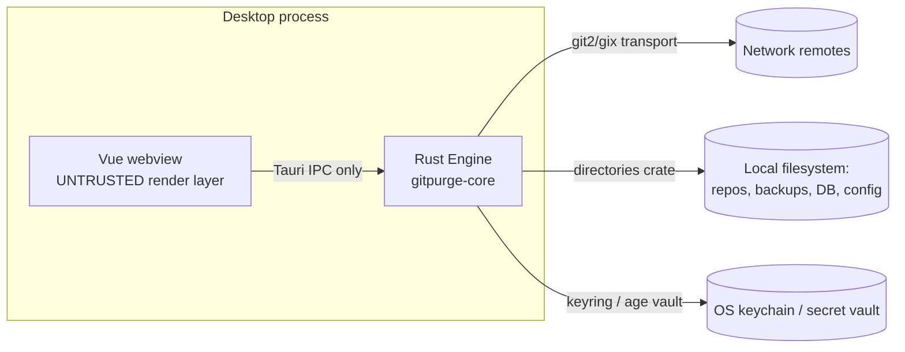

# 14 — Security

`Status: Draft` · `Owner: Security` · `Last-updated: 2026-07-11` ·
`Related: [../delivery/CONVENTIONS.md](../delivery/CONVENTIONS.md), [../delivery/DEFINITION_OF_DONE.md](../delivery/DEFINITION_OF_DONE.md), [02-architecture.md](02-architecture.md), [09-authentication.md](09-authentication.md), [11-safety-model.md](11-safety-model.md), [13-distribution-and-ci.md](13-distribution-and-ci.md)`

Security is a first-class product goal ([00-vision-and-scope.md](00-vision-and-scope.md),
[01-tech-stack.md](01-tech-stack.md)). This doc defines the threat model, the hardening
posture for the Tauri app, supply-chain controls, and the **P8 security-review
checklist** ([ROADMAP](ROADMAP.md#p8--hardening-security-review--10-8-ed)). It complements
[09-authentication.md](09-authentication.md) (secrets) and [11-safety-model.md](11-safety-model.md)
(destructive-op safeguards) rather than repeating them.

---

## 1. Threat model (STRIDE-lite)

### 1.1 Assets

| Asset | Where it lives | Why it matters |
| :--- | :--- | :--- |
| **Repository data** (branches, commits, working history) | user's local repos + remotes | primary user value; destructive ops can lose unmerged work |
| **Credentials** (SSH passphrase, HTTPS password, token) | OS keychain / encrypted-file vault | compromise → remote repo access |
| **Backups / snapshots** | `<data_dir>/git-purge/backups/*.git` | the safety net; if corrupted, restore fails |
| **History DB & logs** | `<data_dir>/git-purge/history.db`, `<state_dir>/…/logs` | audit trail; must contain no secrets |
| **Config** | `<config_dir>/git-purge/config.toml` | integrity of protected-ref list & policy |

### 1.2 Trust boundaries



Boundaries: **webview ↔ Rust** (the webview is treated as untrusted and may only call
the explicit command set), **process ↔ network remotes** (authenticated, TLS/SSH), and
**process ↔ filesystem/keychain** (path- and permission-scoped).

### 1.3 Adversaries & STRIDE mitigations

| STRIDE | Threat | Mitigation |
| :--- | :--- | :--- |
| **S**poofing | Malicious remote impersonates a host | Standard TLS/SSH host verification via git2/gix; no custom cert bypass; `auth test` surfaces the resolved host. |
| **T**ampering | Compromised dependency or altered release artifact | `cargo-deny` + `cargo-audit`, committed `Cargo.lock`, SHA-256 + minisign on releases (§4, [13](13-distribution-and-ci.md)). |
| **T**ampering | Malicious page/script in the webview reaching git/fs | Locked-down Tauri capabilities + CSP + no remote content (§2); webview cannot call git/fs/shell/http directly. |
| **R**epudiation | "I didn't run that delete" | Append-only audit journal + `RunReport` in history DB ([11](11-safety-model.md), CONVENTIONS §7). |
| **I**nfo disclosure | Secrets in logs/reports/snapshots | SAFE-07: zeroize, redaction, no secret columns/fields ([09 §6](09-authentication.md#6-security-requirements-safe-07-and-supporting-rules)). |
| **D**enial of service | Huge repo (2k+ refs) exhausts memory | Streaming ref enumeration + bounded concurrency + cancellation ([02 §5](02-architecture.md#5-concurrency--cancellation)). |
| **E**levation | Injected shell command runs with user privileges | No `sh -c`; argv-only process spawning (§3); `#![forbid(unsafe_code)]` in core/cli. |

### 1.4 Out of scope (v1)

No multi-user/server model (single-user, local — [00 non-goals](00-vision-and-scope.md#non-goals-v1));
we do not defend against a fully compromised OS account (which already owns the
keychain, repos, and process).

## 2. Tauri hardening (v2)

The Vue webview is untrusted; it reaches the Rust `Engine` **only** through the
explicit `#[tauri::command]` set in [CONVENTIONS §10](../delivery/CONVENTIONS.md)
(`repo_list`, `scan`, `plan`, `backup_create`, `delete_branches`, …). We do **not**
enable the `fs`, `shell`, or `http` plugins, so the webview has **no** ambient
filesystem/network/shell capability — all such work happens in Rust behind our own
commands.

### 2.1 Capabilities (Tauri v2 permission model)

Tauri v2 replaces v1's global "allowlist" with **capability files** that grant scoped
**permissions** to specific windows. We grant the minimum:

```jsonc
// apps/desktop/src-tauri/capabilities/default.json
{
  "$schema": "../gen/schemas/desktop-schema.json",
  "identifier": "default",
  "description": "Minimal capabilities for the main Git Purge window.",
  "windows": ["main"],
  "permissions": [
    "core:default",                 // event/window basics only
    "core:event:allow-listen",      // receive gitpurge://progress
    "core:window:allow-set-theme",  // light/dark/system (R12)
    "dialog:allow-open"             // native DIRECTORY picker for "add repo" — nothing else
  ]
}
```

Deliberately **absent**: `shell:*`, `fs:*`, `http:*`, `dialog:allow-save` for
arbitrary paths, and any `allow-execute`. Our custom `#[tauri::command]`s are the only
way the UI touches the disk or network, and each validates its inputs in
`gitpurge-core`.

### 2.2 CSP & no remote content

```jsonc
// apps/desktop/src-tauri/tauri.conf.json (excerpt)
{
  "$schema": "https://schema.tauri.app/config/2",
  "productName": "Git Purge",
  "identifier": "com.gitpurge.desktop",
  "app": {
    "security": {
      "csp": "default-src 'self'; script-src 'self'; style-src 'self' 'unsafe-inline'; img-src 'self' data:; connect-src 'self' ipc: http://ipc.localhost; object-src 'none'; base-uri 'self'; frame-ancestors 'none'",
      "assetProtocol": { "enable": false },
      "freezePrototype": true
    },
    "windows": [{ "label": "main", "title": "Git Purge" }]
  }
}
```

- **CSP** forbids remote scripts/styles; `connect-src` allows only `'self'` and the
  Tauri IPC origins (`ipc:` / `http://ipc.localhost`). `style-src 'unsafe-inline'` is
  the single concession (Vue scoped-style injection) and carries no script capability.
- **No remote content:** the frontend is **bundled and served locally** (`frontendDist`
  points at the built Vue assets); we never load a remote URL into the webview, so
  there is no page an attacker controls.
- `freezePrototype` mitigates prototype-pollution; `assetProtocol` disabled since we
  serve no user files to the webview.

## 3. Command / argument safety

- **We call libraries, not shells.** All git work goes through the `GitBackend` port
  backed by **`gix`/`git2`** ([ADR-0002](adr/)) — in-process library calls, **no shell
  at all** on the happy path. This structurally eliminates the shell-injection surface
  that the legacy bash scripts had (they interpolated branch names and repo paths into
  `git ...` command strings — an attacker-crafted branch name like
  `$(rm -rf ~)` was a real risk there).
- **When we must shell out** (`ShellGitBackend`, the last-resort/parity adapter,
  CONVENTIONS §4), we spawn via `std::process::Command` passing **each argument as a
  separate argv element** — never `sh -c "..."`, never string interpolation. Branch
  names, refs, and paths are arguments, so a value like `--upload-pack=…` or
  `; rm -rf` is inert data, not a command. `ShellGitBackend` is never on the
  zero-setup path and is off by default.
- **`#![forbid(unsafe_code)]`** in `gitpurge-core` and `gitpurge-cli`
  ([CONVENTIONS §12](../delivery/CONVENTIONS.md)) removes the memory-unsafety class
  outright.

## 4. Supply chain

| Control | Tool / practice |
| :--- | :--- |
| License + advisory + ban + source gate | **`cargo-deny`** (`deny.toml`), runs as the `deny` CI job ([13 §5](13-distribution-and-ci.md#5-ciyml-continuous-integration)) |
| Known-vuln scan | **`cargo-audit`** against RustSec, in CI + scheduled |
| Reproducible deps | `Cargo.lock` **committed**; frozen `pnpm-lock.yaml` |
| Pinned toolchain | `rust-toolchain.toml` (stable, MSRV **1.82** — CONVENTIONS §3) |
| Minimal, audited deps | curated stack ([01-tech-stack.md](01-tech-stack.md)); new deps justified in PR review |
| No unsafe | `#![forbid(unsafe_code)]` in core/cli |
| Dependency review | GitHub **dependency-review-action** on PRs; Dependabot updates |
| SBOM | `cargo-cyclonedx` generates a CycloneDX SBOM, attached to each release |

```toml
# deny.toml (excerpt) — the shape the P0/P8 scaffolding implements
[advisories]
version = 2
yanked = "deny"
# ignore = []  # each entry needs a justification comment + expiry

[licenses]
version = 2
allow = ["MIT", "Apache-2.0", "Apache-2.0 WITH LLVM-exception", "BSD-3-Clause", "ISC", "Unicode-3.0"]
confidence-threshold = 0.9

[bans]
multiple-versions = "warn"
# Architecture guard (mirrors 02-architecture §1): adapters must not pull the engines.
# Enforced together with an architecture test asserting gitpurge-cli / gitpurge-desktop
# do NOT depend on gix / git2 / rusqlite directly.
deny = []

[sources]
unknown-registry = "deny"
unknown-git = "deny"
```

## 5. Data safety

Destructive-operation safeguards are specified in [11-safety-model.md](11-safety-model.md)
and enforced by `SAFE-01..06`; from a security standpoint the relevant properties are:

- **Backup-before-destroy** — a verified pre-op snapshot exists before any delete/
  archive unless `--no-backup` is explicit (`SAFE-04`); minimal-space bare-mirror model
  (CONVENTIONS §6) so the safety net is always affordable.
- **Auto-restore on failure** — a failed delete offers restore from the pre-op snapshot
  (`SAFE-05`); declining is a no-op.
- **Never force-overwrite on restore** without explicit consent (`SAFE-06`).
- **Append-only audit journal** — every mutating op is logged for audit and undo
  (CONVENTIONS §7); logs are JSON-lines under `<state_dir>` and contain **no secrets**
  (`SAFE-07`).

## 6. Secret handling

Full detail in [09-authentication.md §6](09-authentication.md#6-security-requirements-safe-07-and-supporting-rules).
Summary of the security posture:

- Secrets live in the **OS keychain** (`keyring`) or an **encrypted-file vault**
  (`age`/`aes-gcm`, Argon2id-derived key); never in `config.toml`, `history.db`,
  snapshots, or reports.
- In memory they are wrapped in **`zeroize`** buffers and wiped on drop.
- Never logged or rendered: `tracing` fields and `GitPurgeError` messages carry only
  redacted identity (host, method, fingerprint, last-4). `SAFE-07` has a dedicated
  regression test ([12 §4](12-testing-strategy.md#4-safety-regression-tests-safe-01safe-07)).
- Secrets are never passed as CLI args (argv is world-readable); `auth add` reads from
  a prompt or stdin.

## 7. Responsible disclosure

- A repo-root **`SECURITY.md`** states the supported versions and the private reporting
  channel: **GitHub Security Advisories** ("Report a vulnerability" on
  `MohamedGamil/git-purge`), with a security contact email as fallback.
- Please **do not** open public issues for vulnerabilities. We aim to acknowledge
  within a few business days, coordinate a fix, and credit reporters.
- Fixes ship in a patch release; the CHANGELOG **Security** section and a GitHub
  Security Advisory document the issue after users have had time to update.

## 8. Privacy

- **No telemetry, no analytics, no phone-home** — by default and by design. There is no
  code path that sends usage data anywhere.
- Everything is **local**: repos, backups, history DB, config, and secrets all live on
  the user's machine under the `directories`-resolved paths (CONVENTIONS §5). The only
  network traffic is the git operations the user explicitly initiates against their own
  remotes.
- No hidden background network activity; the desktop app loads no remote content (§2.2).

## 9. P8 security-review checklist

Signed off as part of **P8 hardening** before the 1.0 tag
([ROADMAP](ROADMAP.md#p8--hardening-security-review--10-8-ed)); ties into the global
[Definition of Done](../delivery/DEFINITION_OF_DONE.md).

```
Threat model & boundaries
- [ ] Threat model (§1) reviewed; new commands/ports added since last review are covered
- [ ] webview↔Rust boundary: every #[tauri::command] validated in core; no direct git/fs/net from JS

Tauri hardening
- [ ] capabilities/*.json grants only the minimum (no shell/fs/http; dialog scoped to open-directory)
- [ ] CSP present, no remote content, frontend served locally; assetProtocol disabled; freezePrototype on
- [ ] No new Tauri plugins added without a security note

Secrets (cross-ref 09)
- [ ] No secret in logs/errors/snapshots/reports (SAFE-07 test green)
- [ ] All secret buffers zeroized; no secret in config/history.db; no secret in argv

Command/argument safety
- [ ] No `sh -c` anywhere; ShellGitBackend (if used) passes argv only; unsafe_code still forbidden in core/cli

Supply chain
- [ ] `cargo deny check` clean (licenses/advisories/bans/sources); `cargo audit` clean
- [ ] Cargo.lock + pnpm-lock.yaml committed; toolchain pinned; SBOM generated for the release
- [ ] Dependency-review action passing; new deps justified

Data safety (cross-ref 11)
- [ ] SAFE-01..06 regression tests green; backup verified before destroy; restore never force-overwrites
- [ ] Audit journal append-only and secret-free

Release integrity (cross-ref 13)
- [ ] SHA256SUMS produced and minisign-signed; code-signing/notarization status documented in release notes

Privacy
- [ ] No telemetry/network beyond user-initiated git ops; no remote content loaded
```

## 10. Traceability

| Concern | Requirement / invariant | Where |
| :--- | :--- | :--- |
| Secure storage & auth | R5, SAFE-07 | §6, [09-authentication.md](09-authentication.md) |
| Destructive-op safety | R2, SAFE-01..06 | §5, [11-safety-model.md](11-safety-model.md) |
| Shared-core / no adapter leakage | R6 | §4 (cargo-deny ban + architecture test), [02-architecture.md](02-architecture.md) |
| Release integrity | R9, R11 | §4, [13-distribution-and-ci.md](13-distribution-and-ci.md) |
| Hardening sign-off | DoD | §9 checklist |
