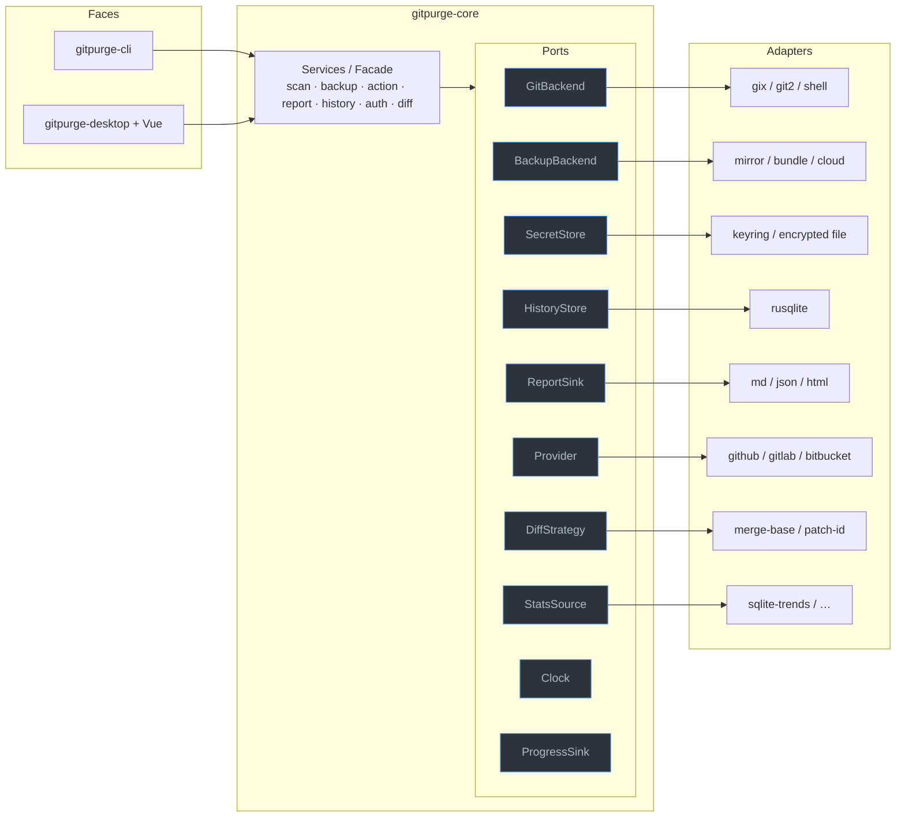

# 15 — Extensibility

`Status: Draft` · `Owner: Architecture` · `Last-updated: 2026-07-11` ·
`Related: ../delivery/CONVENTIONS.md, 02-architecture.md, 04-core-spec.md,
08-backup-and-restore.md, 09-authentication.md, 00-vision-and-scope.md (R6)`

> This document realizes **R6**: "CLI + UI share the same core abstractions;
> extensible to new providers / VCS / backup / restore / diff / stats methods."
> It is the detailed expansion of [architecture §8](02-architecture.md#8-extensibility-seams-detail-in-15-extensibilitymd).

---

## 1. Philosophy: ports and adapters

Git Purge is a hexagonal (ports-and-adapters) design. Every external concern —
talking to git, storing secrets, persisting history, rendering a report, knowing
about a git *host* — is expressed as a **trait ("port")** in `gitpurge-core`, with
one or more concrete **adapters** behind it. The services (`scan`, `backup`,
`action`, `report`, …) and both faces (CLI, UI) depend **only on the traits**.



**The rule (CONVENTIONS §2/§4, architecture §1):** callers never touch `gix`,
`git2`, `rusqlite`, `keyring`, or a provider SDK directly. Adding a capability =
adding an adapter; it never edits a service or a face.

---

## 2. The port catalogue

| Port | What varies behind it | Default adapter(s) | Spec |
| :--- | :--- | :--- | :--- |
| **`GitBackend`** | *How* git objects/refs are read and mutated (transport, credentials, ancestry, push/delete). | `gix` (reads) + `git2` (push/auth); `ShellGitBackend` fallback | [04](04-core-spec.md), CONVENTIONS §4 |
| **`BackupBackend`** | *How* snapshots are captured/verified/restored/pruned. | `MirrorBackupBackend` (bare mirror + namespaced refs) | [08](08-backup-and-restore.md) |
| **`SecretStore`** | *Where/how* credentials are stored + retrieved. | OS keychain (`keyring`) + encrypted-file fallback | [09](09-authentication.md), [14](14-security.md) |
| **`HistoryStore`** | *Where* runs/snapshots/trends persist. | `rusqlite` (bundled SQLite) | [10](10-reporting-and-history.md) |
| **`ReportSink`** | *What format* a report is emitted in. | Markdown, JSON, HTML | [10](10-reporting-and-history.md) |
| **`Provider`** | *Knowledge about a git host*: URL parsing, auth hints, (later) PR/MR metadata. | GitHub (default); GitLab/Bitbucket/Gitea optional | §4a |
| **`DiffStrategy`** | *How* two refs are compared (equivalence, rename detection). | merge-base tree diff; patch-id equivalence | §4d |
| **`StatsSource`** | *Where* branch/trend statistics come from. | Local classification over `GitBackend`; SQLite trends | §4e |
| **`Clock`** | *Where "now" comes from* (real vs. deterministic in tests). | `SystemClock`; `FixedClock` (testkit) | [02](02-architecture.md) |
| **`ProgressSink`** | *How* progress is surfaced. | `indicatif` (CLI); Tauri events (UI); no-op (tests) | [02](02-architecture.md) |

`GitBackend`, `SecretStore`, `HistoryStore`, `ReportSink`, `Clock`, and
`ProgressSink` are already declared in [architecture §3](02-architecture.md#3-layered-design-inside-gitpurge-core);
`BackupBackend`, `Provider`, `DiffStrategy`, and `StatsSource` are the seams this
doc adds detail for.

---

## 3. Registry & selection

Keep it simple — no dynamic plugin loading, no `dlopen`, no scripting engine (out of
scope, and a security liability, see [14](14-security.md)). Two lightweight patterns
cover every case:

**A. Compile-time enum dispatch** — for ports with a small, known, mostly-stable set
of implementations (backup kind, report format, diff strategy). Config names a
variant; the core boxes the chosen adapter. No overhead, exhaustive matching:

```rust
pub enum BackupKindCfg { Mirror, Bundle, Cloud }

pub fn make_backup_backend(cfg: &Config) -> Box<dyn BackupBackend> {
    match cfg.backup.kind {
        BackupKindCfg::Mirror => Box::new(MirrorBackupBackend::new(cfg)),
        #[cfg(feature = "backend-bundle")]
        BackupKindCfg::Bundle => Box::new(BundleBackupBackend::new(cfg)),
        #[cfg(feature = "backend-cloud")]
        BackupKindCfg::Cloud  => Box::new(CloudBackupBackend::new(cfg)),
        // features off → a clear "not compiled in" error, never a silent fallback
        #[allow(unreachable_patterns)]
        other => Box::new(UnavailableBackend::new(other)),
    }
}
```

**B. First-match registry** — for `Provider`, where *many* hosts coexist and
selection is data-driven (which host owns this URL?). A `ProviderRegistry` holds an
ordered `Vec<Box<dyn Provider>>` and returns the first whose `matches()` is true:

```rust
pub struct ProviderRegistry { providers: Vec<Box<dyn Provider>> }

impl ProviderRegistry {
    /// Built from enabled Cargo features; order = precedence.
    pub fn with_defaults() -> Self {
        let mut providers: Vec<Box<dyn Provider>> = Vec::new();
        #[cfg(feature = "provider-github")]    providers.push(Box::new(GitHubProvider::default()));
        #[cfg(feature = "provider-gitlab")]    providers.push(Box::new(GitLabProvider::default()));
        #[cfg(feature = "provider-bitbucket")] providers.push(Box::new(BitbucketProvider::default()));
        providers.push(Box::new(GenericGitProvider::default())); // always-present fallback
        Self { providers }
    }

    pub fn resolve(&self, url: &RemoteUrl) -> &dyn Provider {
        self.providers
            .iter()
            .find(|p| p.matches(url))
            .map(|b| b.as_ref())
            .unwrap_or_else(|| self.generic()) // GenericGitProvider never fails to match
    }
}
```

Config can also **pin** a provider for a repo (`[repo] provider = "gitlab"`) to skip
URL sniffing. The registry is built once at `Engine::open` and injected; services
receive `&dyn Provider`, never the registry internals.

---

## 4. How to add a new …

### 4a. …git host / provider (GitLab, Bitbucket, Gitea) — via `Provider`

A **provider** encodes what is *host-specific*: how to parse its URLs, what auth it
prefers, and (post-v1) how to read PR/MR metadata. It does **not** move git data —
that is `GitBackend`'s job, and `GitBackend` already abstracts transport, so most
hosts need *only* a provider.

```rust
/// Port: knowledge about a specific git host. Never moves git data.
pub trait Provider: Send + Sync {
    /// Stable machine id: "github" | "gitlab" | "bitbucket" | "gitea" | "generic".
    fn id(&self) -> ProviderId;

    /// Does this provider own/recognize the given remote URL?
    fn matches(&self, url: &RemoteUrl) -> bool;

    /// Normalize a remote URL into coordinates used for repo-id derivation,
    /// canonical https/ssh forms, and auth. No secrets here.
    fn parse(&self, url: &RemoteUrl) -> Result<RepoCoordinates, GitPurgeError>;

    /// Preferred credential kinds + endpoints to guide the auth subsystem
    /// (see 09-authentication.md). Hints only — never returns a secret.
    fn auth_hints(&self, coords: &RepoCoordinates) -> AuthHints;

    /// OPTIONAL (post-v1): enrich a branch with host metadata (open PR/MR,
    /// review state). Default = None, so hosts without an API still work fully.
    async fn pr_metadata(
        &self,
        _coords: &RepoCoordinates,
        _branch: &str,
        _secrets: &dyn SecretStore,
    ) -> Result<Option<PrMetadata>, GitPurgeError> {
        Ok(None)
    }
}
```

**Worked example — a GitLab provider sketch:**

```rust
#[derive(Default)]
pub struct GitLabProvider { /* optional: self-managed host allowlist from config */ }

#[async_trait::async_trait]
impl Provider for GitLabProvider {
    fn id(&self) -> ProviderId { ProviderId::new("gitlab") }

    fn matches(&self, url: &RemoteUrl) -> bool {
        // gitlab.com plus self-managed hosts configured by the user
        url.host_is("gitlab.com") || url.host_matches_config("gitlab")
    }

    fn parse(&self, url: &RemoteUrl) -> Result<RepoCoordinates, GitPurgeError> {
        // GitLab allows nested groups: git@gitlab.com:group/subgroup/project.git
        let host = url.host()?;
        let path = url.path().trim_end_matches(".git");         // "group/subgroup/project"
        let (namespace, project) = path.rsplit_once('/').ok_or(GitPurgeError::BadRemoteUrl)?;
        Ok(RepoCoordinates {
            provider: self.id(),
            host: host.to_string(),
            owner: namespace.to_string(),                       // may contain '/'
            repo:  project.to_string(),
            canonical_https: format!("https://{host}/{path}.git"),
            canonical_ssh:   format!("git@{host}:{path}.git"),
        })
    }

    fn auth_hints(&self, coords: &RepoCoordinates) -> AuthHints {
        AuthHints {
            https_username: Some("oauth2".into()),              // GitLab PAT convention
            token_env: vec!["GITLAB_TOKEN".into(), "CI_JOB_TOKEN".into()],
            ssh_preferred: true,
            api_base: Some(format!("https://{}/api/v4", coords.host)),
        }
    }

    async fn pr_metadata(
        &self, coords: &RepoCoordinates, branch: &str, secrets: &dyn SecretStore,
    ) -> Result<Option<PrMetadata>, GitPurgeError> {
        // v1: return Ok(None). Later: GET /projects/:id/merge_requests?source_branch=…
        // Merge-request state feeds classification (e.g. "safe to delete, MR merged").
        let _ = (coords, branch, secrets);
        Ok(None)
    }
}
```

Register it behind a feature: add `providers.push(Box::new(GitLabProvider::default()))`
under `#[cfg(feature = "provider-gitlab")]` in `ProviderRegistry::with_defaults()`.
Nested-group URL parsing is the *only* real GitLab-specific logic; branch cleanup
itself is identical because it flows through `GitBackend`.

### 4b. …a new VCS backend — a broader `VcsBackend`

Supporting a non-git VCS (Mercurial, Jujutsu, Fossil) is a larger step because
"branch", "tag", "commit", and "merged-into" are git-shaped in the current model.

- **What generalizes** (stays in a hypothetical `VcsBackend` supertrait):
  ref/head enumeration, commit metadata (author/date/message), ancestry/"contained
  in" checks, delete/create-ref, and *the entire safety + backup workflow* (snapshot →
  verify → act → restore) — those are VCS-agnostic.
- **What is git-specific** (must be re-expressed per VCS): the SHA-1/SHA-256 object
  model, `refs/heads` vs `refs/remotes` vs `refs/tags` layout, the mirror-refspec
  restore mechanism (§7 of doc 08), and merge-base semantics.

Recommended path: keep `GitBackend` as-is for v1; if a second VCS is ever required,
extract a minimal `VcsBackend` trait for the generalizable subset and make
`GitBackend: VcsBackend`. The `MirrorBackupBackend` would then need a per-VCS
capture/restore mechanism (e.g. `hg bundle`), which is exactly why backup is *also* a
port (§4c). This is explicitly a **post-v1** seam — noted here so the boundaries are
drawn now, not retrofitted.

### 4c. …a new backup / restore strategy — via `BackupBackend`

The `BackupBackend` trait ([doc 08 §9](08-backup-and-restore.md#9-the-backupbackend-port))
already isolates *how* snapshots are stored. New strategies implement the same trait:

- **`BundleBackupBackend`** — each snapshot is a `git bundle` file; portable single
  files, trades object-sharing for portability.
- **`TarballBackupBackend`** — archive the whole bare repo; simplest, largest.
- **`CloudBackupBackend`** — push snapshot refs to a remote object store / backup
  remote for off-machine durability.

None of these touch the `backup`/`action` services; they are selected by config
(§3A) and gated by a Cargo feature (§5). The default stays `mirror` (minimal space).

### 4d. …a new diff strategy — via `DiffStrategy`

```rust
pub trait DiffStrategy: Send + Sync {
    fn id(&self) -> &'static str;                 // "merge-base" | "patch-id" | …
    fn compare(&self, a: &ResolvedRef, b: &ResolvedRef, git: &dyn GitBackend)
        -> Result<DiffResult, GitPurgeError>;
}
```

- Default **`MergeBaseDiff`**: ahead/behind counts + tree diff from the merge base.
- **`PatchIdDiff`**: treats branches as equivalent if their patch-ids match
  (cherry-pick/rebase-aware "already merged" detection) — improves delete-safety
  classification without changing any caller.

### 4e. …a new report format / stats source

- **`ReportSink`** — implement `emit(&Report) -> Result<Rendered>` for a new format
  (CSV, SARIF, a CI annotation). Selected by `--format` / config. The `report`
  service builds a format-agnostic `Report` model; sinks only render.
- **`StatsSource`** — implement to pull branch/trend stats from somewhere other than
  local classification (e.g. a provider's API, or an external metrics store). The
  history/trend charts consume `StatsSource`, so a new source needs no UI change.

---

## 5. Feature flags (keep the default binary lean)

Optional adapters are behind Cargo features so the default `git-purge` binary stays
small and its dependency/advisory surface minimal (CONVENTIONS §14, [14](14-security.md)).

```toml
# crates/gitpurge-core/Cargo.toml
[features]
default = ["provider-github", "report-md", "report-json"]

# Providers
provider-github    = []
provider-gitlab    = []          # opt-in
provider-bitbucket = []          # opt-in
provider-gitea     = []          # opt-in

# Backup strategies
backend-bundle     = []          # opt-in; default is the built-in mirror
backend-cloud      = ["dep:reqwest"]

# Report formats / diff
report-md          = []
report-json        = []
report-html        = ["dep:minijinja"]
diff-patch-id      = []

# Git engine fallback
shell-git          = []          # ShellGitBackend (diagnostics/parity only)
```

Rules:

- A disabled feature must fail **loudly** ("provider `gitlab` not compiled in") — never
  silently fall back to a different provider/host.
- The `GenericGitProvider` and `MirrorBackupBackend` are **always** compiled in, so a
  bare binary can back up and clean *any* git remote by URL alone.
- Features are additive and must not change the meaning of existing behavior (no
  feature toggles a safety default).

---

## 6. Stability contract & semver

`gitpurge-core` is a real library others may embed (it is already embedded by the
CLI and the desktop backend), so its surface is versioned deliberately.

| Tier | Items | Semver policy |
| :--- | :--- | :--- |
| **Stable (public API)** | `Engine` and its methods; the model types (`Repo`, `Branch`, `Snapshot`, `Plan`, `RunReport`, …); the port **traits** `GitBackend`, `BackupBackend`, `Provider`, `SecretStore`, `HistoryStore`, `ReportSink`, `DiffStrategy`, `StatsSource`, `Clock`, `ProgressSink`; `GitPurgeError` variants; the config schema. | Breaking change ⇒ **major** bump + a [`docs/adr/`](adr/) entry + CHANGELOG migration note. |
| **Evolving** | Concrete adapters (`MirrorBackupBackend`, `GitHubProvider`, …) and their constructors; optional trait methods with defaults (e.g. `pr_metadata`). | New methods **with defaults** or new adapters ⇒ **minor**. Adding a required trait method ⇒ major. |
| **Internal (no guarantees)** | Anything under a `pub(crate)` or `#[doc(hidden)]` module; `testkit`; exact SQLite/on-disk layout (the manifest schema is the compatibility contract, not the DB — doc 08 §4). | May change in any release. |

- The `snapshot.json` `schema_version` field (doc 08 §4.1) governs on-disk backup
  compatibility independently of the crate version; old snapshots must remain
  restorable across at least one major version.
- Trait evolution prefers **new methods with default bodies** over changing existing
  signatures, so out-of-tree adapters keep compiling.

---

## 7. Anti-patterns to avoid

- **Leaking `gix`/`git2` (or `rusqlite`, `keyring`) types across a port boundary.**
  Port signatures use `gitpurge-core` model types only. If a `gix::Repository` or a
  `git2::Oid` appears in a trait method, the abstraction has failed — an alternate
  backend or a mock could not implement it. (Enforced by the architecture test +
  `cargo-deny` bans, architecture §1.)
- **Provider-specific logic in the facade/services.** No `if provider == "github"` in
  `scan`/`action`/`report`. Host quirks live *inside* the `Provider` adapter; services
  see only `RepoCoordinates` / `AuthHints` / `PrMetadata`.
- **Adapters reaching back into other adapters.** Adapters depend on model types and
  possibly other *ports*, never on a sibling concrete adapter.
- **Feature flags that alter safety.** A feature may add a *strategy*; it may never
  weaken dry-run defaults, protected refs, or backup-before-destroy.
- **Silent fallback on a missing feature/provider.** Fail with a clear, typed error.
- **Dynamic/scripted plugins.** Out of scope for v1 and a security risk; extension is
  by compiled adapter + Cargo feature only.

---

## 8. Checklist: "add GitLab support"

A concrete, ordered path a future agent can follow (see [AGENT_GUIDE](../delivery/AGENT_GUIDE.md)):

1. **Feature flag** — add `provider-gitlab = []` to `gitpurge-core`'s `[features]` (§5).
2. **Adapter** — add `crates/gitpurge-core/src/provider/gitlab.rs` implementing
   `Provider` (§4a): `matches` (gitlab.com + self-managed hosts from config), `parse`
   (nested-group URLs), `auth_hints` (`oauth2` HTTPS user, `GITLAB_TOKEN`, SSH).
   Leave `pr_metadata` returning `Ok(None)` for v1.
3. **Register** — push it under `#[cfg(feature = "provider-gitlab")]` in
   `ProviderRegistry::with_defaults()` (§3B). Allow `[repo] provider = "gitlab"` pinning.
4. **Auth wiring** — ensure `SecretStore` keying uses `RepoCoordinates.host`, so a
   self-managed GitLab's token is stored per host ([09](09-authentication.md)).
5. **No `GitBackend` change** — push/delete/fetch already work via git2/gix over the
   canonical HTTPS/SSH URL. Do **not** add GitLab code to services (§7 anti-patterns).
6. **Tests** — `testkit` cases for URL parsing (incl. nested groups and self-managed
   hosts) and `auth_hints`; a feature-gated integration test that a GitLab-shaped URL
   resolves to `GitLabProvider`. Network-free (CONVENTIONS §13).
7. **Docs** — note the new provider here (§2 table) and in [09](09-authentication.md);
   if any canonical decision changed, add an ADR.
8. **Gate** — the local gate (fmt, clippy `-D warnings`, nextest, deny) must pass with
   the feature both **on and off**; verify the default binary is unchanged.

---

## 9. Traceability

| Requirement | Where satisfied |
| :--- | :--- |
| **R6** — CLI + UI share the same core abstractions | §1 (both faces depend only on ports), CONVENTIONS §2 |
| **R6** — extensible to new **providers** | §3B, §4a, §8 |
| **R6** — extensible to new **VCS** | §4b (`VcsBackend` seam) |
| **R6** — extensible to new **backup/restore** methods | §4c, [08 §9](08-backup-and-restore.md#9-the-backupbackend-port) |
| **R6** — extensible to new **diff** methods | §4d |
| **R6** — extensible to new **stats / report** methods | §4e |

Related: [02-architecture.md](02-architecture.md) (seams overview),
[04-core-spec.md](04-core-spec.md) (`Engine` + port declarations),
[08-backup-and-restore.md](08-backup-and-restore.md) (`BackupBackend`),
[09-authentication.md](09-authentication.md) (`SecretStore`, auth hints),
[14-security.md](14-security.md) (why no dynamic plugins).
